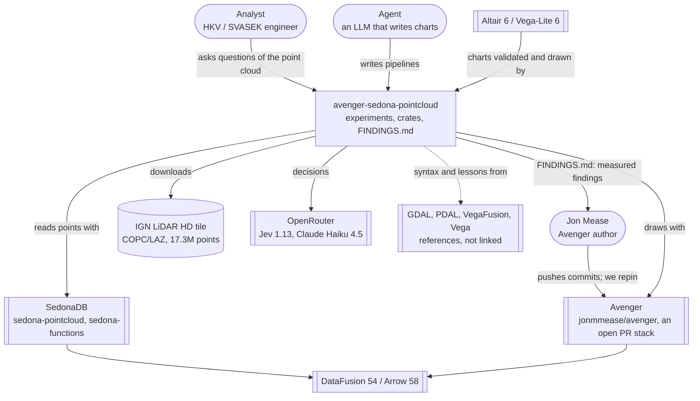
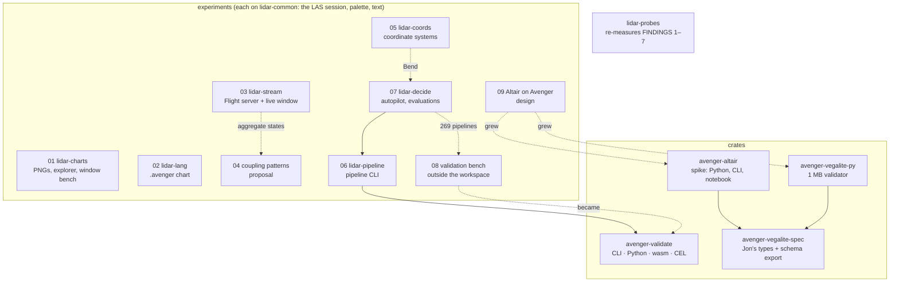
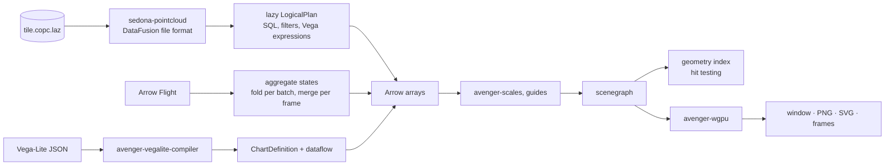
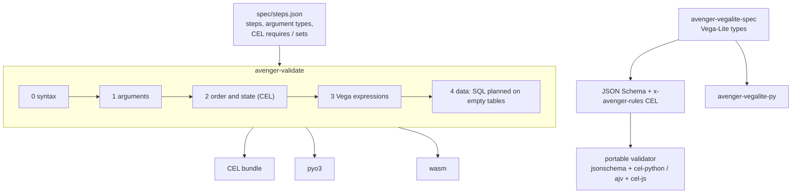
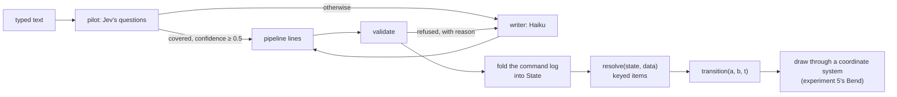
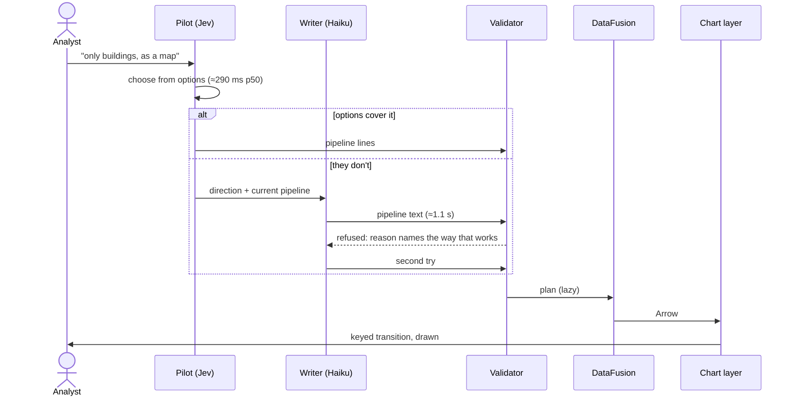
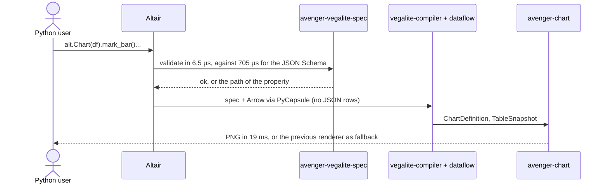
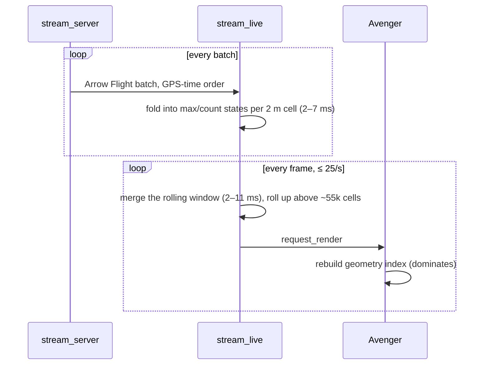
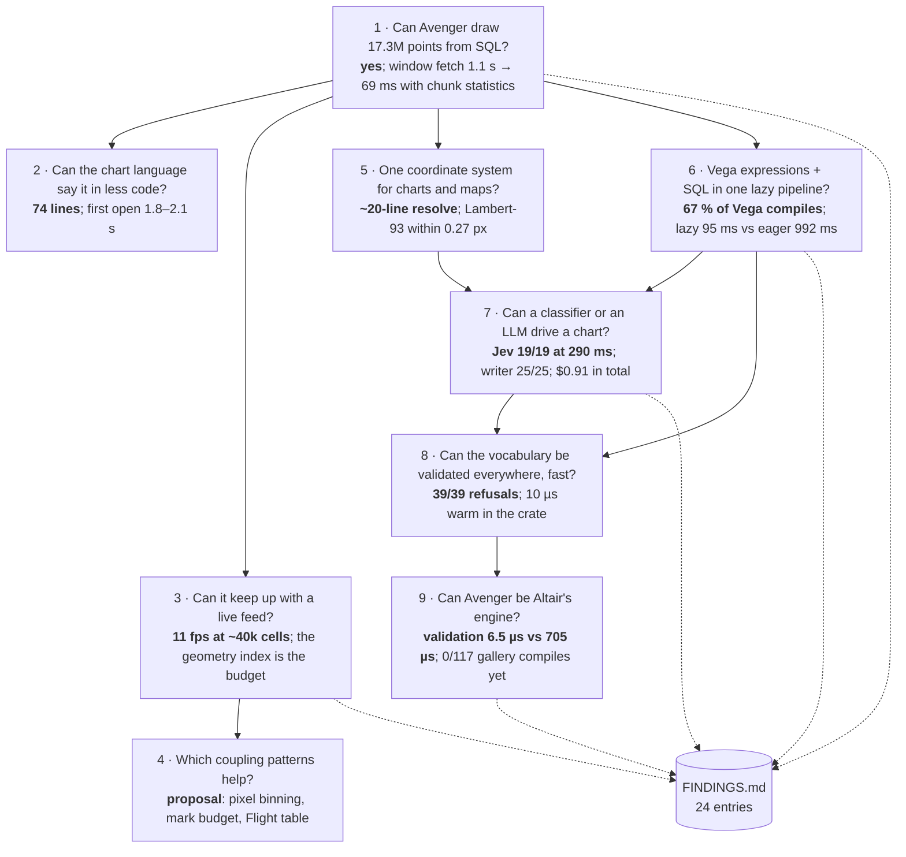

# The bigger picture

Nine experiments, four crates and one findings ledger, drawn as one system.
The views follow the [C4 model](https://c4model.com) (context, containers,
components, and dynamic views for the main paths), then a
[Wardley map](https://learnwardleymapping.com) for what evolves where, then a
map of the questions the experiments asked. Diagrams are Mermaid, so GitHub
draws them and they change in the same commits as the code.

State of 27 Sep 2026, Avenger pinned at `f4890be` (#130). Numbers are copied
from the experiment READMEs, with the machine they were measured on where it
matters; they are not re-measured here.

## The one-sentence version

Every experiment is a new front door onto the same spine: a lazy DataFusion
plan over the tile, Arrow in between, and Avenger drawing natively. What grew
around that spine, experiment by experiment, is a **vocabulary as data**: the
steps, the chart commands and Vega-Lite's types written down once, validated
in microseconds everywhere, and followed by whatever drives the chart, a
person, a classifier, an LLM or Altair.

## 1. Context

Who and what the repo touches.



The repo has two outputs of equal weight: charts that work, and a ledger of
what Avenger should change, each entry with the command that measures it.

## 2. Containers

What runs, and how it is run. Solid arrows are crate dependencies; dashed
arrows are "grew out of" or "reads the output of".



| Container | Runs as | Output |
|---|---|---|
| lidar-charts | binaries | PNG, winit window |
| lidar-stream | gRPC server + window | frames, MP4 |
| lidar-pipeline | CLI | PNG, pipeline JSON, chart-definition bytes |
| lidar-decide | window + evaluation binaries | window, session log, results JSON/MD |
| avenger-validate | CLI, pyo3 module, wasm (3.0 MB) | diagnostics JSON, CEL bundle |
| avenger-altair | pyo3 module (89 MB), CLI, anywidget | PNG, SVG, notebook view |
| avenger-vegalite-py | pyo3 module (1 MB) | `None` or `(path, message)` |

## 3. Components

### The spine



The one measured bottleneck on this spine sits after the data and before the
GPU: rebuilding the geometry index costs about 1.2 µs a mark, 387 ms for
300k symbols against 21 ms to render them (FINDINGS 1–3).

### The vocabulary and its checks



Two vocabularies, one pattern: types in Rust, rules that JSON Schema cannot
state exported as CEL, the native validator shipped to Python and the browser,
and a portable fallback for anyone without the binary.

### The chart layer of experiment 7



## 4. Dynamic views

### A decision, from text to pixels



### Altair, drawn by Avenger



### A live feed



## 5. Wardley map

The user need at the top, the commodity at the bottom; evolution from genesis
on the left to commodity on the right. Paste the block into
[onlinewardleymaps.com](https://onlinewardleymaps.com) to draw it.

```
title Questioning a point cloud with charts
anchor Analyst [0.98, 0.45]
anchor Agent [0.98, 0.20]

component Answer to a question [0.90, 0.35]
component Altair API [0.80, 0.78]
component Decider (Jev, Haiku) [0.78, 0.22]
component Pipeline language [0.70, 0.15]
component Validator [0.64, 0.12]
component Vocabulary as data [0.58, 0.08]
component Chart layer, transitions [0.56, 0.10]
component Coordinate systems [0.50, 0.14]
component Vega-Lite compiler [0.52, 0.32]
component Avenger scenegraph, scales, guides [0.44, 0.38]
component Geometry index [0.38, 0.30]
component Aggregate states [0.40, 0.28]
component LLM API [0.62, 0.55]
component CEL [0.46, 0.58]
component JSON Schema [0.46, 0.85]
component sedona-pointcloud [0.30, 0.30]
component DataFusion [0.30, 0.68]
component Arrow Flight [0.26, 0.66]
component Arrow [0.20, 0.86]
component wgpu [0.14, 0.72]
component COPC/LAZ tile [0.10, 0.80]
component GPU [0.04, 0.95]

Analyst->Answer to a question
Agent->Answer to a question
Analyst->Altair API
Answer to a question->Decider (Jev, Haiku)
Answer to a question->Pipeline language
Decider (Jev, Haiku)->LLM API
Decider (Jev, Haiku)->Vocabulary as data
Pipeline language->Validator
Validator->Vocabulary as data
Validator->CEL
Altair API->Vega-Lite compiler
Altair API->JSON Schema
Pipeline language->Chart layer, transitions
Chart layer, transitions->Coordinate systems
Chart layer, transitions->Avenger scenegraph, scales, guides
Vega-Lite compiler->Avenger scenegraph, scales, guides
Avenger scenegraph, scales, guides->Geometry index
Avenger scenegraph, scales, guides->wgpu
Pipeline language->DataFusion
Aggregate states->DataFusion
Aggregate states->Arrow Flight
DataFusion->sedona-pointcloud
sedona-pointcloud->COPC/LAZ tile
DataFusion->Arrow
wgpu->GPU

evolve Validator 0.45
evolve Vocabulary as data 0.40
evolve Vega-Lite compiler 0.55
evolve Avenger scenegraph, scales, guides 0.60
evolve sedona-pointcloud 0.55

note genesis: built here [0.75, 0.05]
note custom: Avenger, moving to product [0.35, 0.45]
note commodity: use, don't build [0.12, 0.90]
note FINDINGS 1–3: the frame budget [0.35, 0.22]
```

What the map says:

- **Genesis is where this repo adds value:** the pipeline language, the
  vocabulary as data, the validator, the decider loop, the chart layer with
  transitions, coordinate systems as one trait. None of it exists as a product
  elsewhere; GDAL comes closest for pipelines, and it does not export its step
  types.
- **Avenger is custom-built and moving towards product**, and the ledger is
  how this repo pushes it: every finding is a friction point on that move
  (the geometry index, the spec types refusing Altair's `config`, 0 of 117
  gallery examples compiling).
- **The bottom is commodity and should stay bought:** Arrow, DataFusion,
  Flight, wgpu, JSON Schema, CEL. The measured wins came from keeping data in
  Arrow across boundaries (1M rows: 48 ms via Arrow, 2.2 s as JSON rows) and
  from native code (validation: 6.5 µs against 705 µs).
- **What should move right next:** the validator and the Vega-Lite additions,
  from this repo into Avenger or a published crate (`avenger-vegalite-spec`'s
  schema export, #141 for the dataflow charge). Doctrine: once a genesis piece
  works, hand it to the component that will own it.

## 6. The questions, and what each answer grew



Read top to bottom, the questions moved from *can it draw* (1–3), to *how
should charts be described* (4–6), to *who drives the chart* (7), to *how is
what they write checked, fast, in every language* (8–9). The next question on
that line is where the vocabulary lives: in this repo, in Avenger, or in a
crate of its own that Altair, the pipeline and a decider all read.

## Not in these views

- The Code level of C4. It changes with every experiment; the READMEs name
  the files.
- A deployment view beyond the table in section 2. Nothing here is deployed;
  everything runs on one machine.
- Positions on the Wardley map are judgements, not measurements. The
  evolution axis in particular is an opinion to argue with.
- Numbers come from different machines (Apple Silicon for most, a Linux
  container for experiment 8's benchmark) and from different Avenger
  revisions; each README says which.
