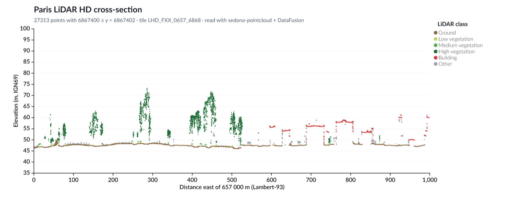
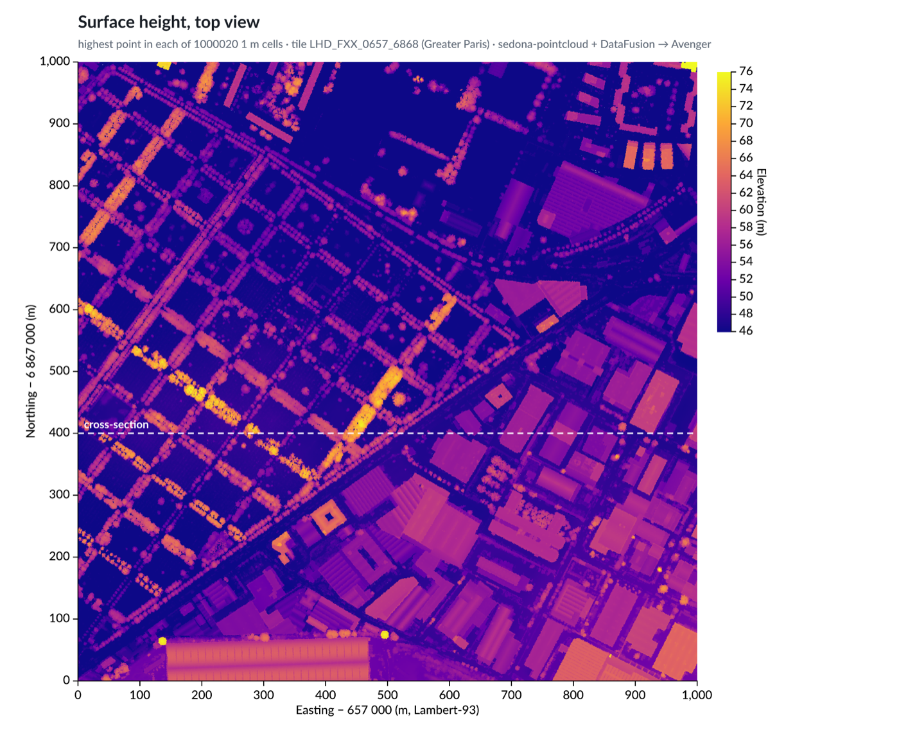
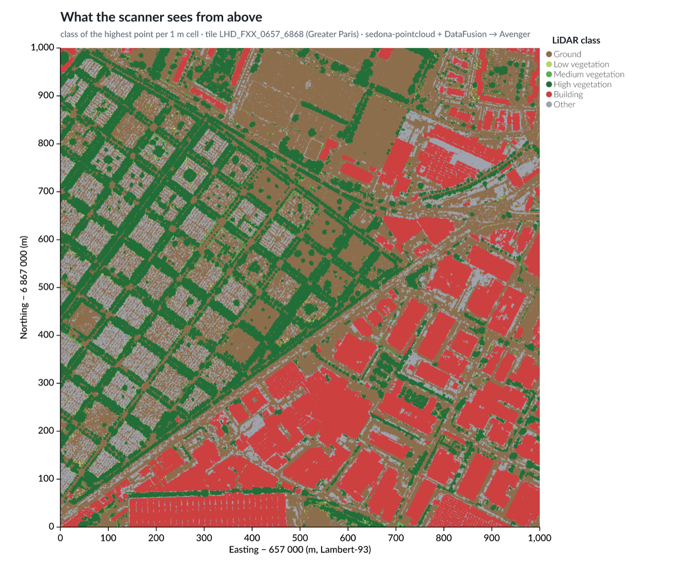
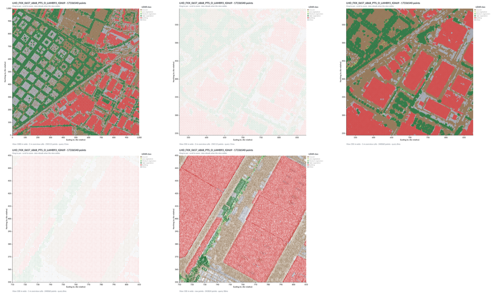
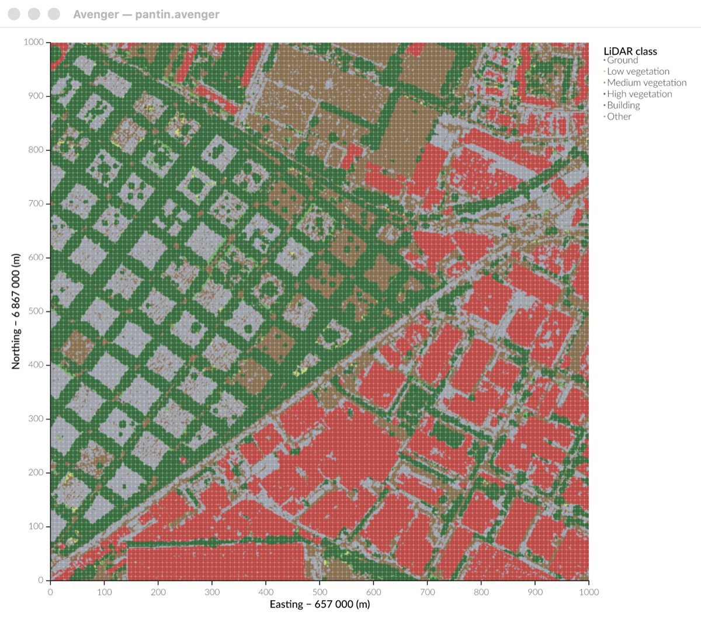
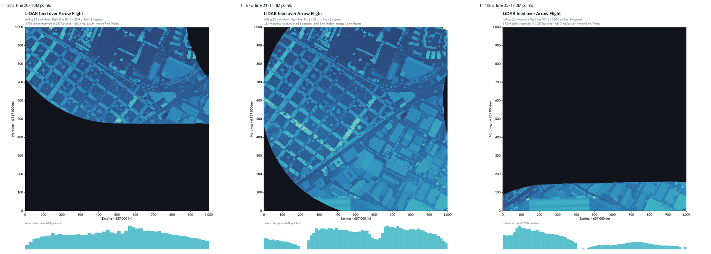
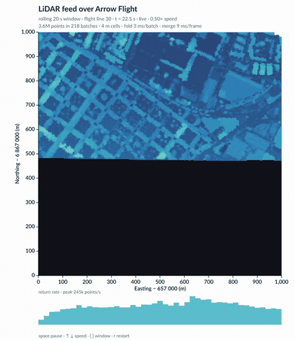

# avenger-sedona-pointcloud

Scatterplots of a real LiDAR point cloud: static charts, an interactive explorer with pan and zoom, a benchmark of window queries, a live feed over Arrow Flight, and the same map written in the experimental Avenger chart language.

The pipeline has no JSON and no browser in between:

```
tile.copc.laz ─► sedona-pointcloud (DataFusion file format)
              ─► SQL ─► Arrow arrays
              ─► Avenger scales, axes, legends ─► wgpu ─► PNG
```

- **Data:** [`sedona-pointcloud`](https://github.com/apache/sedona-db/tree/main/rust/sedona-pointcloud) registers LAS/LAZ (and therefore COPC) as a DataFusion file format, so the point cloud is queried with plain SQL.
- **Charts:** [Avenger](https://github.com/jonmmease/avenger) scales take the resulting Arrow arrays directly, with no conversion.
- **Rendering:** Avenger's offscreen `PngCanvas`, using wgpu.

The input is one 1 km² [IGN LiDAR HD](https://geoservices.ign.fr/lidarhd) tile (17.3 million points) north-east of Paris.

## Charts

### Cross-section

`cross_section`: every point in a 2 m wide west–east strip (27,313 points), coloured by LiDAR class.



### Top views

`topviews` aggregates all 17.3 million points into 1 m cells with one `GROUP BY` query (about 1.2 s). Each cell becomes one point, about 1 million per chart.

| Surface height (highest point per cell) | Class of the highest point |
|---|---|
|  |  |

| Mean return intensity | Every raw point in a 120 × 120 m window |
|---|---|
|  |  |

The core of the top-view query:

```sql
SELECT floor(x - 657000) + 0.5                        AS cx,
       floor(y - 6867000) + 0.5                       AS cy,
       max(z)                                         AS zmax,
       first_value(classification ORDER BY z DESC)    AS top_class,
       avg(intensity)                                 AS intensity
FROM 'data/LHD_FXX_0657_6868_PTS_O_LAMB93_IGN69.copc.laz'
GROUP BY 1, 2
```

### Interactive explorer

`explorer` opens a window: drag to pan, scroll to zoom.

- **At startup:** the tile is loaded into an in-memory DataFusion table (about 2 s), and overview levels of 1, 2, 4, 8 and 16 m cells are built from it (about 0.4 s).
- **While you drag or scroll:** only the view changes. Avenger applies GPU-side scale adjustments, so no data is queried or re-uploaded, and symbols grow with the zoom so the current data stays readable.
- **About 150 ms after the view settles:** the explorer queries data for the new view and swaps it in.
  - When zoomed out, it uses the matching overview level (about 250k cells, 8–11 ms).
  - When zoomed in to at least 3 px per metre, it uses the raw points for the view plus a 20% margin, drawn low to high and capped at 3M points (242,824 points in 37 ms).



*Top row: overview, zoomed to 350 m before the reload, after the reload (1 m cells). Bottom row: zoomed to 100 m before the reload, after the reload (raw points). These frames come from `explorer … --snapshots out`, which renders the same scene headlessly.*

### Fetching a map window: benchmark

`bench_window` compares four ways to fetch the points in a window from this tile (17.3M points):

| Method | 120 × 120 m | 500 × 500 m | Notes |
|---|---|---|---|
| sedona-pointcloud, full scan | 1.1 s | 1.1 s | baseline |
| sedona-pointcloud + chunk statistics | 69 ms | 491 ms | The first query takes 0.84 s because it builds the statistics. `las.persist_statistics` writes a 25 KB `.stats` sidecar, so a new session takes 72 ms. |
| COPC octree via `copc-rs` | 270 ms | 2.9 s | Point-by-point decoding is the bottleneck. Selecting by resolution works: the whole tile at 2 m is 1.9M points in 0.7 s. |
| In-memory table (DataFusion `MemTable`) | 4 ms | 7 ms | Loading takes 1–2 s, and all points stay in RAM. |

Chunk statistics work well on COPC files because every LAZ chunk is an octree node, so a spatial filter skips most of the file. `copc-rs` is taken from git: the crates.io release (0.5.0) does not build with current `las`.

### The same map in the Avenger chart language

[`lang/pantin.avenger`](lang/pantin.avenger) describes the "class from above" map in the experimental Avenger chart language, from the [`jonmmease/facet-fresh-start`](https://github.com/jonmmease/avenger/tree/jonmmease/facet-fresh-start) branch. The chart takes 68 lines, plus 6 in [`lang/catalog.avenger`](lang/catalog.avenger). Its `transform sql` aggregates all 17.3M points into 2 m cells, and the language takes care of the axes, the legend and the layout.

```
transform sql {
  query:
    SELECT "cx", "cy", max("z") AS zmax,
           CASE first_value("classification" ORDER BY "z" DESC)
             WHEN 2 THEN 'Ground' ... ELSE 'Other' END AS class
    FROM (SELECT floor("x" / 2.0) * 2.0 + 1.0 AS cx,
                 floor("y" / 2.0) * 2.0 + 1.0 AS cy, "z", "classification"
          FROM input) AS points
    GROUP BY "cx", "cy"
    ORDER BY zmax;
}
mark symbol as cells {
  fill: encoded "class" { legend: { title: 'LiDAR class'; } scale: ordinal { domain: [...]; range: [...]; } }
  x: encoded "cx" { axis: { title: 'Easting − 657 000 (m)'; } scale: linear { domain: [0.0, 1000.0]; } }
  y: encoded "cy" { ... }
}
```

`avenger watch` shows the chart in a native window and redraws it whenever the file is saved. The first open took 1.8–2.1 s; a reload after switching to 4 m cells took 1.1 s.



The chart language does not read LAZ directly, so `export_parquet` first writes the tile to `lang/pantin_points.parquet` (about 105 MB, 2–3 s; the file is ignored by git). Things noticed while writing this chart:

- A positional `GROUP BY 1, 2` inside `transform sql` fails to plan: the positions become literals. Grouping by named columns in a subquery works.
- The legend reuses the mark's symbol size, so with `size: 4` the legend dots are very small.
- There is no pan or zoom yet in the language. `watch` reloads the file; it does not navigate.

### Live feed over Arrow Flight

The tile records a GPS timestamp for every point, and it was flown as four
flight lines of 21–27 s each. `stream_server` replays those lines in the order
the scanner recorded them, over [Arrow Flight](https://arrow.apache.org/docs/format/Flight.html),
the standard Arrow gRPC protocol — the same Arrow version as the rest of the
pipeline, so batches arrive ready to query. The replay speed is a Flight
ticket: `{"speed": 4.0}`.

`stream_live` consumes that stream and keeps a rolling window of the last
N seconds of scanning:

- **Once per batch:** fold ~16k raw points into per-2 m-cell *states* with
  `maxState(z)` and `countState()` from
  [`avenger-datafusion-aggregate-state`](https://github.com/jonmmease/avenger/pull/123)
  (2–7 ms).
- **Once per frame:** merge the retained states with `maxMerge` / `countMerge`
  into the current picture (2–11 ms). Raw points are never revisited, and
  states that fall out of the window are simply dropped.
- **Redraw:** the feed thread calls `RenderInvalidationHub::request_render`, so
  the window rebuilds when data arrives instead of polling, at most 25 times a
  second.
- **Adaptive grid:** frame cost scales with the number of marks, about 1.4 us
  per cell, so a long window drawn at 2 m would crawl. When the window holds
  more than about 55k cells the states are rolled up to a coarser grid (4 m,
  8 m, …) and back again as it empties. States merge at any resolution, so this
  costs nothing but the grid itself. With the default 20 s window the viewer
  runs at about 11 frames per second instead of 3.

In the viewer:

| Key | Effect |
|---|---|
| space | pause and resume |
| ↑ / ↓ (or + / -) | double or halve the replay speed, 0.25× to 32× |
| [ / ] | shorten or lengthen the rolling window |
| r | restart the flight |

A speed change reconnects with a new Flight ticket carrying the new speed and
the point to resume from, so nothing is replayed twice:

```
client connected: 105.6 s of flight from t = 56.6 s at 2x (24.5 s of wall clock)
```

The window opens at 660 × 760 so it fits a small screen, and the square map
takes whatever room the window leaves, so resizing works and
`--size 1100x1200` opens it larger.



A minute of the replay at half speed, recorded headlessly with
`--record` (the first flight line finishing and the second starting):



The full 60 s recording is [`docs/videos/stream_live_0.5x.mp4`](docs/videos/stream_live_0.5x.mp4).

*Left to right: the first line covering the north, the second line sweeping
south, and the last line, where the rolling window holds only the final
partial pass. The black area is not missing data — it is everything scanned
longer ago than the window.*

```sh
cargo run --release --bin stream_server -- data/LHD_FXX_0657_6868_PTS_O_LAMB93_IGN69.copc.laz
cargo run --release --bin stream_live   -- --speed 4 --window 12
cargo run --release --bin stream_live   -- --speed 1 --size 1100x1200              # larger window
cargo run --release --bin stream_live   -- --speed 8 --window 12 --snapshots out   # headless stills
cargo run --release --bin stream_live   -- --speed 0.5 --record out/frames --fps 12 --record-seconds 60
ffmpeg -framerate 12 -i out/frames/frame_%05d.png -c:v libx264 -preset slow -crf 30 -pix_fmt yuv420p out.mp4
```

`STREAM_DEBUG=1` prints one line per scene rebuild and a feed report every two
seconds with how far the viewer has fallen behind the sensor's clock. The
client keeps up with no measurable lag at every speed up to 32×, where the
whole flight arrives in about three seconds.

Rerun's [`re_datafusion`](https://docs.rs/re_datafusion/) would fit the same
client unchanged — it pins arrow 58.3 and datafusion 54, exactly our versions —
but it needs Rust 1.96, and this repo is built with 1.89.

## Run

```sh
./scripts/download_tile.sh     # ~105 MB into data/
mkdir -p out
cargo run --release --bin cross_section -- data/LHD_FXX_0657_6868_PTS_O_LAMB93_IGN69.copc.laz out/cross_section.png
cargo run --release --bin topviews      -- data/LHD_FXX_0657_6868_PTS_O_LAMB93_IGN69.copc.laz out
cargo run --release --bin explorer      -- data/LHD_FXX_0657_6868_PTS_O_LAMB93_IGN69.copc.laz
cargo run --release --bin bench_window  -- data/LHD_FXX_0657_6868_PTS_O_LAMB93_IGN69.copc.laz
cargo run --release --bin probe_guides  # re-tests the guide pitfalls listed below
```

To use the chart language, build the `avenger` CLI from Jon's experimental branch, then export the data and watch the chart:

```sh
git clone --branch jonmmease/facet-fresh-start https://github.com/jonmmease/avenger ../avenger-facet
cargo build --release -p avenger-lang-cli --manifest-path ../avenger-facet/Cargo.toml   # ~12 min, ~4.5 GB target

cargo run --release --bin export_parquet -- data/LHD_FXX_0657_6868_PTS_O_LAMB93_IGN69.copc.laz
cd lang && ../../avenger-facet/target/release/avenger watch pantin.avenger --scale 2
```

At the time of writing, that branch does not build as-is. `avenger-typst-label/Cargo.toml` declares three optional `typst*` dependencies that point to a local `../../typst` checkout. Remove those dependency lines, empty the `upstream-typst-probe` feature, and delete the `upstream-typst-math-svg-probe` bin entry, or check out Typst at that path.

Rendering needs a GPU adapter that wgpu can use (Metal, Vulkan or DX12).

Timings measured on an Apple Silicon Mac:

| Step | Time |
|---|---|
| Full-scan aggregation over 17.3M points | 1.2 s |
| Filtered query (strip or window) | 1.0 s (full scan; chunk statistics not enabled) |
| Rendering 1M points to a 2× PNG | 0.2–0.3 s |
| Streaming: fold one 16k-point batch into cell states | 2–7 ms |
| Streaming: merge a 12 s window into the current frame | 2–11 ms |
| Streaming: whole frame, ~40k cells | ~90 ms (about 11 fps) |

## Versions and pitfalls

This repo is a snapshot of work in progress on both sides.

- **Arrow and DataFusion versions must match.** Avenger's scales take `ArrayRef`, so both crates need the *same* Arrow version.
  - The `sedona-pointcloud` 0.4.1 release uses Arrow 57 and DataFusion 52.5.
  - Avenger `main` has `arrow = "*"`.
  - This repo therefore pins SedonaDB `main` (DataFusion 54.1, Arrow 58.3) together with the Avenger core PR stack (DataFusion 54, Arrow 58.3).
- **The Avenger stack is a set of open PRs.** This repo pins the top of that stack, `5f31c58` ([#124](https://github.com/jonmmease/avenger/pull/124), `codex/selection`). A pinned commit may disappear if the branch is rebased; if it does, update the `rev` values in `Cargo.toml`. Moving from #120 to #124 needed no code changes here.
- **Minimum Rust version.** With Rust 1.89, generate the lockfile with `CARGO_RESOLVER_INCOMPATIBLE_RUST_VERSIONS=fallback cargo update`, because the newest `ordered-float` needs Rust 1.90.
- **Workarounds for issues found in the Avenger stack.** All of these were re-tested against #124 on 2026-09-20 with `cargo run --release --bin probe_guides`, and all are still needed:
  - `make_colorbar_marks` draws at (0, 0), so the caller must position it; the `origin` argument is now explicitly ignored in the source. In `PngCanvas` the bar carries a real gradient fill but renders as a single colour. `topviews` draws its own colorbar from stacked rects plus an axis.
  - The symbol legend title is placed inside the plot area (x = 8 for a 300-wide plot) while the entries are placed correctly beside it, so these examples draw the title separately.
  - `LinearScale` accepts only a two-value domain (`numeric_interval_domain` rejects anything else). Colour ramps use evenly spaced stops.
- **An issue on Avenger `main`** (fixed in the stack, and still fixed in #124): `make_numeric_axis_marks` always sets a `band` option, which `LinearScale` rejects.

## Data

The LiDAR HD data is © IGN (Institut national de l'information géographique et forestière) and published as open data; check the [IGN LiDAR HD terms](https://geoservices.ign.fr/lidarhd) for the current licence and attribution. The tile is downloaded from the host used by [Giro3D's massive point cloud example](https://giro3d.org/latest/examples/massive-point-cloud.html) and is not stored in this repository.
