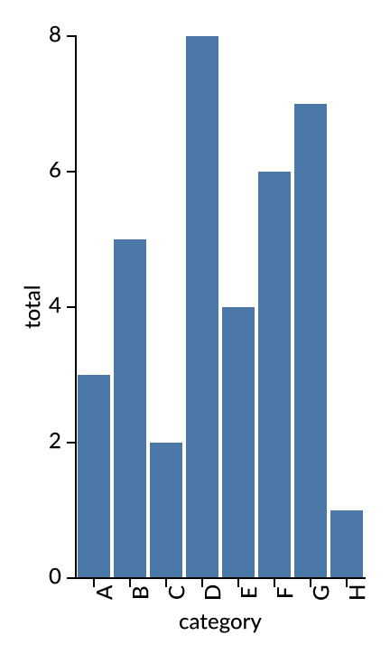
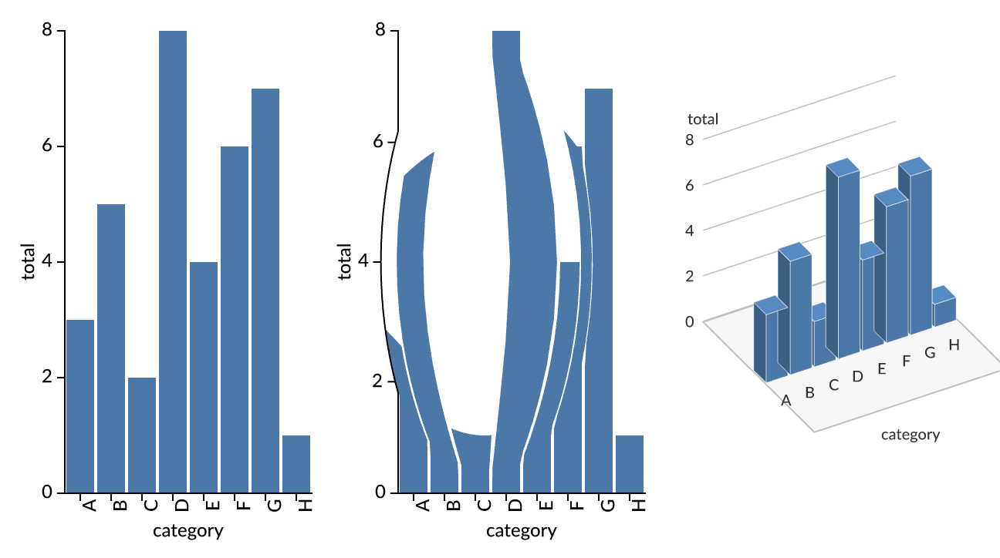

# avenger-altair

Avenger as an opt-in backend for Altair. Altair stays the front end; Avenger
validates the chart and draws it, in-process, with no JavaScript.

```python
import altair as alt
import avenger_altair as av

av.enable()                     # draw with Avenger, validate with Avenger
chart = alt.Chart(df).mark_bar().encode(x="category:N", y="sum(amount):Q")
chart                           # a PNG from Avenger in the notebook
av.save(chart, "bars.png")      # or .svg
av.explain(chart)               # "Avenger draws this chart." or the property that stops it
av.disable()                    # back to what was active before
```



The design, and the steps from here to an Altair whose API and validation come
from Avenger, are in [experiments/08-pipeline-validation/altair-avenger.md](../../experiments/08-pipeline-validation/altair-avenger.md).

## What it does

- **Validation.** `to_dict()` calls `validate` on the top-level chart; enabled,
  that asks Avenger first (`avenger-vegalite-spec`, typed Vega-Lite 6.4.3). A
  spec Avenger takes is valid; one it does not take is checked by Altair's
  JSON Schema as before, so a valid chart outside Avenger's subset stays
  valid, and an invalid chart still raises Altair's `SchemaValidationError`.
- **Rendering.** A renderer, `"avenger"`, compiles the spec to a native chart
  definition (`avenger-vegalite-compiler`) and draws it. A chart Avenger does
  not draw yet falls back to the renderer that was active; `av.last` says
  which one drew the last chart and why, and `enable(fallback=False)` makes
  that an `AvengerRefusal` with the path instead.
- **Data as Arrow.** Enabled, an `"avenger"` data transformer keeps a
  DataFrame and puts only its name in the spec; the renderer hands the frame
  to Avenger through the Arrow PyCapsule interface (`__arrow_c_stream__`:
  pandas, Polars, PyArrow), where it becomes a named `TableSnapshot`. No rows
  are written as JSON. For a chart that falls back, the rows are written back
  into the spec's `datasets` first. `enable(arrow=False)` keeps Altair's
  transformer.
- **Altair's default theme.** Every Altair chart carries
  `config.view.continuousWidth/Height`; Avenger reads no `config` yet, so that
  one config is written out as the width or height Vega-Lite would give a
  continuous axis. Any other config is left for Avenger to refuse.

## Without Rust: the schema and its rules

[`python/avenger_altair/avenger-vegalite.schema.json`](python/avenger_altair/avenger-vegalite.schema.json)
(18.8 KB, JSON Schema draft 2020-12) is generated from Avenger's own spec
types. Structure, types, choices and numeric ranges are JSON Schema; the
rules JSON Schema cannot state are CEL over `self` in `x-avenger-rules`, on
the definition they belong to, as Kubernetes attaches CEL to OpenAPI
(`x-kubernetes-validations`):

| Where | Rule |
|---|---|
| root | parameter names are distinct |
| `BinParams` | `extent` is ordered; `steps` strictly increase |
| `AggregateTransform` | output aliases are distinct |
| `BinTransform` | the two boundary aliases differ |

`avenger_altair.portable.validate(spec)` runs it with `jsonschema` and
`cel-python`, and no compiled code: `jsonschema`'s validator, extended with
the keyword `x-avenger-rules`, runs each rule on every instance node its
subschema matches. The schema is what Altair's generator would read in place
of Vega-Lite's (step 3 of the design).

**Altair's own generator reads it.** `python bench/altair_generator.py <altair checkout> <out>`
runs `tools/generate_schema_wrapper.py` from an Altair checkout (changing
nothing in it) on this schema, after renaming `$defs` to draft-07
`definitions` and giving two definitions the names the generator looks up
(`FacetedEncoding` for `Encoding`, a stub `RepeatRef`):

| Generator step | Result |
|---|---|
| core classes | 38 classes |
| channel classes | 9 (`X`, `Y`, `X2`, `Y2` and their variants), with shorthand |
| mark mixin | `mark_bar()`, called with Avenger's names (`MarkType`, `BarMark`) instead of Altair's fixed Vega-Lite list |
| config mixin | `configure()`, `configure_view()`, now that Avenger's types have `config` |
| camera mixin (ours, after Altair's `MARK_METHOD`) | `camera_flat()`, `camera_fisheye()`, `camera_tilt()`, one per `Camera` variant in the schema |

With a small `Chart` over the generated classes (the generated top-level
class with the three mixins and an `encode()` on the generated channels),
`Chart(df).mark_bar(opacity=0.9).encode(x="category:N", y=channels.Y("sum(amount):Q", title="total")).properties(height=300).configure_view(stroke=None)`
validates and Avenger draws it. Two changes to the schema were needed for
the generator: `Camera`'s variants as `anyOf` (it has no case for `oneOf`),
and no constraint-only `anyOf` branches (below).

A bar chart built with the generated classes
(`core.TopLevelUnitSpec(data=…, mark="bar", encoding=core.Encoding(x=channels.X("category:N"), y=channels.Y("sum(amount):Q", title="total")))`)
validates in `to_dict()` against Avenger's schema (365 µs, where Altair's
`to_dict()` takes 1,069 µs), and Avenger draws it, byte for byte the PNG
drawn from Altair's own API. The generated classes refuse what Avenger
cannot draw, in Altair's words: "'point' is an invalid value for `type`.
Valid values are one of ['bar']." The first run failed on constraint-only
`anyOf` branches (`{"required": ["field"]}`), which the generator reads as
a union of types; those rules moved into CEL, and the parity test above
still agrees on 2,992 of 3,008.

The schema comes from a change to `avenger-vegalite-spec`
(now carried in this repo as [`crates/avenger-vegalite-spec`](../avenger-vegalite-spec/VENDORED.md), against `f4890be`): a `schema` feature deriving `schemars::JsonSchema`, the
schema of the five types with their own `Deserialize` written by hand, and
`examples/json_schema.rs`, which printed the file here:
`cargo run -p avenger-vegalite-spec --features schema --example json_schema`.

**Does it accept what Rust accepts?** `python bench/schema_parity.py <avenger checkout at f4890be>`
judges 3,008 specs both ways: 12 seeds (Avenger's fixtures and examples, and
Altair bar charts), each mutated on every node (an unknown key, null, wrong
types, out-of-range numbers, removed properties) and with each rule broken
on purpose. 2,992 agree (99.47 %). The 16 that differ are all one thing, and
it is Rust's: a JSON array where an object belongs (`"encoding": []`,
`"axis": []`) is accepted by the Rust types and refused by the schema, as
Vega-Lite refuses it (FINDINGS.md 23).

| Per spec, warm | Bar chart | Histogram (`bin`) |
|---|---|---|
| Rust, from Python (`avenger-vegalite-spec` alone; [`avenger-vegalite-py`](../avenger-vegalite-py/) is a 1.0 MB module for just this) | 5.0 µs | 6.3 µs |
| Avenger's JSON Schema only (`jsonschema`) | 155 µs | 203 µs |
| JSON Schema + CEL (`jsonschema` + `cel-python`) | 424 µs | 13,378 µs |
| Altair's validation, the whole Vega-Lite schema | 705 µs | |
| JSON Schema + CEL in JavaScript (`ajv` + cel-js), all 3,008 specs | 4.3 µs | |

The same file runs in JavaScript: [`js/portable.mjs`](js/portable.mjs)
compiles the schema with `ajv` (draft 2020-12) and adds `x-avenger-rules` as
a keyword whose rules cel-js evaluates. On the same 3,008 specs
(`python bench/schema_parity.py <checkout> --dump specs.jsonl`, then
`node js/parity.mjs specs.jsonl`) it gives the same verdicts as Python's, so
the same 2,992 agree with Rust and the same 16 arrays differ; it takes 4.3 µs
a spec warm (15 µs on the first pass), faster than calling Rust from Python.

The small schema alone validates 3.5–4.5 times faster than Vega-Lite's.
cel-python is the slow part, and it sets one bound: CEL has no loop over
indices, so "steps strictly increase" is `all` over a literal index list;
a chain of comparisons exceeded cel-python's recursion limit, and `all` over
32 indices took more than 40 s where 16 took 14 ms, so the rule checks the
first 16 steps (Vega's default has two).

## Build

```sh
cd crates/avenger-altair && maturin develop --release
cargo run --release -p avenger-altair -- render spec.json out.png 10   # stages, mean of 10
python bench/coverage.py ~/vega/altair/tests/examples_methods_syntax    # the gallery
```

## Measured

26 Sep 2026, Avenger `f4890be`, Altair 6.3.0, Apple Silicon, Python 3.11.6.
An 8-row bar chart (`x="category:N", y="sum(amount):Q"`), warm.

| | Time |
|---|---|
| Altair's JSON Schema validation | 705 µs |
| Avenger's validation, from Python (with the theme written out and `json.dumps`) | 13.5 µs |
| … of which in Rust | 6.5 µs |
| `to_dict()`, Altair as it is | 1,069 µs |
| `to_dict()` with `av.enable()` | 735 µs |
| `to_dict()` for a chart outside Avenger's subset (both checks run) | 1,148 µs |
| draw to PNG: validate, compile, render, export | 0.02 + 0.7 + 4.3 + 14.1 ms |
| draw to SVG | 0.05 + 1.8 + 5.4 + 341 ms |

### Camera: fisheye and tilt

`camera` is grammar Avenger's spec has and Vega-Lite has not (Vega-Lite's
`view` is the plot background): `{"type": "fisheye", "focus", "radius",
"distortion"}` or `{"type": "tilt", "yaw", "elevation"}`, after experiment
7's views. Enabled, Altair's `Chart` gets `camera_flat()`, `camera_fisheye()`
and `camera_tilt()`, made from the variants in Avenger's schema, so new
grammar there is a new method here:

```python
chart.camera_fisheye(focus=[0.35, 0.5], radius=0.45)
chart.camera_tilt(yaw=30, elevation=35)
```



Avenger's compiler ignores the camera; the bridge applies it to the scene
Avenger renders (`src/camera.rs`). The fisheye (Sarkar-Brown, in the plot's
unit square) turns bars into polygons with subdivided edges and moves grid
lines, ticks and labels with it; the tilt stands the bars up as shaded
blocks on a ground plane, with the value lines on a back wall and the
labels in front of their block, drawn back to front. Both draw to PNG in
16–18 ms, against 14 ms flat. A camera Avenger refuses is reported by
Avenger ("camera.elevation: expected a finite number above 0, at most 90"),
not by Vega-Lite's schema, which does not know the property; a chart that
falls back to Vega has its camera removed. The tilt stands up rect marks
only, which is all the compiler draws so far.

### Live data

`av.live(chart)` compiles the chart once over its DataFrame, as a
replaceable table input of Avenger's dataflow (`compile_vegalite_with_input`,
after Avenger's `streaming_bars`); `append(frame)` hands new rows over as
Arrow, and `png()` draws the rows so far. A histogram fed 10,000 rows at a
time (`python bench/live.py 10000 100`):

| Rows | `append` | draw | the same rows drawn from scratch |
|---|---|---|---|
| 20k | 0.39 ms | 24.6 ms | 26.6 ms |
| 100k | 0.28 ms | 24.2 ms | 27.7 ms |
| 500k | 0.37 ms | 31.1 ms | 34.9 ms |
| 1M | 0.35 ms | 39.2 ms | 44.6 ms |

Appending costs the same at any size. Drawing grows with the table, because
each frame recomputes the dataflow over all rows, and compiling is cheap
(2–5 ms), so compiling once gains little. A draw that does not grow with the
table needs incremental aggregation (Avenger's
`avenger-datafusion-aggregate-state`, the rolling states of experiment 3);
that is not wired here.

### Large data

A histogram (`bin` with 20 bins, `count()`) over N normal values, to PNG at
scale 2, warm; `python bench/large.py 10000 100000 1000000 3000000`.

| N | Avenger, Arrow | Avenger, JSON rows | VegaFusion + vl-convert | vl-convert | matplotlib `hist` |
|---|---|---|---|---|---|
| 10k | 35 ms | 57 ms | 427 ms | 431 ms | 50 ms |
| 100k | 38 ms | 273 ms | 506 ms | 744 ms | 32 ms |
| 1M | **48 ms** | 2,184 ms | 519 ms | 3,131 ms | 37 ms |
| 3M | **83 ms** | refused (budget) | 482 ms | not run | 52 ms |

With JSON rows at 1M, the time is Altair's `to_dict` (975 ms), `json.dumps`
(545 ms), and in Rust parsing the rows (221 ms) and turning them into Arrow
(144 ms); the chart itself, binning and counting and drawing, is about 50 ms.
With Arrow, `to_dict` takes 2 ms and the rest is the chart. At 3M the process
peaks 121 MB above where it started, for a 24 MB column.

This is the question of vega/altair#3035
([Jon's reply, 2024](https://github.com/vega/altair/discussions/3035#discussioncomment-10647136)):
then, `avenger-png` drew a 3M-point line in 34.9 s because Vega built the
scenegraph row by row before Avenger drew it, and passing tables as JSON cost
about a second per million rows each way. The present stack answers both:
Vega-Lite compiles to a DataFusion dataflow over columns, and the table
arrives as Arrow. The comparison is not like for like: that chart was a line,
which Avenger's compiler does not draw yet; this one is a histogram.

Avenger's dataflow charges what active queries materialise against a budget,
256 MB by default. The charge grows faster than the data (22 MB for 100k
rows, 1.98 GB for 1M, 17.7 GB for 3M, JSON or Arrow alike), so the default
refuses a histogram over 1M rows; the bridge sets 64 GiB
(`AVENGER_MAX_MATERIALIZED_BYTES` overrides it). The cause is that each
batch is charged for the whole buffers it shares with other batches;
charging the slice makes it linear, 32 bytes a row
([`bench/charge-slices.patch`](bench/charge-slices.patch), FINDINGS.md 22).

SVG is the default in Vega's notebooks, but here 139 of its 148 KB is one
embedded font and nearly all its time is spent there, so the renderer
defaults to PNG ([FINDINGS.md](../../FINDINGS.md) 20). `enable(format="svg")`
switches.

Coverage: none of the 117 Altair gallery examples that run here compiles to
Avenger yet; the compiler draws bar charts (bars, ranges, aggregates,
histograms, stacks), and the gallery's first refusals are layers, other marks,
colour and composition (FINDINGS.md 21). A plain Altair bar chart, as above,
is drawn.

## Not built, not checked

- The PNG and SVG were checked to be produced and non-empty, and the PNG by
  eye; they were not compared pixel by pixel with Vega-Lite's rendering.
- PDF: the compiler's `pdf` feature needs rustc 1.92.
- A validator hook in Altair itself; this bridge replaces `Chart.validate` on
  `enable()` and restores it on `disable()`. `LayerChart` and the
  concatenated charts are not hooked, since Avenger draws none of them yet.
- Frames with nested or object columns were not tried on the Arrow path;
  the frames above have one float column, and the bar chart one string and
  one integer column.
- The large-data comparison is a histogram; a line or scatter plot of
  millions of points waits for those marks in Avenger's compiler.
- Interaction and the notebook widget.
- The mark and config mixins, `alt.Chart` itself (`api.py`) and the rest of
  Altair's package were not generated from Avenger's schema; the generated
  core and channels were used on their own.
