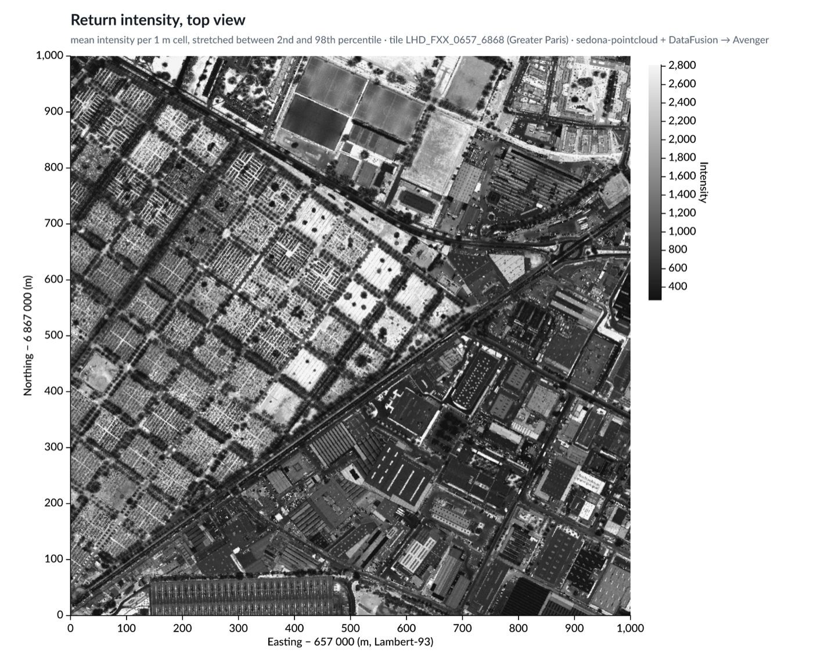
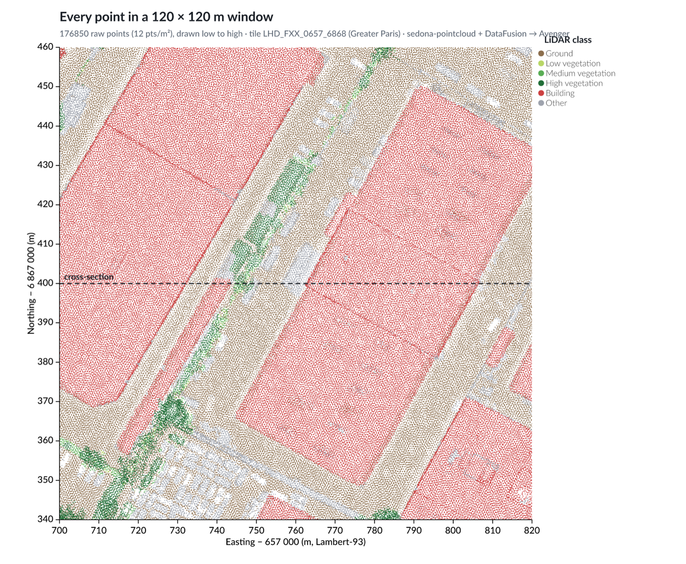

# Experiment 1 — charts of a point cloud

Can Avenger draw a real point cloud straight from a DataFusion query, with no
JSON and no browser in between? Static charts, an interactive explorer, and a
benchmark of the four ways to fetch a map window.

```
tile.copc.laz ─► sedona-pointcloud (DataFusion file format)
              ─► SQL ─► Arrow arrays
              ─► Avenger scales, axes, legends ─► wgpu ─► PNG
```

## Run

```sh
../../scripts/download_tile.sh     # ~105 MB into data/, from the repo root
cargo run --release -p lidar-charts --bin cross_section -- data/LHD_FXX_0657_6868_PTS_O_LAMB93_IGN69.copc.laz out/cross_section.png
cargo run --release -p lidar-charts --bin topviews      -- data/LHD_FXX_0657_6868_PTS_O_LAMB93_IGN69.copc.laz out
cargo run --release -p lidar-charts --bin explorer      -- data/LHD_FXX_0657_6868_PTS_O_LAMB93_IGN69.copc.laz
cargo run --release -p lidar-charts --bin bench_window  -- data/LHD_FXX_0657_6868_PTS_O_LAMB93_IGN69.copc.laz
```

Paths are relative to the repo root; run the commands from there.

### Cross-section

`cross_section`: every point in a 2 m wide west–east strip (27,313 points), coloured by LiDAR class.


### Top views

`topviews` aggregates all 17.3 million points into 1 m cells with one `GROUP BY` query (about 1.2 s). Each cell becomes one point, about 1 million per chart.

| Surface height (highest point per cell) | Class of the highest point |
|---|---|
|  |  |

| Mean return intensity | Every raw point in a 120 × 120 m window |
|---|---|
|  |  |

The core of the top-view query:

```sql
SELECT floor(x - 657000) + 0.5                        AS cx,
       floor(y - 6867000) + 0.5                       AS cy,
       max(z)                                         AS zmax,
       first_value(classification ORDER BY z DESC)    AS top_class,
       avg(intensity)                                 AS intensity
FROM 'data/LHD_FXX_0657_6868_PTS_O_LAMB93_IGN69.copc.laz'
GROUP BY 1, 2
```

### Interactive explorer

`explorer` opens a window: drag to pan, scroll to zoom.

- **At startup:** the tile is loaded into an in-memory DataFusion table (about 2 s), and overview levels of 1, 2, 4, 8 and 16 m cells are built from it (about 0.4 s).
- **While you drag or scroll:** only the view changes. Avenger applies GPU-side scale adjustments, so no data is queried or re-uploaded, and symbols grow with the zoom so the current data stays readable.
- **About 150 ms after the view settles:** the explorer queries data for the new view and swaps it in.
  - When zoomed out, it uses the matching overview level (about 250k cells, 8–11 ms).
  - When zoomed in to at least 3 px per metre, it uses the raw points for the view plus a 20% margin, drawn low to high and capped at 3M points (242,824 points in 37 ms).


*Top row: overview, zoomed to 350 m before the reload, after the reload (1 m cells). Bottom row: zoomed to 100 m before the reload, after the reload (raw points). These frames come from `explorer … --snapshots out`, which renders the same scene headlessly.*

### Fetching a map window: benchmark

`bench_window` compares four ways to fetch the points in a window from this tile (17.3M points):

| Method | 120 × 120 m | 500 × 500 m | Notes |
|---|---|---|---|
| sedona-pointcloud, full scan | 1.1 s | 1.1 s | baseline |
| sedona-pointcloud + chunk statistics | 69 ms | 491 ms | The first query takes 0.84 s because it builds the statistics. `las.persist_statistics` writes a 25 KB `.stats` sidecar, so a new session takes 72 ms. |
| COPC octree via `copc-rs` | 270 ms | 2.9 s | Point-by-point decoding is the bottleneck. Selecting by resolution works: the whole tile at 2 m is 1.9M points in 0.7 s. |
| In-memory table (DataFusion `MemTable`) | 4 ms | 7 ms | Loading takes 1–2 s, and all points stay in RAM. |

Chunk statistics work well on COPC files because every LAZ chunk is an octree node, so a spatial filter skips most of the file. `copc-rs` is taken from git: the crates.io release (0.5.0) does not build with current `las`.

