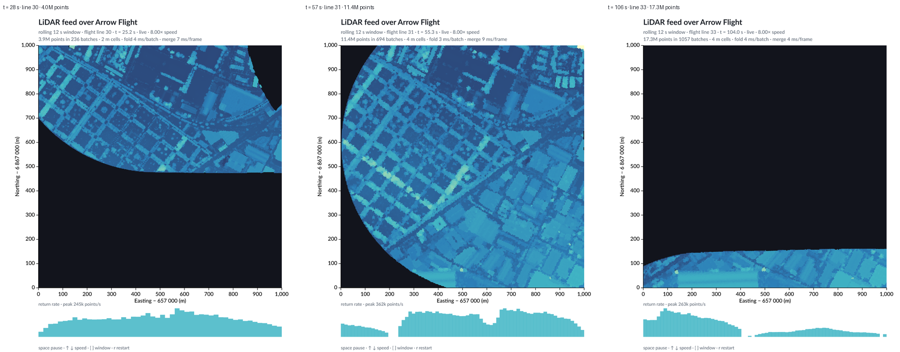

# Experiment 3 — a live feed over Arrow Flight

The tile as a live sensor: its points carry a GPS timestamp and it was flown as
four lines, so it can be replayed in the order the scanner recorded it. The
viewer keeps a rolling window of the last N seconds using merge states, and
redraws when data arrives.

## Run

Two terminals, from the repo root:

```sh
cargo run --release -p lidar-stream --bin stream_server -- data/LHD_FXX_0657_6868_PTS_O_LAMB93_IGN69.copc.laz
```

```sh
cargo run --release -p lidar-stream --bin stream_live -- --speed 4 --window 20
```

Headless, for stills and for filming:

```sh
cargo run --release -p lidar-stream --bin stream_live -- --speed 8 --window 12 --snapshots out
cargo run --release -p lidar-stream --bin stream_live -- --speed 0.5 --record out/frames --fps 12 --record-seconds 60
ffmpeg -framerate 12 -i out/frames/frame_%05d.png -c:v libx264 -preset slow -crf 30 -pix_fmt yuv420p out.mp4
```


The tile records a GPS timestamp for every point, and it was flown as four
flight lines of 21–27 s each. `stream_server` replays those lines in the order
the scanner recorded them, over [Arrow Flight](https://arrow.apache.org/docs/format/Flight.html),
the standard Arrow gRPC protocol — the same Arrow version as the rest of the
pipeline, so batches arrive ready to query. The replay speed is a Flight
ticket: `{"speed": 4.0}`.

`stream_live` consumes that stream and keeps a rolling window of the last
N seconds of scanning:

- **Once per batch:** fold ~16k raw points into per-2 m-cell *states* with
  `maxState(z)` and `countState()` from
  [`avenger-datafusion-aggregate-state`](https://github.com/jonmmease/avenger/pull/123)
  (2–7 ms).
- **Once per frame:** merge the retained states with `maxMerge` / `countMerge`
  into the current picture (2–11 ms). Raw points are never revisited, and
  states that fall out of the window are simply dropped.
- **Redraw:** the feed thread calls `RenderInvalidationHub::request_render`, so
  the window rebuilds when data arrives instead of polling, at most 25 times a
  second.
- **Adaptive grid:** frame cost is dominated by rebuilding the scene's
  geometry index, about 1.2 us per mark, so a long window drawn at 2 m would
  crawl (see [FINDINGS.md](../../FINDINGS.md)). When the window holds more than about
  55k cells the states are rolled up to a coarser grid (4 m, 8 m, …) and back
  again as it empties. States merge at any resolution, so this costs nothing
  but the grid itself. With the default 20 s window the viewer runs at about 11
  frames per second instead of 3.

In the viewer:

| Key | Effect |
|---|---|
| space | pause and resume |
| ↑ / ↓ (or + / -) | double or halve the replay speed, 0.25× to 32× |
| [ / ] | shorten or lengthen the rolling window |
| r | restart the flight |

A speed change reconnects with a new Flight ticket carrying the new speed and
the point to resume from, so nothing is replayed twice:

```
client connected: 105.6 s of flight from t = 56.6 s at 2x (24.5 s of wall clock)
```

The window opens at 660 × 760 so it fits a small screen, and the square map
takes whatever room the window leaves, so resizing works and
`--size 1100x1200` opens it larger.



A minute of the replay at half speed, recorded headlessly with
`--record` (the first flight line finishing and the second starting):


The full 60 s recording is [`video/stream_live_0.5x.mp4`](video/stream_live_0.5x.mp4).

*Left to right: the first line covering the north, the second line sweeping
south, and the last line, where the rolling window holds only the final
partial pass. The black area is not missing data — it is everything scanned
longer ago than the window.*


`STREAM_DEBUG=1` prints one line per scene rebuild and a feed report every two
seconds with how far the viewer has fallen behind the sensor's clock. The
client keeps up with no measurable lag at every speed up to 32×, where the
whole flight arrives in about three seconds.

Rerun's [`re_datafusion`](https://docs.rs/re_datafusion/) would fit the same
client unchanged — it pins arrow 58.3 and datafusion 54, exactly our versions —
but it needs Rust 1.96, and this repo is built with 1.89.

