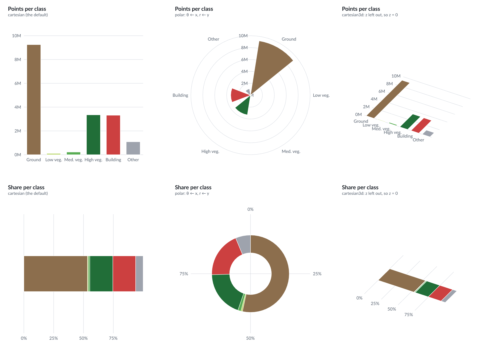
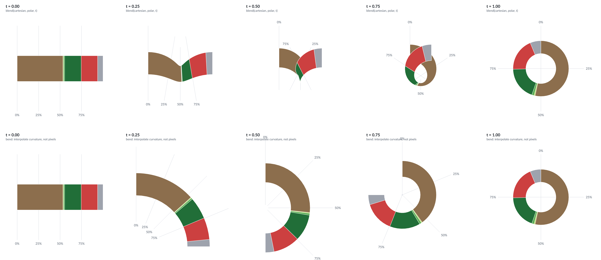
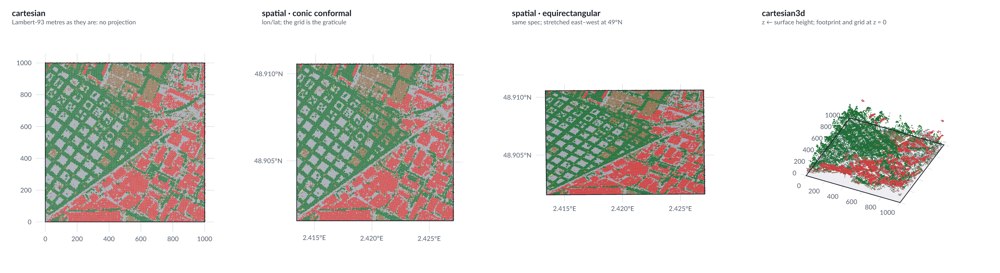
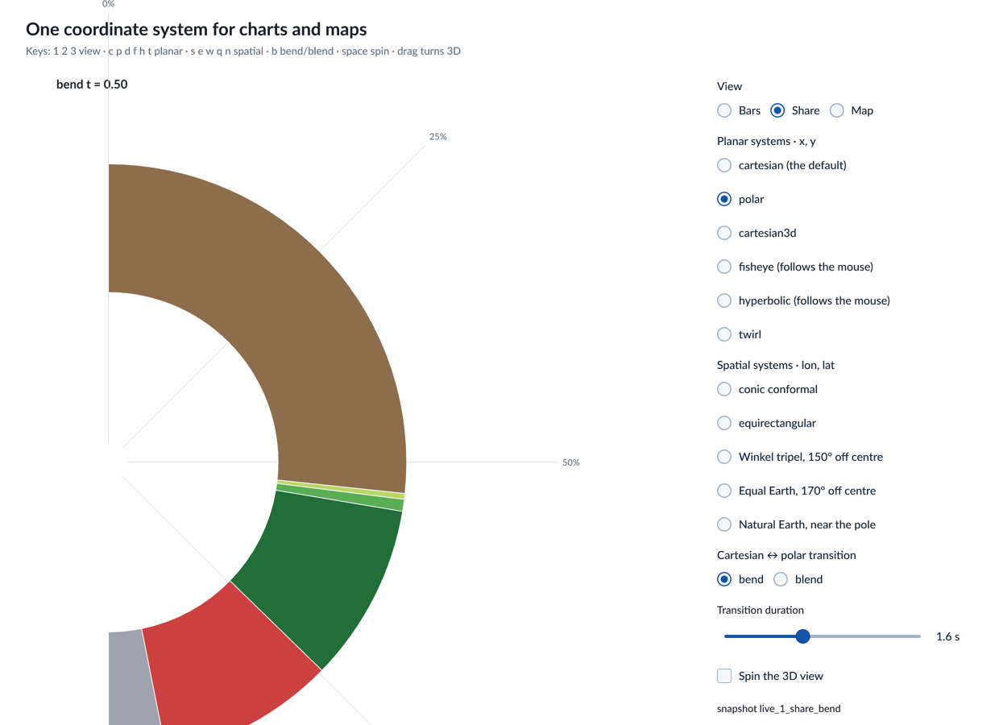
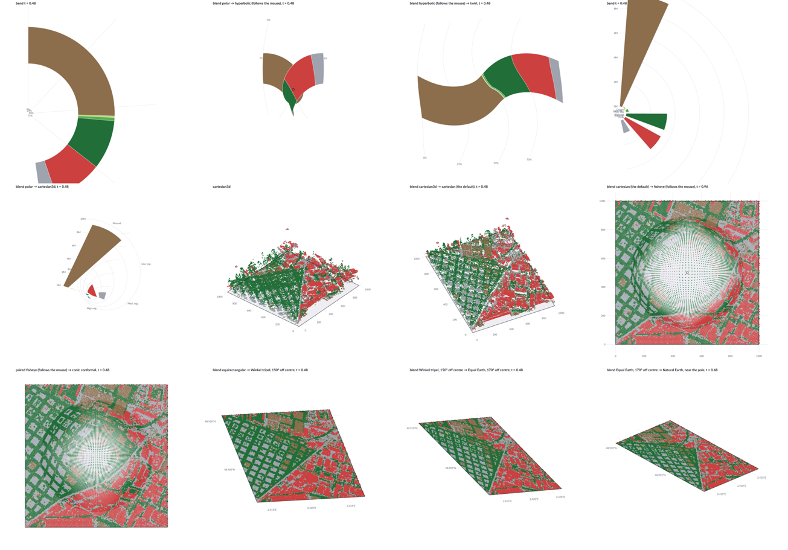
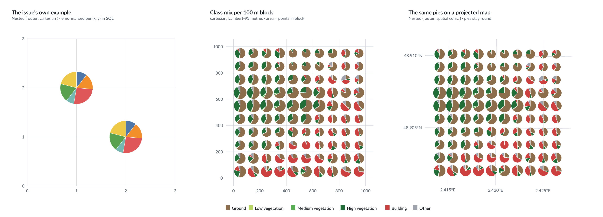

# Experiment 5 — one coordinate system for charts and maps

Status: prototype run against the pinned stack (`5f31c58`), 22 Sep 2026.

What does it take to have a single, general coordinate transform in Avenger,
with Cartesian as the default and map projections as just some of the options?
GMT works this way: `-JX` for a plain Cartesian plot is one entry in the same
list as `-JM` for Mercator. Avenger does not yet:

- A geographic projection is a separate thing (`avenger-geo`, #102). A
  geoshape cannot be layered with a scatter chart in the same frame without
  going through the projection by hand.
- A bar chart cannot be turned into a donut. That would be the same marks with
  the Cartesian transform swapped for a polar one.
- On a map the grid is called a *graticule* and is generated separately. It is
  really the grid of the coordinate system: lines of constant input value,
  passed through the transform.
- A map that is already projected (such as the Lambert-93 tile these experiments
  use) needs `identity` with `reflectY: true`. Under a Cartesian default it
  would need nothing.

## Where the stack stands

| | Branch | Coordinate systems |
|---|---|---|
| Core stack | `codex/*` up to #129, pinned here at `5f31c58` | None. `avenger-geo` is a standalone d3-geo port: projections, resampling, clipping and graticule. The chart layer (#127) has no coordinate abstraction. |
| Chart language | `jonmmease/facet-fresh-start` | A `CoordinateSystem` trait in `avenger-chart-core`. Each system declares its `required_channels()` and its own guide type, and has one crate: `-cartesian`, `-polar`, `-geo`, `-parallel` and `-treemap`. **Marks are generic over the system.** `avenger-chart-polar` has line, symbol, text and subplot marks, but no rect mark. |

The chart-language design lets the coordinate system decide which channels
exist. Jon prefers this because validation and completion then know that `z`
is only valid under `cartesian3d`. The open question from that discussion:

> What happens visually if a chart has only `x` and `y`, and one switches from
> `cartesian` to `cartesian3d`?

## Hypothesis

A coordinate system needs very little:

1. **A list of channels, each either required or with a default.** For
   `cartesian3d`, `z` defaults to 0. A 2D chart does not become invalid under
   3D. It lies flat on the `z = 0` plane, which the view can tilt.
2. **A point transform from scaled channel values to pixels.**
3. **A line transform.** A straight line in data space becomes a curve under
   polar or a projection. For Cartesian the line transform is the identity. A
   generic system samples the line adaptively. A spherical one needs
   great-circle resampling and antimeridian cutting, which `avenger-geo`
   already has.
4. **A flag saying whether the transform is *rectilinear***, meaning it keeps
   rectangles as rectangles. When it does, rects stay native rect instances on
   the GPU. When it does not, a rect becomes a polygon, and the polygon becomes
   a path.

Everything else is derived. The grid is the image of constant-value lines, and
a morph is a transform that interpolates between two others. If this holds,
marks do not have to be generic over the coordinate system: one rect mark
covers the bar, the donut segment and the tilted bar.

## Plan

A crate `lidar-coords` holding a small prototype trait, all fed from the same
LiDAR tile. The first six systems were the plan; the rest were added once the
live viewer existed:

| System | Channels | Rectilinear | Line transform |
|---|---|---|---|
| `Cartesian` | x, y | yes | identity |
| `Polar` | θ ← x, r ← y | no | adaptive sampling |
| `Spatial { projection }` | lon, lat (degrees, unscaled) | no | `avenger-geo`: resampling, clipping |
| `Cartesian3d { yaw, elevation }` | x, y, z (z = 0 by default) | no | adaptive sampling |
| `Blend(a, b, t)` | those of `a` | no | adaptive sampling |
| `Bend { t }` | x, y | only at t = 0 | adaptive sampling |
| `Paired(a, b, t)` | those of `a`, then those of `b` | no | adaptive sampling |
| `Fisheye { focus }` | x, y | no | adaptive sampling |
| `Hyperbolic { focus }` | x, y | no | adaptive sampling |
| `Twirl` | x, y | no | adaptive sampling |
| `Spatial`: Winkel tripel, Equal Earth, Natural Earth | lon, lat | no | `avenger-geo` |

`Bend` was added after `Blend` turned out to be a poor morph, and `Paired`
after transitions between `cartesian` and `spatial` turned out to need both
input encodings (see below). The last three map projections are rotated so the
tile lies far from the projection centre. That is the only way a 1 km tile
shows any distortion.

Figures, each drawn with a single mark specification and only the coordinate
system changed:

1. **Bars.** Point counts per LiDAR class, and the same counts as one stacked
   share bar. Drawn under `Cartesian`, `Polar` and `Cartesian3d`, which gives a
   rose chart, a donut, and bars lying on a tilted floor.
2. **Morph.** The stacked bar blended into the donut in five steps.
3. **Maps.** The tile as 5 m cells (scatter), its footprint polygon (geoshape)
   and the grid:
   - under `Cartesian`, in Lambert-93 metres with no projection;
   - under `Spatial` with a conic conformal projection, using lon/lat obtained by
     inverting Lambert-93, where the grid becomes the graticule;
   - under `Cartesian3d` with `z` = surface height.

Measurements:

- the time to project each figure;
- how many vertices a rect becomes when the system is not rectilinear;
- how far the spherical conic projection deviates from the Lambert-93 grid in
  pixels, as a check that `Spatial` and `Cartesian` agree on the same tile.

## Run

```sh
./scripts/download_tile.sh      # from the repo root, if data/ is empty
cargo run --release -p lidar-coords --bin coords -- \
  data/LHD_FXX_0657_6868_PTS_O_LAMB93_IGN69.copc.laz experiments/05-coordinate-systems/images
cargo test --release -p lidar-coords    # Lambert-93 inverse against IGN's origin

T=data/LHD_FXX_0657_6868_PTS_O_LAMB93_IGN69.copc.laz
cargo run --release -p lidar-coords --bin coords_live -- $T                          # the window
cargo run --release -p lidar-coords --bin coords_live -- $T --snapshots out/coords_live
cargo run --release -p lidar-coords --bin coords_live -- $T --tour out/tour_frames   # 1,125 frames
cargo run --release -p lidar-coords --bin coords_live -- $T --record out/fisheye_frames
ffmpeg -framerate 30 -i out/tour_frames/frame_%05d.png -c:v libx264 -preset slow -crf 30 \
  -pix_fmt yuv420p experiments/05-coordinate-systems/video/tour.mp4
```

`--snapshots`, `--tour` and `--record` render the window's scene headlessly, so
no window capture is involved.

| File | What it holds |
|---|---|
| [coords.rs](src/coords.rs) | The trait, channel resolution, adaptive sampling, and every system |
| [draw.rs](src/draw.rs) | Points, rects, geoshapes and the grid, drawn through any system |
| [specs.rs](src/specs.rs) | The queries and the three chart specifications (bars, share, map) |
| [bin/coords.rs](src/bin/coords.rs) | The figures and measurements below |
| [bin/coords_live.rs](src/bin/coords_live.rs) | The live viewer, snapshots, and the two recorded videos |

Leaving out `name()`, the trait has six methods, and the last four have defaults:

```rust
trait CoordinateSystem {
    fn channels(&self) -> Vec<Channel>;          // name, default (None = required), extent
    fn project(&self, p: &[f64]) -> Option<Screen>;
    fn is_rectilinear(&self) -> bool { false }
    fn project_line(&self, pts, closed) -> Vec<Vec<Screen>> { /* adaptive sampling */ }
    fn depth(&self, p: &[f64]) -> f64 { 0.0 }     // painter's order, 3D only
    fn label_side(&self, i: usize) -> (f64, f64) // where tick labels go
}
```

## Results

### One bar specification, three systems



`bars()` and `stack()` never mention a coordinate system. Under `polar`, the
per-class bars become a rose, and the stacked bar becomes a donut. The donut
needs no inner-radius option: its hole is simply the bar's position in `y`,
from 0.35 to 0.65. Under `cartesian3d`, the same marks lie flat on the floor.

This answers the open question. With only `x` and `y`, switching to
`cartesian3d` resolves `z` to its default and tilts the view, and nothing
becomes invalid. Validation still works as Jon wants, because the system owns
the channel list:

```
cartesian    ["x", "y"]       ok
cartesian3d  ["x", "y"]       ok, z = 0 (default)
cartesian    ["x", "y", "z"]  error: `z` is not a channel of cartesian; it has x, y
cartesian3d  ["x", "z"]       error: cartesian3d requires `y`
```

A 2D bar in 3D stays a flat rectangle. An upright 3D bar needs a second z
value (`z2`, an extrusion) and is a different mark, not a different system.

### The cost of a system that is not rectilinear

| System | Six bars drawn as | Vertices, per-class bars | Vertices, stacked bar |
|---|---|---|---|
| `cartesian` | rect instances | 24 | 24 |
| `polar` | paths | 56 | 142 |
| `cartesian3d` | paths | 36 | 32 |

Only `cartesian` keeps rects as rect instances. Every other system turns each
rect into a sampled ring and draws it as a path (0.25 px tolerance). For six
bars that costs nothing (0.1–0.3 ms to build). For thousands of rects, such as a
heatmap in polar, it means paths instead of instanced rects. That is the
performance price of one rect mark for all systems: a `rect` fast path plus a
polygon fallback, decided by one flag.

### Morph: interpolate the transform, not the pixels



In the top row, `Blend` interpolates the screen positions of `cartesian` and
`polar` point by point. Both ends are right, but the middle frames fold and
self-intersect. In the bottom row, `Bend` interpolates the transform's
parameters: curvature grows from 0 to 1 turn, and the radius and rotation
follow. Every frame is then a valid polar-like system, a ring segment that
closes into the donut. A morph therefore needs a family of systems with
parameter t, not a generic blend. The middle frames of `Bend` still extend
beyond their panel, because its size is not fitted per frame.

### Maps: the same layers in four systems



Each panel layers the same three marks: the grid, the tile footprint as a
geoshape, and 40,098 cells of 5 m as a scatter.

- **`cartesian`** draws the Lambert-93 metres as they are. There is no
  projection, and no `identity` + `reflectY`.
- **`spatial · conic conformal`** takes lon/lat, obtained by inverting
  Lambert-93 on GRS80, and uses `avenger-geo`'s spherical conic with
  Lambert-93's parallels (44°, 49°) and central meridian (3°E). The grid code
  is unchanged, but with lon/lat ticks it draws the graticule.
- **`spatial · equirectangular`** is the same specification. At 49°N one
  degree of longitude is 0.66 of a degree of latitude, so the tile is
  stretched 1.52× east–west.
- **`cartesian3d`** sets `z` to the surface height. The footprint and the grid
  have no `z`, so they lie on the floor.

Do `cartesian` and `spatial` agree? The best similarity transform between the
two panels' cell positions has rotation 0.0000° and a largest residual of
**0.27 px** at 300 px, over the whole tile. The spherical conic reproduces the
ellipsoidal Lambert-93 grid to within a third of a pixel. At this scale a
pre-projected map in `cartesian` and a lon/lat map in `spatial` are
interchangeable.

| System | Project and build, 40,098 cells + footprint + grid |
|---|---|
| `cartesian` | 2.4–2.7 ms |
| `spatial` (equirectangular) | 2.4–3.0 ms |
| `spatial` (conic conformal) | 3.6–4.1 ms |
| `cartesian3d` (incl. depth sort) | 4.5–5.0 ms |

These are three runs each, Apple Silicon, release build. Converting the cells
from Lambert-93 to lon/lat is data preparation and takes 41–44 ms. It is timed
separately, because the first run included it and made `spatial` look 15×
slower than it is.

### Live: every system, animated



`coords_live` opens a window where you pick one of the three views and any of
the eleven systems. Changing system animates the transition. Dragging turns the
3D view, and the fisheye and hyperbolic lenses follow the pointer. Keys: `1 2 3`
view · `c p d f h t` planar · `s e w q n` spatial · `b` bend or blend · space
spin.

Two recordings, rendered headlessly from the same scene:

- [video/tour.mp4](video/tour.mp4) (37.5 s) runs through 17 shots: share →
  donut → hyperbolic → twirl, then bars → rose → 3D, then the map from 3D terrain
  through cartesian, fisheye and every map projection, and back to cartesian.
- [video/fisheye_tour.mp4](video/fisheye_tour.mp4) (14 s) moves the fisheye
  focus through the map and along all four edges.



These frames come from the middle of transitions. From top left: bend into the
donut, polar → hyperbolic, hyperbolic → twirl, bend into the rose,
polar → 3D, the spinning 3D map, 3D → cartesian, cartesian → fisheye,
fisheye → conic (paired), and three blends between map projections.

**Transitions across input spaces need both encodings.** Planar systems read
the cells as unit Lambert-93 metres, and spatial ones read lon/lat. Blending
between them has nothing to interpolate unless every position is available in
both. `Paired` takes the two encodings side by side and projects each half
with its own system. The grid is hidden during the transition because the two
grids are in different units. The second encoding belongs to the data, not to
either coordinate system: it is a CRS on the data. That is what `crs.rs` in
`avenger-chart-geo` on `facet-fresh-start` is for.

**The viewer runs on the pinned stack's own interaction support.** Frames come
from the host's wake-up scheduler: while a transition or spin runs, each scene
build returns `RuntimeHostCommand::RequestWakeup` for 16 ms later, and the
`RuntimeWake` event triggers the next build. There is no helper thread and no
`RenderInvalidationHub`. The side panel uses `avenger-widgets` (radio groups, a
slider, a checkbox), following `examples/winit-widgets`. Headless, a frame of
the 40,098-cell map takes about 16 ms to build, render and write as PNG
(420 frames in 6.7 s; the tour's 1,125 frames took 15.2 s). The window's frame
rate was not measured.

### Composing systems: a pie at every point (vega-lite#7848)

[vega-lite#7848](https://github.com/vega/vega-lite/issues/7848), "Composing
cartesian and polar coordinates", has been open since 2021. It asks for a
scatter plot whose points are pie charts. Vega-Lite gets close with `arc` and
`detail`, but the theta scale is computed over the whole dataset rather than
per point, and x/y and theta live in one flat encoding. The thread's
suggestion is to facet by x and y before computing the theta scale.
The workaround posted there computes the angles with extra transforms.

Both halves are small in this design:

- **Composition is a coordinate system.** `Nested { outer, radius }` takes
  the outer system's channels, then θ and r. The glyph's centre goes through
  the outer system; θ and r are drawn in screen space around it, so the pies
  stay round under any outer system, a map projection included. The slices are
  rings in (outer…, θ, r) space, drawn by the same generic line sampler as
  every other system; nothing pie-specific is needed.
- **Per-group normalisation is SQL.** The "facet first, then scale" of the
  issue is a window function:

  ```sql
  SELECT gx, gy, cat, n,
         sum(n) OVER (PARTITION BY gx, gy ORDER BY cat
                      ROWS BETWEEN UNBOUNDED PRECEDING AND CURRENT ROW) - n AS start,
         sum(n) OVER (PARTITION BY gx, gy) AS total
  FROM groups
  ```

  θ runs from `start / total` to `(start + n) / total`. This is the same query
  for the issue's two points and for the tile.

The data side is two Avenger pipelines (experiment 6), saved in
[pipelines/](pipelines/). The first starts from the issue's rows with a `sql`
step over `VALUES`; the second reads the tile. Both end in the window query
above and write their slices to Parquet. `glyphs` only draws:

```sh
T=data/LHD_FXX_0657_6868_PTS_O_LAMB93_IGN69.copc.laz
WINDOW='sql "SELECT gx, gy, cat, n,
  sum(n) OVER (PARTITION BY gx, gy ORDER BY cat ROWS BETWEEN UNBOUNDED PRECEDING AND CURRENT ROW) - n AS start,
  sum(n) OVER (PARTITION BY gx, gy) AS total FROM input ORDER BY gx, gy, cat"'

# the issue's example: a pipeline can start with sql (VALUES)
cargo run --release -p lidar-pipeline --bin pipeline -- "sql \"SELECT CAST(x AS DOUBLE) AS gx, CAST(y AS DOUBLE) AS gy,
    category AS cat, CAST(value AS DOUBLE) AS n
    FROM (VALUES (1,4,1,2),(2,6,1,2),(3,10,1,2),(4,3,1,2),(5,7,1,2),(6,8,1,2),
                 (1,4,2,1),(2,6,2,1),(3,10,2,1),(4,3,2,1),(5,7,2,1),(6,8,2,1)) AS t(category, value, x, y)\"
  ! $WINDOW ! write out/glyphs_issue.parquet"

# the tile: class mix per 100 m block; half-open, so edge points belong to the next tile
cargo run --release -p lidar-pipeline --bin pipeline -- "read $T --statistics
  ! filter --sql \"x < 658000 AND y < 6868000\"
  ! sql \"SELECT CAST(floor((x - 657000) / 100) * 100 + 50 AS DOUBLE) AS gx,
               CAST(floor((y - 6867000) / 100) * 100 + 50 AS DOUBLE) AS gy,
               CAST(CASE WHEN classification BETWEEN 2 AND 6 THEN classification ELSE 7 END AS INT) AS cat,
               CAST(count(*) AS DOUBLE) AS n
        FROM input GROUP BY 1, 2, 3\"
  ! $WINDOW ! write out/glyphs_tile.parquet"

cargo run --release -p lidar-coords --bin glyphs -- \
  out/glyphs_issue.parquet out/glyphs_tile.parquet experiments/05-coordinate-systems/images/glyphs.png
```

Or replay the saved pipelines instead of typing them:

```sh
cargo run --release -p lidar-pipeline --bin pipeline -- --replay experiments/05-coordinate-systems/pipelines/glyphs_issue.json "write out/glyphs_issue.parquet"
cargo run --release -p lidar-pipeline --bin pipeline -- --replay experiments/05-coordinate-systems/pipelines/glyphs_tile.json "write out/glyphs_tile.parquet"
```

Checked: the typed pipelines and the replayed ones both give a PNG
byte-identical to the one rendered when the same SQL ran inside `glyphs`.
The tile pipeline takes 1.1 s for 17.3 M points; the issue's takes 15 ms.
The pies are drawn by `glyphs`, not by the pipeline's `render` sink, because
`avenger-chart` has no arc or path marks yet.



- **Left:** the issue's own data. Each pie is normalised within its (x, y).
- **Middle:** the tile's class mix per 100 m block. There are 100 blocks and 563
  slices, from one pipeline over 17.3 M points. Pie area is
  proportional to the block's point count: the thread's `sqrt(total)` for the
  radius.
- **Right:** the same pies, with `spatial` conic conformal as the outer system.
  The block centres are projected from lon/lat and the pies stay round.

The tile pipeline treats the tile as half-open (x < 658,000, y < 6,868,000). Without
that, 19 extra "blocks" of 4–10 points appear, made of points lying exactly
on the tile's east and north edges.

The open design choice is where the glyph lives. Here it is in screen space
(radius in pixels, as Vega-Lite's `radius`). A glyph in data space, such as a
pie whose radius is in metres and which a map projection distorts, is the same
`Nested` with the polar offset added before the outer transform.

## What it takes

Measured against the hypothesis:

1. **Channels with defaults** are enough to reconcile both positions in the
   discussion. The system declares the channels, which gives validation and
   completion. A default makes switching systems never invalid. One
   `resolve()` of 20 lines does both.
2. **A point transform** covers symbols in every system. Points stay symbol
   instances everywhere, even in 3D, where they only need a depth order.
3. **A line transform** is where systems really differ. Planar systems share
   one adaptive sampler. `spatial` must delegate to `avenger-geo` for
   great-circle resampling and antimeridian cutting. The grid must also be
   densified *in input space* first: a parallel is straight in lon/lat but is
   not a great circle, so resampling alone would draw it wrong. This is why
   d3's graticule has a `precision`.
4. **One flag, `is_rectilinear`**, decides between rect instances and the
   polygon fallback. With it, one rect mark serves the bar, the donut segment,
   the rose petal and the bar on the floor. Marks do not need to be generic
   over the coordinate system for this. That is the main difference from
   `facet-fresh-start`, where `avenger-chart-polar` has no rect mark.
5. **Guides are derived, except for placement.** The grid is generic, and the
   graticule is just the grid. Where labels go (`label_side`) is the one guide
   decision each system still makes. It is rough here: the `0M` label in the
   polar rose sits on the centre.

6. **Symbol size is not a position.** Under the fisheye, magnified cells
   spread apart and leave gaps, because only their centres go through the
   transform. Sizes, widths and stroke widths would need the transform's local
   scale, its Jacobian. The same Jacobian is what pan and zoom need to turn
   screen deltas into input deltas (Jon's `interaction_frame`).
7. **Nothing clips to the plot.** At the map's edges the fisheye pushes the
   tile's border outward past the frame, and the middle frames of `Bend` spill
   over their panel. A real version needs a clipping policy for each system:
   clip to the plot, clip in input space, or leave it unclipped as a lens does.
8. **Morphs are families, not blends.** A generic `Blend` is correct at both
   ends and is enough for small changes, such as between two map projections or
   into a lens. Between systems with a different topology (a strip and a ring)
   it folds, and only a family with a parameter (`Bend`) stays valid in every
   frame. Transitions across input spaces need `Paired`, and so a CRS.

What this prototype does not cover, and a real version would have to:

- scales for the unit channels;
- pan and zoom (Jon's `interaction_frame`);
- inverting the transform for picking and brushing;
- text and image marks;
- clipping to the plot for planar systems;
- axis titles.

On the specification side, the result supports Mattijn's proposal: an absent
`coordinate_system` means `cartesian`, and a map is `spatial` with a
projection option. Jon's point also holds: projection-wide settings such as map
tiles belong under `spatial`, not under each projection.

## Notes for Jon

These are observations from building this prototype, not requests. They may be
useful when coordinate systems land in the chart layer.

1. **The system declares channels, and every channel has a default or is
   required.** This keeps your validation (`z` is an error under `cartesian`)
   and makes a switch to a system with more channels always valid (`z = 0`
   under `cartesian3d`). In `facet-fresh-start`, `required_channels()` would
   become a channel list with optional defaults.
2. **Marks may not need to be generic over the system.** A rect mark with a
   rectilinear fast path and a polygon fallback covered bars, rose petals, donut
   segments and bars on a tilted floor. Rect-specific options (corner radius,
   instancing) apply only on the fast path. What does not generalise is an
   upright 3D bar, which needs `z2` and is a different mark.
3. **Three transforms per system: point, line and local scale.** The point
   transform and the line transform (adaptive sampling for planar systems,
   `avenger-geo`'s stream for spherical ones) were enough for positions. The
   fisheye showed that the local scale (Jacobian) is also needed, for symbol
   sizes and for pan and zoom.
4. **The grid is generic, and a graticule is the grid in lon/lat.** Lines of
   constant input value are densified in input space, then sent through the
   line transform. Only label placement is decided per system (`label_side`
   here). That could simplify `avenger-geo`'s separate `Graticule`.
5. **`cartesian` as the default makes unprojected maps free.** Lambert-93
   metres drew in `cartesian` without `identity` + `reflectY`, and matched the
   `spatial` conic map to within 0.27 px.
6. **Transitions need a family of systems with a parameter, or a CRS.** Blending
   screen positions folds shapes between strip and ring. Transitions from
   planar to spatial need every position in both encodings, which argues for a
   CRS on the data, separate from the coordinate system.
7. **Composition answers vega-lite#7848.** `Nested { outer, radius }` puts a
   polar glyph at every position of any outer system, and per-group
   normalisation is a SQL window function. Between them they give pies on a
   scatter plot and pies on a projected map. The system itself is about 30
   lines (`Nested` in `coords.rs`); the figure is `bin/glyphs.rs`.
8. **The pinned host's wake-ups and widgets were enough for an animated,
   interactive viewer.** Nothing extra was needed beyond `RequestWakeup` and
   `avenger-widgets`. One small thing we ran into: `SymbolShape` has only
   `Circle` and `Path`, so square cells need a path.

Checked against `jonmmease/avenger` `5f31c58`, the revision pinned for this
repo at the time. Rerun on `602b99c` (#130) on 25 Sep 2026 with no code
changes: the same table, and the same images except `maps.png`, which is not
pixel-stable between two runs on one revision (overlapping symbols).
