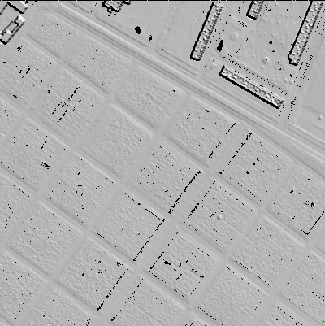
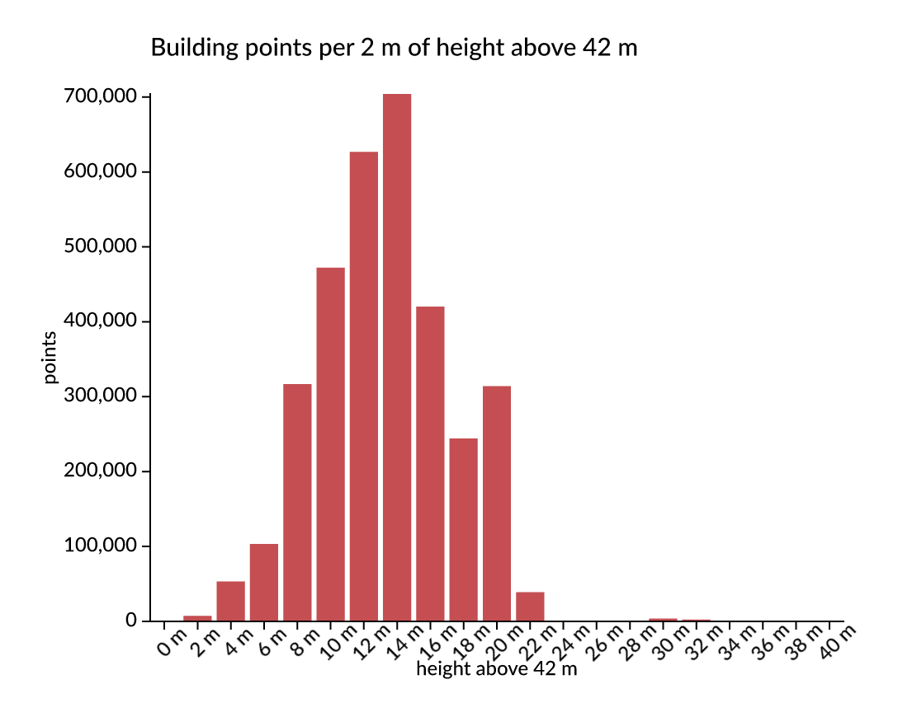

# Experiment 6 — Vega expressions, SQL and chained pipelines

Status: all six phases run, 23 Sep 2026. The data side uses the workspace tile; the chart side uses the top of the stack (#129, `a2241265`).

Two questions, one on each side of the same design:

1. **Backwards compatibility.** Vega specifications use the Vega expression
   language (`datum.delay > 10 && isValid(datum.carrier)`) in `filter`,
   `calculate`, signals and encodings. How much of it can Avenger support, and
   by what route?
2. **The next level.** Can expressions become one toolset in a chain, next to
   SQL and other tools, the way `gdal raster pipeline` chains steps? The
   pipeline would stay lazy until the end, as a GDAL VRT does. Reading
   (queries) and changing (commands) would be kept apart, CQRS-style. And
   function packages would be registered, for example geodatafusion and
   SedonaDB.

## Where the stack stands

Checked on the top of the stack, #129 `codex/dataflow-incremental` (`a2241265e`):

| Piece | What it does today |
|---|---|
| `avenger-transform` (#125) | Vega-style `extent`, `bin`, `filter`, `formula` and `aggregate` as native DataFusion 54 plans, with Vega's truthiness and bin rules. *"They do not parse Vega expression strings."* |
| `avenger-vegalite-compiler` (#128) | Vega-Lite bar charts. Filters are a structured `{"field", "gte"}` predicate only. *"General expression strings are not parsed."* |
| `avenger-chart-definition` + `avenger-chart` (#127) | A chart is a `Dataflow` plus visual descriptors, serialisable to protobuf with native plans. `Chart::prepare` → `render` → `to_png`. Nothing is evaluated until render: this is the VRT idea already. |
| `avenger-vega-test-data` | 127 Vega specifications, a corpus of real expressions. |

Outside the stack:

| Package | Level | DataFusion | Notes |
|---|---|---|---|
| VegaFusion 2.0.3 (Jon's earlier project) | Vega expression → DataFusion compiler | 48 | The reference for semantics and function mapping. It cannot be linked next to DataFusion 54, so it is a model to port, not a dependency. |
| [geodatafusion](https://github.com/datafusion-contrib/geodatafusion) 0.5 | row-level `ST_*` UDFs, PostGIS-style | 54 | Same DataFusion, but it could not be linked into this workspace (phase D). |
| SedonaDB `sedona-functions` | row-level `ST_*` UDFs | 54 at the git revision this repo already pins | Links directly. |
| [geolibre-rust](https://github.com/opengeos/geolibre-rust) | 700+ *whole-dataset* tools (slope, hydrology, LiDAR), WASM | none | A table or raster goes in and a table or raster comes out. These are pipeline steps, not expression functions. |

That last row answers the doubt in the brief. "Registering function packages"
is right, but there are **two registries**:

- **Functions:** row-level (and aggregate) functions such as geodatafusion,
  Sedona and the Vega built-ins. They register into the DataFusion session,
  and then both SQL and Vega expressions can call them.
- **Steps:** whole-dataset tools such as geolibre/whitebox, a hillshade, or a
  reprojection. They register as pipeline steps with typed arguments, the way
  GDAL's `reproject` or `hillshade` are steps and not functions.

## Hypothesis

- **Vega expressions compile to DataFusion `Expr`.** A small parser and a
  function table cover the expressions real specifications use. What does not
  map (JavaScript coercion, regexes, some date functions) fails with a clear
  error, and the failures are countable.
- **A pipeline is a chain of typed steps over one lazy plan.** Vega, SQL and
  transform steps all extend the same DataFusion `LogicalPlan`. Nothing runs
  until a sink (`render`, `write`, `query`). The optimiser therefore sees the
  whole chain: a Vega filter written after a SQL step still reaches the scan.
- **CQRS falls out of the step types.** A *command* returns a new chart state
  and nothing else. A *query* returns a value and leaves the state unchanged.
  The command log is then the chart's history: replaying it reproduces the
  chart exactly, and undo is dropping the last command.
- **The pipeline serialises**, like `.gdalg.json`: to its step list, and after
  compilation to an `avenger-chart-definition` artifact.

## Plan

A crate `lidar-pipeline` in `experiments/06-pipelines`. It pins its own
Avenger revision, the top of the stack (#129), so it can use
`avenger-transform`, `avenger-chart-definition` and `avenger-chart`. The
workspace pin for experiments 1–5 stays at `5f31c58`. Moving everything is a
separate repin round (CLAUDE.md), not part of this experiment.

Pipeline syntax borrowed from GDAL, on the LiDAR tile:

```
avenger pipeline
  ! read tile.copc.laz
  ! filter  --vega "datum.classification == 6 && datum.z > 50"
  ! calc    --vega "height = datum.z - 42"
  ! sql     "SELECT floor(x/5)*5 AS cx, floor(y/5)*5 AS cy, max(height) AS h FROM input GROUP BY cx, cy"
  ! chart   symbol --x cx --y cy --fill h          (command)
  ! set     scale.fill.scheme viridis              (command)
  ! query   scale.fill.domain                      (query: prints, state unchanged)
  ! write   buildings.png
```

The work runs in phases, each ending in a measurement:

| Phase | Builds | Measures |
|---|---|---|
| A. Vega expressions | A parser (Pratt, JavaScript subset) → AST → DataFusion `Expr`, driven by a function table ported from VegaFusion's mapping | Coverage on every expression in `avenger-vega-test-data`: parsed, compiled, and unsupported by reason. Coverage of the function list in the Vega expression reference. |
| B. Semantics | Differential tests: the same expressions over the same rows in real Vega (Node, `vega` package) and in DataFusion | Rows that agree and rows that differ, by cause: truthiness, null, NaN, division by zero, `+` on strings, integer and float. |
| C. Lazy chaining | `!` pipeline parser, step registry, steps that extend one `LogicalPlan`, sinks | `EXPLAIN` of a Vega → SQL → Vega chain: is it one fused plan, and does the late Vega filter reach the LAZ scan? Time on the tile with and without that pushdown. |
| D. Two registries | Function packages: Vega built-ins, geodatafusion, Sedona. Step packages: a native hillshade on the 1 m surface grid as the example of a whole-dataset tool | Name collisions between packages (both define `ST_*`). A Vega expression that calls a registered spatial function. |
| E. CQRS on a chart | Commands that build an `avenger-chart-definition`, queries that read the definition or the rendered frame (scale domains, row counts) | Replaying the command log gives byte-identical PNG output. Queries leave the state hash unchanged. Undo by dropping the last command. |
| F. Serialisation | The pipeline as JSON (the step list), and as a chart-definition artifact with native plans | Round trip: serialise, load in a fresh process, render, and compare. |

Not planned: a full Vega runtime (signals, event streams, scenegraph), and
running geolibre's WASM tools. An adapter shape for them is sketched in phase D
and not tested.

## Run

```sh
T=data/LHD_FXX_0657_6868_PTS_O_LAMB93_IGN69.copc.laz

# A. coverage of the Vega test specifications (with and without the format package)
cargo run --release -p lidar-pipeline --bin vega_coverage -- experiments/06-pipelines/corpus/vega_test_data.json --package vega-format

# B. differential test against real Vega (Node 22, vega 6.4.0)
(cd experiments/06-pipelines/reference && npm install && \
  TZ=UTC node vega_eval.mjs ../corpus/differential.json > ../../../out/vega_reference.json)
cargo run --release -p lidar-pipeline --bin vega_diff -- experiments/06-pipelines/corpus/differential.json out/vega_reference.json

# C. laziness and pushdown
cargo run --release -p lidar-pipeline --bin pipeline_bench -- $T

# D–F. any pipeline; the packages, CQRS and serialisation checks
cargo run --release -p lidar-pipeline --bin pipeline -- --steps
cargo run --release -p lidar-pipeline --bin pipeline -- --packages
cargo run --release -p lidar-pipeline --bin pipeline -- --semantics vega --trace "read $T --statistics ! filter --vega \"datum.classification == 6\" ! count"
cargo run --release -p lidar-pipeline --bin cqrs_check -- $T out
cargo run --release -p lidar-pipeline --bin pipeline -- --replay out/cqrs_pipeline.json "render out/cqrs_replayed.png"
cargo run --release -p lidar-pipeline --bin pipeline -- --render-avc out/cqrs_chart.avc out/cqrs_from_avc.png
```

| File | What it holds |
|---|---|
| [vega/parse.rs](src/vega/parse.rs) | Tokenizer and Pratt parser for the Vega expression language |
| [vega/compile.rs](src/vega/compile.rs) | AST → DataFusion `Expr`; analysis into row expression, chart query or interaction; SQL and Vega semantics |
| [pipeline.rs](src/pipeline.rs) | `!` syntax, step kinds, the lazy plan, packages, save and replay |
| [steps.rs](src/steps.rs) | The `core` steps: `read filter calc sql bin materialize count head schema explain query write save` |
| [packages/](src/packages/) | `vega-format`, `vega-compat`, `sedona`, `terrain` (`hillshade`, `png`), `chart` (`chart set undo get domain history render`) |
| [corpus/](corpus/) | The 253 expressions from `avenger-vega-test-data`, and the differential cases |
| [reference/](reference/) | The Node script that evaluates the cases with real Vega |
| [results/](results/) | The full coverage and differential tables, the saved pipeline |

## Video

[video/overview.mp4](video/overview.mp4) (45 s) builds one pipeline step by
step. The left side shows the chain, coloured by step kind; the right side
shows what that exact pipeline produced on the tile, with the time of each
step that executed. Twelve shots:

1. a lazy `read` and a `count`;
2. a Vega filter;
3. SQL over `input` and a chart;
4. commands that style it;
5. a late Vega filter that DataFusion pushes below the aggregation;
6. queries that change nothing;
7. a command;
8. `undo`;
9. and 10. the same histogram under SQL and Vega semantics (`0.0 m` against `0 m`);
11. packages: hillshade plus Sedona functions called from Vega;
12. save and replay in a fresh process, with a byte-identical PNG.

Every shot is a real run of `target/release/pipeline`.
[video/storyboard.py](video/storyboard.py) runs them and composes the frames:

```sh
python3 experiments/06-pipelines/video/storyboard.py
ffmpeg -framerate 30 -i out/video/frames/frame_%05d.png -c:v libx264 -preset slow -crf 30 \
  -pix_fmt yuv420p experiments/06-pipelines/video/overview.mp4
```

## Results

### A. How much Vega compiles to DataFusion

Every expression in the 97 Vega test specifications that contain one (1,018
occurrences, 253 unique) was parsed and analysed. The corpus has no data, so
compiling assumes every `datum` field is a Float64.

| Outcome | Without packages | With `vega-format` |
|---|---|---|
| Parses | 253 | 253 |
| Row expression, compiles | 62 | 102 |
| Row expression with signals (become query parameters), compiles | 67 | 67 |
| **Reads the chart** (`scale()`, `data()`, `domain()`, `bandspace()`, `invert()`) | 34 | 34 |
| **Interaction** (`x()`, `y()`, `modify()`, `vlSelection*`, `event`, `parent`) | 26 | 26 |
| Unsupported | 54 | 14 |
| Compiles, fails to type (nested struct fields read as Float64) | 10 | 10 |

So 169 of 253 (67 %) are row expressions that compile to DataFusion, and 60
(24 %) are not row expressions at all. They read the chart or respond to
input, which is the query and command side of the chart, not SQL. That split
is not imposed by this experiment; it is already in the expression language.

`format` and `timeFormat` were the largest gap (41 expressions). Both are d3
formatting, and Avenger already has it: the `vega-format` package wraps
`avenger-format-number` and `avenger-format-datetime` as two DataFusion
functions. Most of what remains is `timeUnitSpecifier(…, {…})`, whose object
literal has no SQL counterpart.

Against the [Vega expression reference](https://vega.github.io/vega/docs/expressions/),
74 of 220 documented names compile. Type checking, coercion, control flow,
math and constants are complete. Easing (37), statistical (12), colour (6),
regular expressions (2) and most date-time `utc*` functions are not
implemented yet; none of them occur in the test specifications. The full
tables are in [results/](results/).

### B. Semantics: SQL is not JavaScript

52 expressions over 8 rows of edge cases (0, negative, NaN, null, Infinity, the
empty string, `' 5 '`, `'0'`, null Booleans and dates), evaluated by Vega
6.4.0 in Node and by DataFusion. Two expressions throw in Vega itself
(`length(null)`, `indexof(null, …)`).

| Semantics | Rows agreeing | Expressions agreeing on every row |
|---|---|---|
| SQL (DataFusion as is, with Jon's truthiness) | 323 / 400 (80.8 %) | 12 / 52 |
| Vega (the compiler's JavaScript mode, `vega-compat` package) | 398 / 400 (99.5 %) | 48 / 52 |

What SQL does differently:

| Cause | Example | Vega | SQL |
|---|---|---|---|
| null is 0 in arithmetic and comparisons | `null + 3`, `null < 4` | `3`, `true` | `NULL`, `NULL` |
| numbers print as JavaScript does | `'n=' + 1`, `'' + Infinity` | `"n=1"`, `"Infinity"` | `"n=1.0"`, `"inf"` |
| null prints as `"null"` | `'n=' + null`, `upper(null)` | `"n=null"`, `"NULL"` | `"n="`, `NULL` |
| strings convert to numbers | `+' 5 '`, `+'abc'`, `+''` | `5`, `NaN`, `0` | `NULL` |
| NaN never compares true | `NaN > 1`, `min(NaN, 1)` | `false`, `NaN` | `true`, `1` |
| rounding | `round(-2.5)` | `-2` | `-3` |
| Vega's own coercions | `toBoolean('0')`, `year(null)` | `false`, `1970` | `true`, `NULL` |

Vega mode fixes these with two functions (`js_to_number`, `js_string`) and
rewrites in the compiler. The two rows that still differ are `null + -3` and
`-3 + null` in a string column. JavaScript decides per value that null is a
number, but a compiler decides per column type that `+` concatenates. That
difference is irreducible without evaluating per row.

### C. One lazy plan, and what pushes down

Transform steps only extend the plan (0.1–2.7 ms each); only queries and sinks
execute. The `sql` step exposes the chain so far as a view named `input`, which
DataFusion's analyzer inlines, so the optimiser sees one plan. On the 17.3 M
point tile, a Vega filter written *after* a SQL step:

```
read tile --statistics ! calc h --vega "datum.z - 42"
  ! sql "SELECT x, y, h, classification FROM input WHERE classification = 6"
  ! filter --vega "datum.x < 657120 && datum.y < 6867120" ! count
```

| Variant | Time (best of 3) |
|---|---|
| lazy, SQL semantics | 95 ms |
| lazy, Vega semantics | 97 ms |
| eager: `materialize` after every step | 992 ms |
| lazy, without chunk statistics | 1,044–1,150 ms |

The late Vega filter is fused with the SQL `WHERE` into one filter on the scan,
and it reaches the LAZ reader: chunk statistics make it 11× faster. The
physical plan does not show this. The LAZ scan's display lists no pushed
predicate, so only the timing proves it.

Vega semantics cost nothing here only because the LAZ `x` column is
non-nullable, and DataFusion removes the `coalesce(x, 0)` that JavaScript's
null-is-zero needs. On a nullable Parquet copy of the tile, sorted by `x`, the
same filter lost its `pruning_predicate` (10.0–10.6 ms against 3.6–5.6 ms).
The compiler now writes a comparison with a literal as
`(x < c OR x IS NULL) AND NOT isnan(x)`, the same semantics in a form pruning
understands. The pruning predicate is back and the query takes 3.9 ms, with
the differential test unchanged at 99.5 %.

### D. Two registries

| Package | Functions | Steps | Names already taken |
|---|---|---|---|
| DataFusion built-ins | 247 | – | – |
| `vega-format` (Jon's d3 formatters) | 2 | – | 0 |
| `vega-compat` | 2 | – | 0 |
| `sedona` (`sedona-functions`, native set) | 84 | – | 0 |
| `terrain` | – | 2 (`hillshade`, `png`) | 0 |
| `chart` | – | 7 | 0 |

Because the compiler resolves every function by name through the session, a
package's SQL functions are callable from Vega expressions too:
`st_astext(st_point(datum.cx, datum.cy))` works in a `calc --vega` step. One
chain uses all of them on the tile's south-east quarter:

```
read tile --statistics ! filter --vega "datum.x < 657400 && datum.y > 6867600"
  ! sql "SELECT floor(x) AS cx, floor(y) AS cy, max(z) AS h FROM input
         WHERE classification = 2 OR classification = 6 GROUP BY floor(x), floor(y)"
  ! hillshade --x cx --y cy --z h --cell 1
  ! calc wkt --vega "st_astext(st_point(datum.cx, datum.cy))"
  ! calc label --vega "'shade ' + format(datum.hillshade, '.0%')"
  ! png out/hillshade.png --x cx --y cy --value hillshade
```



`hillshade` is the example of a whole-dataset tool, the kind geolibre and
whitebox provide: it needs each cell's neighbours, so it is a step, not a
function. It is also the one point where the chain executes (405 ms for
158,267 cells), as GDAL's `materialize` step does. The geolibre tools
themselves were not run; they would register as steps in the same way.

What did not work:

- **geodatafusion cannot be linked into this workspace.** It needs `geo` 0.31
  (`i_overlay >=4.0, <4.1`), `sedona-geo` needs `geo` 0.33 (`i_overlay` 4.5),
  and Avenger's own `avenger-geo` and `avenger-scenegraph` at the pinned
  revision need `geo` 0.29 (`i_overlay` 1.9). Cargo resolves one lockfile for
  the whole workspace, so adding geodatafusion to experiment 6 also broke
  experiment 5. In a Rust binary, function packages must agree on one
  dependency graph. The same wall stops VegaFusion (DataFusion 48) from
  sitting next to DataFusion 54. `datafusion-ffi` (55.1 on crates.io) is the
  direction for packages compiled separately; it was not tested here.
- **They would collide.** A static comparison of geodatafusion 0.5's source
  with Sedona's function set finds 30 names in both (`st_point`, `st_astext`,
  `st_x`, `st_envelope`, `st_geomfromwkb`, …). DataFusion's `register_udf`
  lets the last one win silently. `Pipeline::install` reports collisions, but a
  real registry needs namespaces or an explicit policy.

### E. CQRS on an Avenger chart

The `chart` package keeps a small declarative chart state. **Commands**
(`chart`, `set`, `undo`) change it and are logged; the state is a fold of that
log. **Queries** (`get`, `domain`, `history`, and the data queries `count`,
`head`, `schema`, `explain`, `query`) read. `render` is the sink: it
materialises the data once, builds an `avenger-chart-definition` and renders
it with `avenger-chart`.

```
read tile --statistics ! filter --vega "datum.classification == 6"
  ! calc height --vega "floor((datum.z - 42) / 2) * 2"
  ! sql "SELECT height, count(*) AS points FROM input WHERE height BETWEEN 0 AND 40
         GROUP BY height ORDER BY height"
  ! calc label --vega "toString(datum.height) + ' m'"
  ! chart bar --x label --y points ! set title "…" ! set x.title "height above 42 m"
  ! set x.labelAngle -45 ! set fill #c44e52 ! render chart.png
```



With SQL semantics, the axis labels read "0.0 m", "2.0 m"; with Vega
semantics, "0 m", "2 m". Phase B, visible in a chart.

| Check (`cqrs_check`) | Holds |
|---|---|
| 40 queries, interleaved with 5 commands, leave the chart state and the plan unchanged | yes |
| Queries are not in the command log | yes |
| `undo` restores the previous state exactly | yes |
| Rendering twice gives the same PNG | yes |
| Replaying the data steps and the command log gives the same PNG and state | yes |

Queries run against the lazy plan, so each one executes it again: `domain y`
took 1.07 s, the time of the LAZ read. The first `render` computed the domains
that way and took 4.3 s; materialising once in the sink and deriving the
domains from that snapshot brought it to 1.2 s. A query side needs a cache,
which is what the result cache in Jon's `avenger-datafusion-dataflow` is for.

### F. Serialisation: two forms, both exact

| Form | Size | Needs | Rendered in a fresh process |
|---|---|---|---|
| [pipeline JSON](results/pipeline.json): data steps + command log, like `.gdalg.json` | 631 bytes | the source file; re-runs everything | byte-identical PNG |
| `avenger-chart-definition` bytes (`render --definition`): native plans + a data snapshot, like a materialised VRT | 1,959 bytes | nothing | byte-identical PNG |

The two are complementary. The JSON is the recipe and stays lazy. The chart
definition is the result, materialised at the end and portable without the
data source.

## What it takes

1. **Vega expressions compile to DataFusion with a small parser and a
   function table**, provided the semantics are chosen explicitly. SQL
   semantics agree with Vega on 81 % of edge-case rows; a JavaScript mode of two
   functions and a few rewrites agrees on 99.5 %.
2. **A quarter of real Vega expressions are not data expressions.** They read
   the chart (`scale`, `domain`, `data`) or respond to input. In a chained design
   they are queries and commands, which fits the CQRS split.
3. **Chaining stays one plan** when every transform extends a DataFusion
   `LogicalPlan` and SQL sees the chain as an inlined view. The optimiser then
   pushes a late Vega filter into the LAZ reader, 10× faster than executing
   step by step.
4. **Compatibility has to be written for the optimiser.** The obvious
   JavaScript encoding (`coalesce`) hides predicates from statistics pruning;
   an equivalent encoding keeps it.
5. **There are two registries: functions and steps.** Functions go into the
   DataFusion session and are reachable from SQL and Vega alike. Whole-dataset
   tools are steps, and each one is a materialisation point.
6. **Registering independent Rust packages runs into linking before
   semantics.** Shared crates such as `geo` must agree across Avenger,
   geodatafusion and Sedona, and function names must be namespaced.

## Notes for Jon

Observations from this prototype that may be useful for the stack. They are
not requests.

1. **An expression front end on `avenger-transform`.** The parser and compiler
   here (about 1,070 lines) produce `Expr` that goes straight into
   `avenger_transform::filter` and `formula`, reusing your `truthy`. They could
   fill the "general expression strings are not parsed" gap in
   `avenger-vegalite-compiler`. The corpus and the differential test against
   Node Vega come with it.
2. **Choose the semantics per chart.** `avenger-transform` documents that
   JavaScript coercion is outside its contract. The measurement shows what that
   costs (81 % against 99.5 % agreement) and that a compat layer is small, as
   long as its comparisons stay pruning-friendly.
3. **`format` and `timeFormat` as DataFusion functions.** Wrapping
   `avenger-format-number` and `avenger-format-datetime` took one file and
   covered 40 more test expressions than any other change.
4. **Chart queries in expressions.** `scale()`, `domain()`, `bandwidth()` and
   `data()` are 34 of the 253 test expressions. In the chart runtime they could
   become queries against the rendered frame's scales, which `avenger-chart`
   already retains.
5. **The chart definition is already the VRT.** A 1,959-byte artifact rendered
   byte-identically in a fresh process. A pipeline JSON beside it gives the
   lazy recipe; the two together are GDAL's `.gdalg.json` and materialised VRT.
6. **Small things we ran into:**
   - the x-axis title is not moved when labels are rotated (`label_angle`), so
     it overlaps them (see the chart above);
   - `Frame::to_png` returns a future that is not `Send`
     (`TextAtlasBuilderTrait`), so it cannot be awaited inside `async_trait`
     code; rendering runs on its own thread here;
   - `avenger-chart`'s default `pdf` feature pulls `krilla` 0.8.2, which
     requires Rust 1.92; `default-features = false, features = ["png"]` builds
     on 1.89.

Not checked: geolibre's tools (adapter shape only), `datafusion-ffi`, Vega
signals and event streams beyond classification, and anything about the chart
side on the old workspace pin: experiment 6 uses `a2241265` throughout for
Avenger crates.
