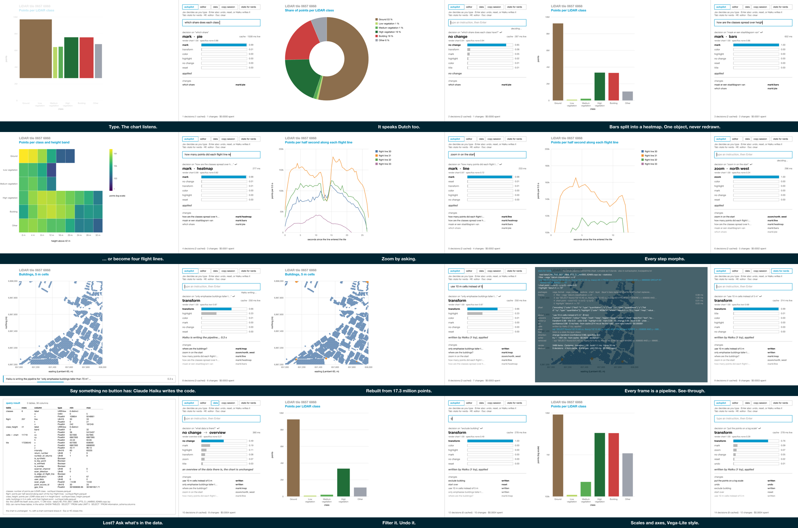
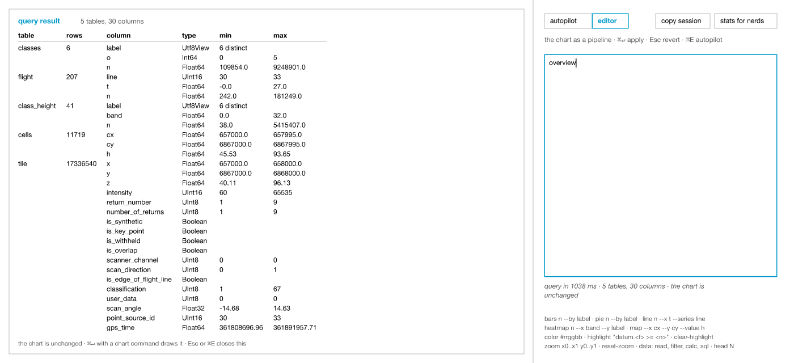
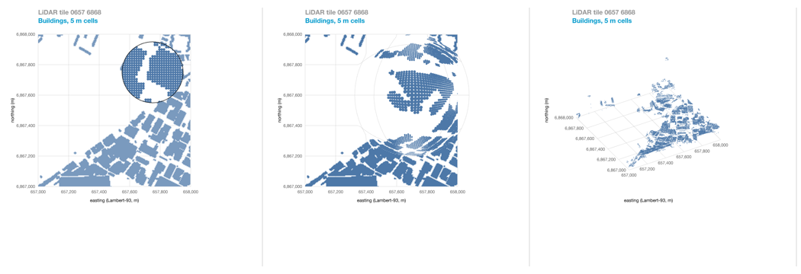
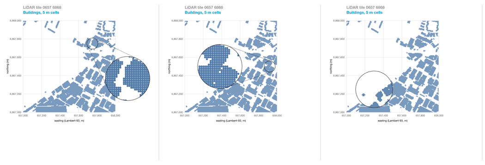
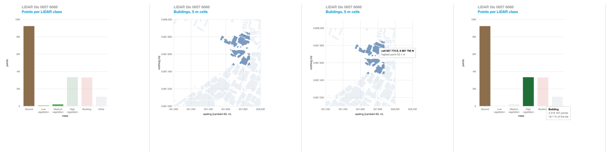
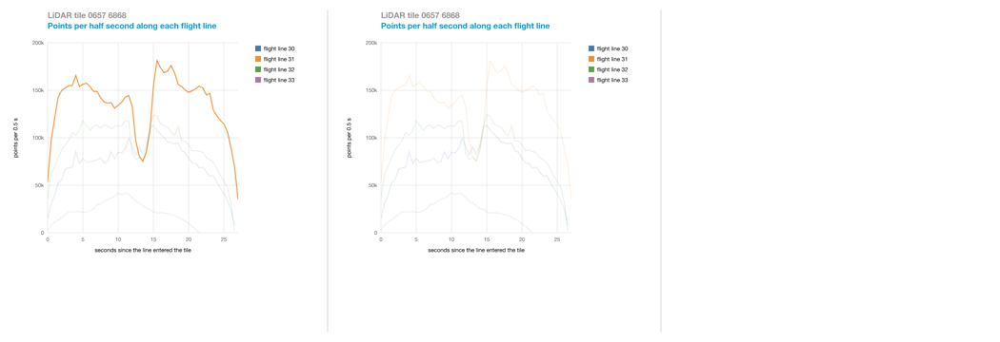
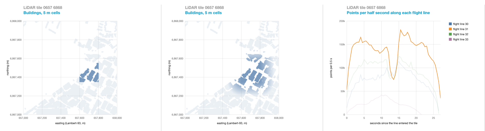
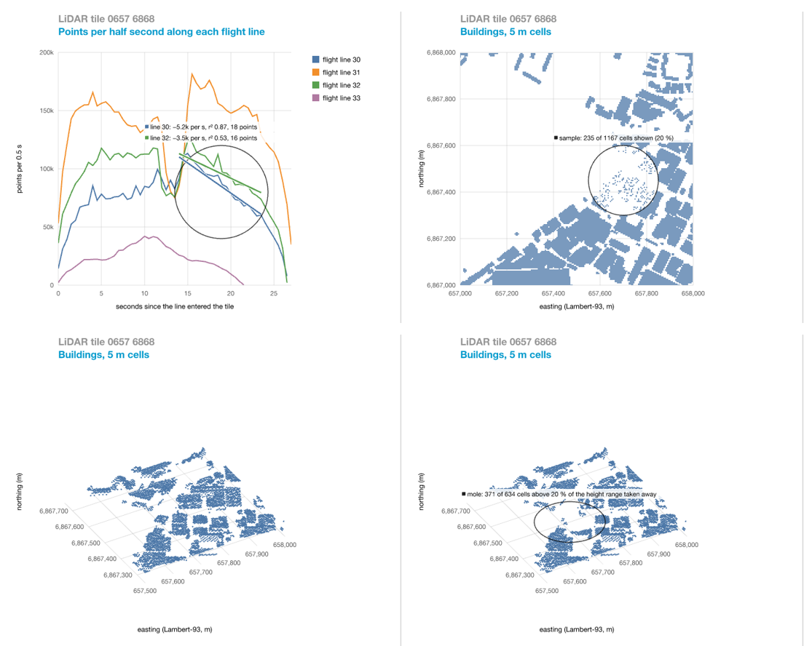
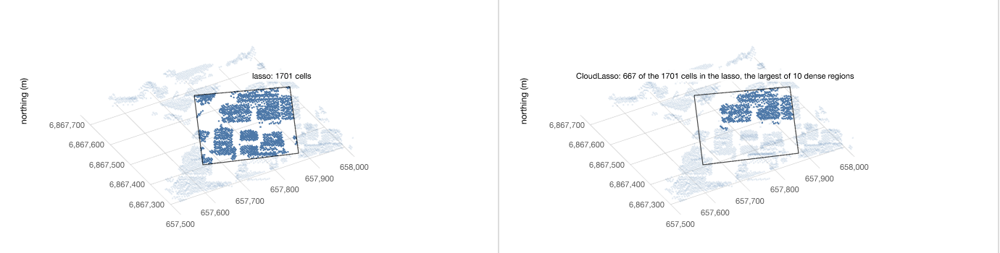

# Experiment 7 — charts driven by decisions

Status: built and measured 24–25 Sep 2026, on Avenger `602b99c` (#130), with
Jev 1.13 and Claude Haiku 4.5 through OpenRouter. A training run as the data
source (phase G) is not built.

Can a chart be driven by what someone types, rather than by commands they
write? A typed classifier, [Jev](https://innfactory.ai/en/blog/jev-system-one-model-classifier-not-llm/),
turns text into choices from options we supply, in about 300 ms. Where the
options cannot say what was meant (a title, "taller than 70 m", "10 m cells"),
Claude Haiku writes the pipeline instead. Either way, what reaches the chart is
a pipeline that has been validated against the data, and the chart drawn is the
fold of that pipeline. One chart object moves between bars, a pie, a heatmap, a
time series and a map, with keyed transitions.

[video/autopilot_tour.mp4](video/autopilot_tour.mp4) (68 s) shows it:



## The window

```sh
set -a; source <folder with your .env>/.env; set +a    # OPENROUTER_API_KEY
cargo run --release -p lidar-decide --bin autopilot_live
```

Three columns: the chart; **Jev**, right of it, with its last decision (the
action, how sure it was of each option, what the window did) and the changes
so far; and the panel, with the box to type in and the pipeline under it.

- **Autopilot.** Type what you want and press Enter. Jev reads while you type
  (400 ms after the last key) and on Enter; the line under the box says what
  Enter will do. What Jev's options cover applies at once; the rest goes to
  Haiku, and a banner over the chart says it is writing.
- **The pipeline** under the box follows every decision, with the stages the
  last one added in the accent colour, so the effect of each decision shows
  as text next to the chart. Click in it to edit, ⌘↵ applies; an edit is kept
  when the autopilot changes the chart, and Esc takes the running pipeline
  again. ⌘E moves between the box and the pipeline.
- **Undo and reset** are instructions like any other ("undo", "go back",
  "start over").
- **Table, export, overview.** "Show head 5 as a table" shows the rows behind
  the chart, "export this to parquet" writes them, and "what data is there?"
  (or the **data** button) lists every table with its columns, types and
  ranges. The chart is left as it is.
- **Stats for nerds** (Tab): the whole pipeline behind the chart, over it and
  see-through, with Jev's answers, the writer's tries and timings.
- **Queries in the pipeline box.** Plain SQL over the named tables
  (`SHOW TABLES`, `SELECT * FROM cells LIMIT 5`, `information_schema`), a
  text that ends in `head N`, or `overview`, show a table over the chart.
- **Copy session** puts the session on the clipboard and in
  `out/autopilot_live/session.txt`: per decision, the chart it saw, every answer
  of Jev's with its confidence, the cache files of the raw responses, what the
  writer wrote and what the view showed; a PNG of the view goes beside it.
  `--snapshot <dir> @@session.txt` replays it.

Text fields edit as text fields should: arrows, ⌥ and ⌘ with them, ⇧ to
select, double and triple click, dragging, and the clipboard.


## How a decision becomes a chart

```
typed text ─► Jev ─┬─ its options say it all ─────────────► pipeline lines ─┐
                   └─ otherwise: its reading as direction ─► Haiku writes ──┤
                                                                            ▼
                               validate every stage, fold to a chart state (or refuse, with the reason)
                                                                            ▼
                                                          keyed transition to the new chart
```

- **Jev answers typed questions**, all in one call: the action (`mark`,
  `color`, `zoom`, `highlight`, `title`, `transform`, `undo`, `reset`, …) and
  its argument (which mark, colour, quarter, subset), how to render (`chart`,
  `table`, `export`, `overview`), and whether the text carries specifics of its
  own that no option holds. The observation holds the chart's state and table
  sizes, never rows.
- **The route.** Jev's options apply when its confidence is at least 0.5, it
  saw no specifics, and the answer fits the chart. Otherwise Haiku gets the
  grammar, the tables and their pipelines, the chart now, the pipeline now,
  the instruction and Jev's chosen change, and writes the whole new pipeline.
  Haiku may also answer `overview` to a question about the data.
- **Nothing written is trusted.** The pipeline runs through the editor's
  path; a refusal goes back to Haiku with its reason, up to three tries.
- **While typing, only Jev decides**, with two gates: confidence ≥ 0.5, and
  ≥ 0.9 for a change of chart kind before the sentence is complete. What only
  Enter can do (a transform, undo, reset, a title, a table) is held and named.
- **Every response is cached**, keyed by a hash of the model, the observation
  and the questions (or the prompt). Everything here replays without a key
  once it has been asked, including the video.

## The pipeline

Data stages first, then one mark, then its properties. The marks use
Vega-Lite's names, with channels as `--channel field:type` (N, O, Q, T; a type
left out comes from the Arrow type). Aggregation is a `sql` stage before the
mark.

```
read out/layer/classes.parquet
! chart bar --x label:N --y n:Q --color label:N
! set x.axis.title "LiDAR class"
! set y.scale.type log
```

| Mark | Channels |
|---|---|
| `chart bar` | `--x f:N` (or O), `--y f:Q`, `--color` the same field as x or `#hex` |
| `chart arc` | `--theta f:Q --color f:N` |
| `chart line` | `--x f:Q` (or T), `--y f:Q`, `--color f:N` (or `--detail`) |
| `chart rect` | `--x f:O` (or Q), `--y f:N`, `--color f:Q` (viridis, log) |
| `chart point` | `--x f:Q --y f:Q --color f:Q` |

| Property | Where |
|---|---|
| `set x.axis.title "…"`, `set y.axis.title "…"` | all but arc |
| `set y.scale.type log` | bar |
| `set x.scale.domain a,b` (or y) | line and point; one axis keeps the other's extent |
| `title "…"`, `color #hex`, `highlight "datum.f >= n"`, `clear-highlight`, `zoom x0..x1 y0..y1`, `reset-zoom` | as the mark allows |
| `view fisheye --focus x,y [--radius r] [--distortion d]` | all marks; focus in the plot's unit square, 0,0 bottom left |
| `view magnifier --focus x,y [--radius r] [--zoom k]` | all but arc |
| `view tilt [--yaw a] [--elevation e]` | point (the map), with height as z |
| `view flat` | |

Data stages are `read <file>`, `filter --vega "…"`, `sql "… FROM input …"`;
`head N` ends a text that is a query. Experiment 6's short forms (`bars n --by
label`, `set x.title`) still work. What the layer cannot draw is refused, never
approximated: a `--size` channel on a point, `label:Q` on a bar's x,
`chart area`, `set x.axis.labelAngle`, a log scale on a map
(`layer_roundtrip` prints each case).

The tile and the four tables derived from it (`classes`, `flight`,
`class_height`, `cells`) are named tables in every session, with
`information_schema` on. A pipeline whose data stages are those of one of the
four tables reads the cached Parquet file instead of the tile: about 2 ms
instead of about 1 s.



## The chart layer

`avenger-chart-definition` at #130 has two marks, rectangles and circle
symbols, each with one constant fill and no colour scale, so a pie, a line
per series and a heatmap cannot be described there. [src/layer/](src/layer/) is
a small chart layer on `avenger-scenegraph`, drawn by `avenger-wgpu`. From
`facet-fresh-start` it takes two ideas (marks separate from their coordinate
system; a line mark split into series by a key) and adds a **key from the data
on every item**, so two frames can be joined item by item:
- items with the same key move, resize and recolour;
- a heatmap cell grows out of its class bar, its parent, and collapses back;
- between Cartesian and polar, a stacked bar curls into a donut through
  experiment 5's `Bend`: first the layout, then the bend;
- a shared linear axis tweens its domain; guides and titles that change fade
  in sequence.

| File | What it does |
|---|---|
| `model.rs` | The chart state and `resolve(state, data)`: a frame of keyed items |
| `anim.rs` | `transition(a, b, t)` |
| `draw.rs` | Frames to marks, through `Bend` |
| `package.rs` | The `layer` pipeline package, decisions → pipeline lines, and the fold back to a state |
| `pilot.rs` | Jev's observation and questions, and its answers applied to the state |
| `writer.rs` | The extra questions, the writer's prompt, write → apply → retry |
| `editor.rs` | A pipeline text or query run on its own, drawn from its result |
| `catalog.rs` | The named tables and the overview |

## Views: experiment 5's coordinate systems, and magnifying

The chart layer first took only `Bend` from experiment 5 (Cartesian ↔
polar). A view now follows the bend, from the same family of point
transforms, and a change of view blends the two, as a change of coordinate
system did in experiment 5:
- **fisheye**, the Sarkar–Brown lens (experiment 5's `Fisheye`): the plot
  stays in its square, grid lines bend with it, and symbol areas follow the
  lens's local magnification, so cells that touch on the flat map still touch;
- **magnifier**, the same items again, undistorted and scaled, clipped with
  `Clip::Path`: the nested alternative to the fisheye. By default it is
  offset, as DragMag: a small source circle at the focus and a callout beside
  it at 4×, joined by the two outer tangents, placed like a label (inside the
  plot or the empty margin beside a map, on the side with the least data, up
  and to the right when it can) and kept still until the source has moved a
  callout radius. `--offset none` puts it in place, at 2×. The defaults come
  from the lens studies in [docs/interactions.md](../../docs/interactions.md);
- **tilt**, the map in 3D (experiment 5's `Cartesian3d`), with each cell's
  highest point as z, painter's order by depth, and the grid on the floor;
  what a zoom leaves outside the square is left out, since a tilted plot has
  no clip rectangle.

Jev has an action `view` with a question which view; the quarter it names is
the focus. "magnify the north-east corner" came back as `zoom` (0.78) beside
`view magnifier` (0.73), and "zoom in on the north-east" as `zoom` (1.00)
beside `magnifier` (0.59), so a view answer becomes the action when it is
within 0.15 of the action's confidence and differs from the current view
(`writer::normalise`). In the window, the focus of a lens follows the cursor
over the plot, and a click puts it in the pipeline as a `view` line. Not
checked with a real mouse: only headless.





## Interactions: the ordinary ones, done well

Following the lessons of vega/altair#3394 (in [docs/interactions.md](../../docs/interactions.md)):

| Gesture | Does |
|---|---|
| click a mark | selects it; ⇧ adds or removes; a click on empty space clears |
| click a legend entry | toggles its category; the swatch and the label are one target |
| drag | brushes: an interval in data units on the time series and the map, the items it overlaps on bars, pie and heatmap (⇧ adds) |
| ⌥-drag | pans the time series or the map |
| wheel | zooms about the pointer |
| hover | a tooltip with the item's values from the data |
| under a lens | hover moves the lens, a click fixes it |

- **A selection is data, in the pipeline:** `select point --keys "Ground;Building"`,
  `select interval --x a..b --y c..d`, `select clear`. It folds into the
  chart state, shows in the pipeline and in stats for nerds, and undo takes it
  back. A pan or a wheel zoom is one `zoom` line when the gesture ends, not
  one per frame.
- **The effect is chosen apart from the selection:** `--effect fade` (the
  default) or `filter`. Filtering keeps the scale domains, so the axes and
  legends keep their meaning.
- **Hit-testing goes through the drawing's projection**, so a click also
  lands under a fisheye, on the pie and in 3D. Faded items stay clickable.
- **Text reaches the same commands.** Jev has an action `select`, and Haiku
  the grammar: "select ground and buildings", "only show the selection",
  "clear the selection" and "select the buildings in the north-east corner"
  each gave the right `select` line, once the prompt said a pipeline holds
  one `select` line and that a change of effect keeps its keys.
- Tested headless, with `--snapshot` steps `!click x,y`, `!shiftclick`,
  `!brush`, `!pan`, `!wheel` and `!hover`; `layer_roundtrip` folds each form
  and refuses an interval on bars. Not tried with a real mouse.



## Interactions: series predicates

The first of the research-grade techniques in [docs/interactions.md](../../docs/interactions.md),
on the time series:

| Gesture | Command | Selects |
|---|---|---|
| ⌘-drag | `select segment --from x,y --to x,y` | the flight lines that cross the segment: a line brush (Konyha et al. 2006; vega-lite#9833) |
| ⌃-drag | `select timebox --x a..b --y c..d` | the flight lines whose every point within the box's x-range lies inside it (Hochheiser & Shneiderman 2004) |

Both are in data units, so they hold under any zoom; in SQL they are window
functions over `PARTITION BY line ORDER BY t` (a segment intersection with
`LEAD`, or `bool_and(n BETWEEN …)`), here evaluated on the drawn series. A
selection that keeps nothing says so instead of fading everything. The
angular brush needs parallel coordinates, which the layer does not have.



## Interactions: smooth brushing

The second, after Doleisch & Hauser (2002): `--soft w` on an interval, a
line brush or a timebox turns the selection from yes or no into a degree of
interest in [0, 1]. Outside a brush the degree falls off linearly with the
distance to it, over `w` of the plot's unit square; for a line brush it is
the distance from the polyline to the segment, and for a soft timebox the
share of a line's points in the box's x-range that lie inside it. Fade
multiplies opacity by 0.15 + 0.85·degree; filter keeps what reaches 0.5,
which is also what the count of selected items reports. `select --soft 0.15`
on its own softens the brush already there; keys stay binary.

| Command | Map, 11,719 cells |
|---|---|
| `select interval --x 657600..657800 --y 6867350..6867550` | 292 selected |
| the same with `--soft 0.15` | 1,953 at a degree of 0.5 or more, the rest fading out |



The degree is a float per item, so it would be a column in SQL and it
animates through the keyed transitions like any other fill. Measured by
`cargo run --release -p lidar-decide --bin layer_roundtrip` (the "soft"
cases). No mouse gesture sets softness yet; it is written in the editor or
asked for in words.

A refusal that names the way that works is what let Haiku fix a try:
"emphasise the band with the most points" on the heatmap was refused as
emphasis three times until the refusal said "to single out cells, select
them: `select point --keys "label|band"`"; then every writing way selected
the cell. w13 expected "unchanged" until the layer had selections, and now
expects a selection.

[docs/interactions.md](../../docs/interactions.md) catalogues interaction
techniques as of September 2026: what doing the ordinary ones well takes
(from vega/altair#3394), research-grade ones not in any mainstream library
(line and crossing brushes, timeboxes, smooth brushing, lenses, CloudLasso,
DimpVis), and the trade-off between magnifying by projection and by a nested
view.

## Interactions: lenses as a local pipeline

The third: a lens is a circle in the plot's unit square plus a step that runs
only on what lies under it (Bier et al. 1993). `lens <kind> --focus x,y
[--radius r]` puts one in the pipeline; in the window it follows the pointer,
re-resolving the frame each move (a few milliseconds on 11,719 cells), and a
click writes its line. Jev has a `lens` action, so words reach it too.

| Command | Chart | Runs under the circle |
|---|---|---|
| `lens regression` | time series | least squares of y on x per line, drawn as a segment, with slope, r² and the number of points (Shao et al. 2017) |
| `lens sample --keep k` | map | only a share k of the cells, chosen by a hash of the key so it holds from frame to frame (Ellis, Bertini & Dix 2005) |
| `lens mole --above h` | map, flat or 3D | the cells above h of the height range taken away, to see what they hide (MoleView, Hurter et al. 2011) |



Removed items leave by the keyed transitions, as any others do. A lens under a
fisheye or a magnifier is refused (one lens at a time), and so are the kinds a
chart has no use for, naming the one that works.

Two things were learned by building them. A regression on the map is not the
regression lens: with x and y both metres there is no dependent axis, and the
principal axis of the cells under a circle (18° there) measured how the
blocks are laid out, not the buildings, which visibly run steeper (by eye,
not measured). It was taken out rather than labelled. And the first hash, FNV-1a alone, sampled cells in
vertical stripes, because keys of one column differ only in their last bytes;
a splitmix64 finish fixed it. The map holds buildings only, so a mole lens
shows lower buildings, not the ground under trees; the raw tile would.

Measured by `layer_roundtrip` (the "lens" cases) and by `autopilot_live
--snapshot out/lens` with `!hover x,y` and `!click x,y` steps.

## Interactions: a structure-aware lasso

The fourth: on the map in 3D a rectangle on the screen means little, so a
drag there draws a lasso. `select lasso --poly "u,v;…" [--yaw a --elevation
e] [--structure d]` holds the polygon on the screen (the plot's unit square,
y up) and the view it was drawn in. Without `--structure` it takes every cell
whose projection falls inside, which in 3D includes whatever lies behind or in
front. With it, CloudLasso (Yu, Efstathiou, Isenberg & Isenberg, TVCG 2012):
the cells inside are counted in voxels of 1/40 of the plot across and 1/10 of
the height range up, voxels reaching `d` times the densest are joined across
faces, edges and corners, and only the largest region is kept. The drag
writes `--structure 0.3`; dropping it in the editor gives the plain lasso.

| Command, zoomed quarter in 3D | Cells taken |
|---|---|
| `select lasso --poly "0.42,0.52;0.75,0.55;0.78,0.32;0.45,0.28" --yaw 30 --elevation 35` | 1,701 |
| the same with `--structure 0.3` | 667, the largest of 10 dense regions: one block |



The outline is shown only in the view it was drawn in, since it lives on the
screen. The test runs in Rust on the drawn cells, not in SQL: SedonaDB's
`st_contains` is in `sedona-geo`, which cannot be linked next to Avenger's
`geo` 0.29 ([FINDINGS.md](../../FINDINGS.md), 16). On the raw tile (17.3M
points) the same selection would be SQL: the projection as arithmetic, the
voxel density as `GROUP BY … HAVING`; that is not built. The map has one cell
per 5 m, so densities are of roofs, not of points. Measured by
`layer_roundtrip` (the "lasso" cases) and `--snapshot` with a `!lasso x,y x,y
…` step, which gives the same 667 cells as the pipeline line.

## Results

The cases were written before any decider ran on them, with the expected
answers; later cases say so in the case file. Counts are small (one case is
4–5 %), so they are indicative. Every decision is in [results/](results/).

### Jev against rules and a general model

27 decisions on the first chart vocabulary ([cases.json](cases.json)): 19
typed instructions and 4 data changes under two policies.

| Decider | Instructions | Data changes | Latency p50 / p95 | Cost |
|---|---|---|---|---|
| rules | 13 / 19 | 8 / 8 (circular: the rules read the diff text the same code wrote) | 0 ms | $0 |
| Jev 1.13, confidence < 0.5 → no change | **19 / 19** | **7 / 8** | 290 / 680 ms | $0.0013 |
| Claude Haiku 4.5 | 19 / 19 | 6 / 8 | 1,114 / 2,315 ms | $0.033 |

- Rules fail on Dutch, paraphrase ("can we look closer at the lower right
  part") and "something calmer"; both models get them.
- Jev's confidence is informative: its wrong answers had 0.12–0.75, and
  below 0.5 as "no change" fixes four of five.
- Both models chose "highlight outliers" when two new categories appeared.
- A narrow policy ("always bars") held in every case, since `mark` is not
  among its options; a free one chose a map when coordinates and a geometry
  column appeared (Jev 0.83).
- An observation must be reproducible: approximate percentiles changed with
  batch order, and with them the cache key; exact `percentile_cont` fixed it.

On the chart layer's vocabulary (five marks, colour, zoom, emphasis;
[cases_layer.json](cases_layer.json)): Jev 24/24 at 278 ms p50, Haiku 24/24 at
1,140 ms, rules 16/24. Jev also reads indirect questions: "which share does
each class have?" is a pie, "where are the buildings?" a map.

### While typing

Deciding after every word ([results/typing.md](results/typing.md)): a
confidence threshold removes about a third of Jev's changes, but not a
confident wrong intermediate ("lower right" is south-west at "lower", 0.96).
Debouncing (400 ms) and the 0.9 gate for a change of chart kind take care of
those: over 12 instructions, one change each, all right, several before the
sentence ends ("which share" → pie, 0.98). Jev is not fully deterministic:
asked again, some confidences moved by 0.01. The cache makes the runs
reproducible.

### Jev steers, Haiku writes

25 cases ([cases_writer.json](cases_writer.json)), each with the state it
must fold to and a reference pipeline that `writer_eval --check` proves
reachable: 6 that Jev's options cover, 19 that need text of their own (titles,
thresholds, ranges, cell sizes, filters, lenses).

| Way | Covered by options | Own text | Writer calls | Accepted first try | Latency p50 | Cost |
|---|---|---|---|---|---|---|
| Jev's options only | 6 / 6 | 4 / 19 | 0 | – | 291 ms | $0.0020 |
| Haiku writes alone | 5 / 6 | 17 / 19 | 25 | 22 / 25 | 1,878 ms | $0.112 |
| routed (the window) | **6 / 6** | **19 / 19** | 20 | 19 / 20 | 1,790 ms | $0.087 |

- Haiku alone drew "which share does each class have?" as bars; with Jev's
  reading it did not. Haiku alone also varies from run to run on w13 and w18
  (18/19 one run, 17/19 the next); with Jev's reading both were right in
  every run. The prompt is longer now that it holds views and
  selections, and a run costs about 15% more.
- Jev had no word for a lens, so it steered away from one: "look through the
  tall buildings" came back as `view tilt`, and Haiku, following it, tilted
  the map. With a `lens` question Jev answered `mole` and `regression` rightly
  while its action still said view or zoom; `normalise` promotes a confident
  lens answer as it does a view answer, and every way but Haiku alone then
  got all three lens cases. Haiku alone read "look through" as a magnifier
  until the grammar said what the mole lens is for ("to see past tall
  buildings"), not only what it does.
- A grammar with two ways to filter is read both ways: once `select … --effect
  filter` existed, Haiku alone wrote "filter ground" as a selection, which
  leaves the rows as they are. One line in the prompt ("rows named in words
  change the data with SQL WHERE, not with select") put it back.
- Jev's `render` answer was right in 21 of 21 cases; its action missed three
  of those (a table asked as `mark/keep`), which the route does not need.
- The prompt matters as much as the model: a palette written as
  `green #59a14f` gave `color green`, and "the top left" of a time series an
  arbitrary range, until the prompt said "the hex, not the name" and listed the
  quarters. Refusals that name the problem are what let Haiku fix a try.
- Earlier rounds of the prompt are kept in `results/writer_v*.md`.

Undo and reset, on 13 cases including four lookalikes ("reset the zoom",
"remove the emphasis", "go back to the bar chart"): 13/13. With table,
export, overview and the views, the Jev-only cases are 22/25: the three
misses are an action beside a right `render` answer, which the window follows.

"draw the buildings as a 3D model" (w12) expected "unchanged" until the layer
had a 3D view; it now expects the tilt, and every way but Jev alone gives it.

### Cost

560 decisions (482 by Jev, 78 by Haiku as a decider) and 277 written
pipelines were made to build and measure this: $0.91 in all, from the cache
files.

## Feedback for Avenger

What building this on the stack taught us, for [FINDINGS.md](../../FINDINGS.md)
and Jon. Each point says where it comes from; the unchecked ones say so.

1. **Chart definitions cannot describe most charts people ask for.** At #130,
   `RectEncoding` and `SymbolEncoding` take one constant `fill: String`, and
   scales are linear, band or point. A pie, a line per series, a heatmap with a
   colour scale and a log axis all had to be drawn on the scenegraph directly,
   although `avenger-scales` has log, pow and symlog. A field-driven colour
   channel with a scale, and line and arc marks, would have covered all five
   charts here.
2. **Items need keys for charts to morph.** The one thing our layer adds that
   makes it feel alive is a key from the data on every item, so a frame can
   be joined to the next: bars curl into a pie, split into a heatmap, and come
   back. `avenger-chart` has an identity per plot, not per item, and its
   retained symbols reuse positions within one mark across a domain change. A
   key channel (Vega's `key`), carried into the rendered frame, would let a
   host animate between any two frames.
3. **Publish the vocabulary as data.** A classifier needs the option list, and
   a writer needs the grammar. Both were written by hand here, from the marks,
   channels, types and properties the layer accepts. If a chart definition
   could list what it accepts (marks, channels with allowed types, properties
   per channel), deciders, editors and prompts could be generated from it,
   and could not drift from what the renderer draws.
4. **Refuse, with a path and a reason.** The loop is safe because anything the
   layer cannot draw is an error that names the problem ("chart point: the layer
   has no `size` channel for this mark; it takes x, y, color"). Haiku fixed
   refused tries from that text alone: with the first prompt, four colours
   written as names were each right on the next try, and in the last round
   the one refused try was too. The Vega-Lite compiler's
   `CompileError::path()` goes this way; the same from
   `ChartDefinition::finish()` for unsupported properties, rather than
   dropping them, would make generated charts trustworthy.
5. **What worked well, and should stay.** `RuntimeHostCommand::RequestWakeup`
   with `RuntimeWake` events let decisions, writes and queries run in the
   background without the window ever waiting. `WriteClipboard`, `MouseUp`
   and `CursorMoved` were all that text fields needed. And the same
   `SceneGraph` rendered headlessly by `PngCanvas` made `--snapshot`, the
   recordings and the video possible: the tour rebuilds from the cache frame
   for frame, without a key.
6. **Text measurement per glyph.** Caret, selection and wrapping need the
   advance of each character. We measure `|c|` minus `||` with
   `measure_bounds` and cache it, which works but is a workaround. Not
   checked: whether `avenger-widgets`' `text_input.rs` (#117) would replace
   our fields.
7. **Gradients still draw flat** (finding 4), so the heatmap's colour legend
   is drawn as stacked rectangles.

## Not built, not checked

- A training run as the data source (phase G); data events (a new column, an
  outlier) are measured on the first vocabulary but not wired to the window.
- Other writer models; instructions that change the data beyond filters and
  cell size; Jev's `score` question type ("how well does this chart serve the
  policy?").
- A mark change resets the title and the scale and axis properties to the
  new mark's defaults; they do not travel with the chart.
- Selections, smooth brushing, the lenses and the lasso were tested headless
  (`--snapshot` with `!click`, `!hover`, `!brush` steps), not with a real
  mouse. No gesture sets softness; space folding and the angular brush are not
  built.
- Jev's questions gained `lens`, which changes every Jev cache key; the
  recorded tour (`--tour`) was not re-recorded and needs the key to replay.
- Registering the named tables costs every new pipeline a little:
  `layer_roundtrip`, which builds thousands, went from 3.9 s to 10.1 s.

## Open questions

- Should a chart library expose its vocabulary *as* the option list, so any
  decider (Jev, an LLM, a UI) drives it through the same typed surface?
- Is "on track for a policy" a score rather than a choice?
- How much of this belongs in Avenger, and how much in an application on top?

## Reference

```sh
cargo run --release -p lidar-decide --bin decide_eval       # Jev, rules and Haiku on cases.json
cargo run --release -p lidar-decide --bin typing            # deciding after every word
cargo run --release -p lidar-decide --bin layer_eval        # the chart layer's vocabulary
cargo run --release -p lidar-decide --bin writer_eval       # Jev steers, Haiku writes; --check: references only
cargo run --release -p lidar-decide --bin layer_roundtrip   # decisions ↔ pipeline, and what is refused
cargo run --release -p lidar-decide --bin autopilot_live -- --snapshot <dir> "instruction" … | @file | @@session.txt
cargo run --release -p lidar-decide --bin autopilot_live -- --tour out/autopilot_live/tour
ffmpeg -framerate 30 -i out/autopilot_live/tour/f%05d.png -c:v libx264 -preset slow \
    -pix_fmt yuv420p -crf 24 -movflags +faststart experiments/07-chart-decisions/video/autopilot_tour.mp4
cargo test --release -p lidar-decide --bin autopilot_live   # text editing
```

`--record` plays the first recording's script ([video/autopilot.mp4](video/autopilot.mp4)),
without the writer. `--no-writer` runs the window without it; `--neutral` gives
the recordings' look. `AUTOPILOT_DEBUG=1` logs input events.

| File | What it holds |
|---|---|
| [src/deciders.rs](src/deciders.rs) | `Rules`, `Jev` (OpenRouter Decisions endpoint), `Llm` and `Writer` (OpenRouter chat), the cache |
| [src/observe.rs](src/observe.rs), [src/options.rs](src/options.rs) | The first vocabulary: column statistics, the observation, the questions per policy |
| [src/layer/](src/layer/) | The chart layer, see above |
| [src/bin/autopilot_live.rs](src/bin/autopilot_live.rs) | The window, snapshots, recordings |
| [cases.json](cases.json), [cases_layer.json](cases_layer.json), [cases_writer.json](cases_writer.json) | The cases, with expected answers |
| [cache/](cache/) | Every response, by hash |
| [results/](results/) | Every decision, and the tables above |
