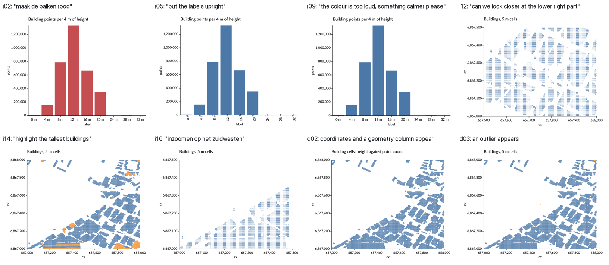
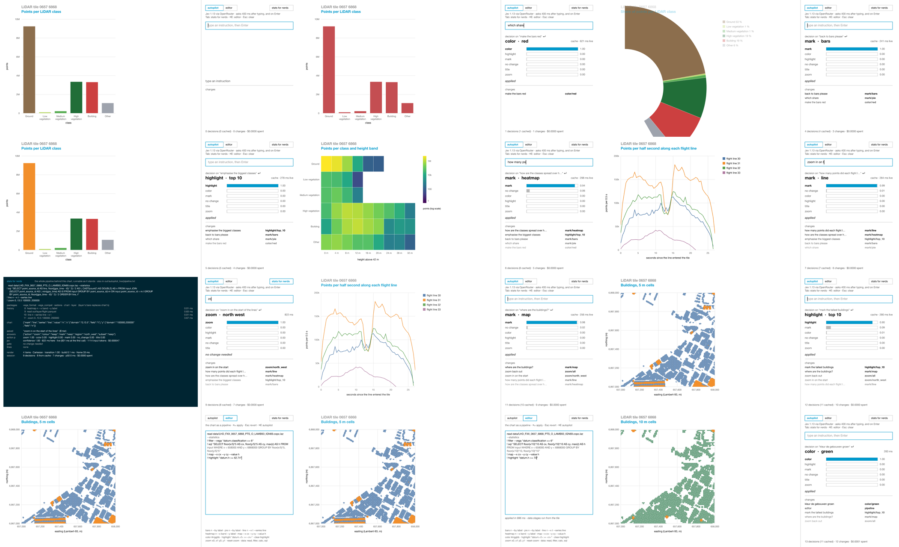
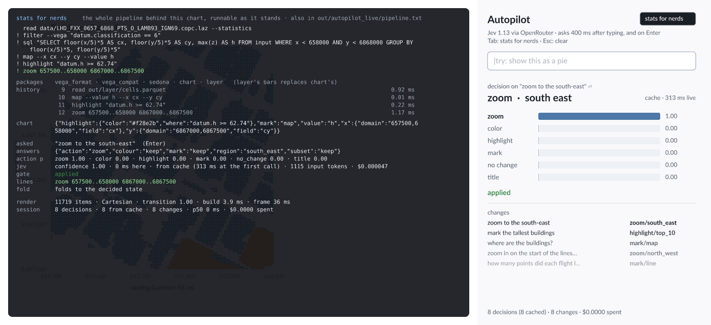
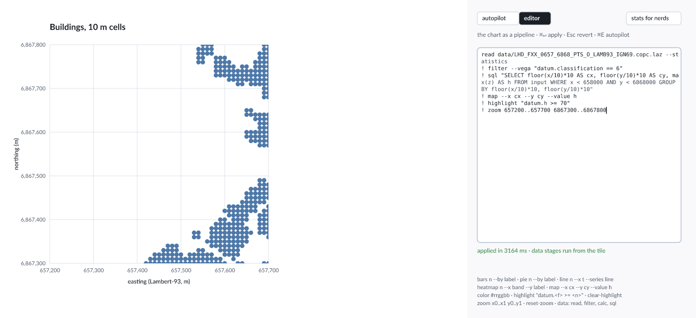
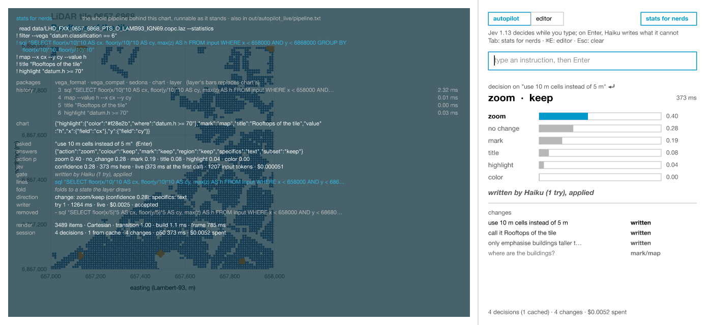

# Experiment 7 — charts driven by decisions

Status: phases A–F run, 24–25 Sep 2026, with Jev 1.13 and Claude Haiku 4.5 through OpenRouter. Phase H (Jev steers, Haiku writes the pipeline) measured 25 Sep 2026, and in the live window behind Enter. Phase G (a training run) is not built yet.

Can a chart be driven by a decider that picks from typed options, rather than
by a person writing commands? Two starting points:

- **A chart library designed to be driven by a typed classifier.**
  Classifiers such as [Jev](https://innfactory.ai/en/blog/jev-system-one-model-classifier-not-llm/)
  turn natural language into enums, quickly and cheaply. That makes chart
  edits possible while someone types.
- **A chart that follows a policy.** The chart keeps its current and previous
  state. It evaluates whether it is on track for a *policy* by looking at the
  difference between states, and a decider picks the visual that suits that
  change. The policy can be narrow ("whatever changes, always a bar chart") or
  free (connected to a database, a new geometry column appears, so the decider
  chooses a map).

## Why now

Experiment 6 ended on the question this depends on. Option 2 there replaced
setters with task commands (`bars`, `zoom`, `highlight`, …), and its notes ask
how large that vocabulary has to be: Vega-Lite v5 has 2,423 property
slots. A decider that picks from options needs exactly that vocabulary as its
option list. This experiment puts the vocabulary under real use instead of
arguing about it.

## What Jev is

Checked from public write-ups, not tested yet:

- A non-autoregressive "system one" model from TypeSafe AI. It reads text and
  answers typed questions in one pass instead of generating tokens.
- Three question types: **choice** (from options you supply), **score** (on
  a scale you define) and **binary** (a probability that a statement is true).
- The classes are described in natural language at call time, with no
  training.
- Latency is roughly 70–500 ms, at 4.2 cents per million input tokens; output
  is free. Several questions about one state are answered together in one
  call.

Sources: [innFactory](https://innfactory.ai/en/blog/jev-system-one-model-classifier-not-llm/),
[MindStudio](https://www.mindstudio.ai/blog/jev-system-one-model-classification),
[MindStudio benchmarks](https://www.mindstudio.ai/blog/jev-vs-classic-classifiers-benchmark),
[Nexus Agent](https://agent.nexus/blog/jev-the-model-that-decides),
[awesome-jev](https://github.com/yibie/awesome-jev).

## How the idea maps onto what exists

| Idea | In the experiments so far |
|---|---|
| The chart holds its current and previous state | The CQRS command log; the chart state is a fold of it (experiment 6) |
| Evaluate the difference with the last state | Two folds compared, plus a diff of the data's schema and statistics from the pipeline |
| A policy, narrow or free | The option list handed to the decider: one allowed chart, or the full vocabulary |
| A geometry column appears, so a map | Choosing a coordinate system: a `project` verb over experiment 5's systems |
| A wrong choice must not break the chart | Tasks are validated against the data before they are accepted (experiment 6) |
| Describe the state to the decider | The `describe` read model (experiment 6), extended with data statistics |

## Design

```
data change ─┐
typed text ──┼─► observation ─► decider ─► proposed command ─► task validation ─► log ─► fold ─► render
policy ──────┘   (compact JSON)  (rules │ Jev │ LLM)            (rejects, or accepts)
```

The decider proposes; the existing task validation decides whether a proposal
is accepted. A decider never writes the chart state directly.

- **Observation.** A compact document, with no raw data:
  - the current and previous `describe` of the chart, and the difference;
  - per column of the data: type, cardinality, null share, min/max, and
    whether it is a geometry, a time or a category;
  - the policy, as text;
  - the options the decider may pick from.
- **Policy as a constraint on options.** A narrow policy offers one mark
  (`bars`) plus styling. A free policy offers every mark, `project` and
  `facet`. The policy decides which enums exist at all, so a decider cannot
  wander outside it.
- **A `decide` step.** A pipeline step of kind Command that builds the
  observation, asks a decider and emits the chosen commands through normal
  validation. It works in the CLI, in the live viewer (as an autopilot), and in
  replay.
- **The log stays deterministic.** The log records the accepted command, not
  the sentence or the diff that led to it. A chart made by a non-deterministic
  decider is still replayed exactly (experiment 6's byte-identical checks
  apply unchanged). The observation and the decision are logged beside it, as
  provenance.

## Considerations

1. **Enums cannot carry free arguments.** Jev returns a choice, not text.
   "Zoom to the north-east" is fine if a named region exists; `zoom
   657500..658000` is not something a classifier produces. Arguments must be
   enumerable:
   - fields from the schema;
   - named palettes and colours;
   - named extents (quarters, a selected feature, "fit the data");
   - angles in steps.

   Anything else needs a second step, such as an LLM or a parser for
   numbers in the text. This constraint shapes the vocabulary more than
   anything else: named things over free values.
2. **The vocabulary comes first.** The noun/verb question from experiment 6's
   notes decides the option lists. It covers styling nouns derived from a
   schema, a few intent verbs (`zoom`, `highlight`, `project`, `facet`) and
   patches as the escape hatch. Which of these can be offered to a classifier
   at all? Noun commands with 78 axis options are a large choice question;
   perhaps the answer is questions in two stages (which object, then which
   property).
3. **Stability while typing.** Deciding on every keystroke can make the chart
   flip back and forth. Needed: a confidence threshold (Jev returns
   probabilities), hysteresis (do not switch unless the new choice wins by a
   margin), and debouncing. The flip rate on partial input is a measurement,
   not an afterthought.
4. **When not to act.** Most data changes need no chart change (more rows of
   the same kind). "No change" must be an explicit option, and the most
   common correct answer.
5. **A hosted service.** Jev (and a hosted LLM) means a network call per
   decision, an API key, and data leaving the machine. The key is read from an
   environment variable that the user sets. The observation holds schema and
   summary statistics only, never the LiDAR points. Responses are cached by a
   hash of the observation, so reruns are reproducible and free.
6. **Baselines keep it honest.** A rule-based decider (a geometry column
   means a map, a time column a line, low cardinality means bars) is the floor.
   If Jev does not beat it on the cases that need language, the measurement
   says so.
7. **Not tested yet.** Neither this repository nor the write-ups above have used Jev for
   chart decisions. The latency and cost figures are TypeSafe's and
   reviewers'; they get re-measured here.

## Plan

A crate `lidar-decide` in `experiments/07-chart-decisions`. It builds on
experiment 6's pipeline and chart package, at the same Avenger revision
(#129, `a2241265`; since 25 Sep 2026 the workspace pin, `602b99c`, #130).

| Phase | Builds | Measures |
|---|---|---|
| A. Vocabulary as options | Option lists derived from experiment 6's task commands, with enumerable arguments (fields, named extents, palettes, coordinate systems), and the policy as a filter on them | How many options each policy offers; which intents cannot be expressed as an enum |
| B. Observation | `describe` + previous state + diff, and column statistics from DataFusion | Size in tokens per observation; that no raw data leaves the machine |
| C. Deciders | Rules baseline, Jev (choice questions, batched), and a general LLM, behind one `Decider` trait with a response cache | Accuracy against expected commands, latency p50/p95, cost per decision, and rejection rate by task validation |
| D. Cases | Typed instructions ("make the bars red", "only buildings", "zoom to the north-east", "as a map") and data changes on the tile (a geometry column via `ST_Point`, a time column, an outlier, a new class, more rows of the same kind) | Per case: expected command, chosen command, confidence, time |
| E. While typing | The prefixes of each instruction, decided in turn with threshold and hysteresis | Flips per instruction; delay before the right chart appears |
| F. Policies | The same cases under a narrow policy ("always bars") and a free one | Whether the narrow policy holds under every case, and what the free one chooses when a geometry column appears |

Phase G, a training run as the data source, is described under
[Advanced](#advanced-a-training-run-as-the-data-source).

Deliverables, as in experiments 5 and 6: a README with measured results, a
`decide` step in the pipeline, an autopilot switch in a live view, and a
video of a chart following typed text and data changes.

## Run

```sh
set -a; source <folder with your .env>/.env; set +a    # OPENROUTER_API_KEY
cargo run --release -p lidar-decide --bin decide_eval   # phases C, D, F
cargo run --release -p lidar-decide --bin typing        # phase E
cargo run --release -p lidar-decide --bin layer_eval    # the chart layer's vocabulary
cargo run --release -p lidar-decide --bin autopilot_live     # the live window
cargo run --release -p lidar-decide --bin layer_roundtrip    # decisions ↔ pipeline check
cargo run --release -p lidar-decide --bin writer_eval        # phase H; --check runs the references only
cargo run --release -p lidar-decide --bin autopilot_live -- --record out/autopilot_live/frames
ffmpeg -framerate 30 -i out/autopilot_live/frames/f%05d.png -c:v libx264 -preset slow \
    -pix_fmt yuv420p -crf 24 experiments/07-chart-decisions/video/autopilot.mp4
cargo run --release -p lidar-decide --bin autopilot_video -- out/autopilot   # per-word run below
```

Every response is cached in [cache/](cache/), keyed by a hash of the decider,
the observation and the questions. Both binaries replay byte-identically
from the cache **without** an API key; only a new or changed case calls the
API. All 108 cached decisions together cost $0.069. The chart layer's
evaluation and the autopilot added about 110 more, for about $0.03.

| File | What it holds |
|---|---|
| [src/observe.rs](src/observe.rs) | Column statistics and roles, the data description, the diff, the observation |
| [src/options.rs](src/options.rs) | The questions per policy, and answers → experiment 6 task commands |
| [src/deciders.rs](src/deciders.rs) | `Rules`, `Jev` (OpenRouter Decisions endpoint), `Llm` (OpenRouter chat), the cache |
| [cases.json](cases.json) | 19 instructions and 4 data changes, with expected answers written before any decider ran |
| [results/](results/) | Every decision (`decisions.json`) and the cache files each run used |
| [src/layer/](src/layer/) | The chart layer: model, keyed transitions, drawing, data, and the decider's vocabulary for it (`pilot.rs`) |
| [cases_layer.json](cases_layer.json) | 24 instructions on the chart layer, expected answers written before any decider ran |
| [cases_writer.json](cases_writer.json) | Phase H: 19 instructions with the state they must fold to, and a reference pipeline for each |
| [src/layer/writer.rs](src/layer/writer.rs) | Phase H: Jev's extra question, the writer's prompt, write → apply → retry |

## Results

### A. The vocabulary as options

One decision is one call with all questions at once, as Jev bills and
answers them.

| Question | Options (free policy) | Options (narrow policy) |
|---|---|---|
| action | no_change, mark, color, zoom, rotate_labels, highlight, title | the same without mark |
| mark | bars, points, map, keep | – |
| colour | red, blue, orange, green, grey, keep | same |
| region | north_east, north_west, south_east, south_west, all, keep | same |
| angle | tilt, vertical, keep | same |
| subset | top_10, outliers, keep | same |
| **total** | **6 questions, 29 options** | **5 questions, 25 options** |

The decider only chooses intent. Arguments are derived from the data:
- the fields for a new mark come from column roles (a category and a measure
  for bars, two coordinates for a map);
- zoom ranges come from the data's extent;
- highlight thresholds come from the 90th and 99.9th percentiles.

**A title cannot be expressed:** every decider recognised `title` when asked,
and the translation stops there ("needs free text"). The policy is part of the
questions themselves: under the narrow policy `mark` does not exist, so no
decider can change the kind of chart.

### B. The observation

The observation holds the policy, the chart's `describe`, one line per data
column and, where relevant, the data change or the typed instruction. That is
~1,100 input tokens for Jev and ~900 for Haiku, with no raw rows.

For example, the column list for the map:

```
11747 rows. Columns:
- cx (Float64, coordinate): 201 distinct, range 657000..658000
- cy (Float64, coordinate): 201 distinct, range 6867000..6868000
- h (Float64, measure): 1814 distinct, range 45.53..93.65
```

**An observation must be reproducible.** DataFusion's approximate percentile
varies with batch order. With a `UNION ALL` it changed the "extreme value"
line of d03 between runs, and with it the cache key. Exact `percentile_cont`
fixed that. Without a reproducible observation, cached and replayed decisions
drift.

### C–D. Decisions

19 typed instructions on two charts (the height histogram and the buildings
map), including two in Dutch. There are also 4 data changes, each under both
policies. The d03 outlier is one synthetic cell with h = 400 m, added by
`UNION ALL`.

| Decider | Instructions right | Data changes right | Latency p50 / p95 | Cost, 27 decisions |
|---|---|---|---|---|
| rules | 13 / 19 | 8 / 8 (circular, see below) | 0 ms | $0 |
| Jev 1.13 | 18 / 19 | 4 / 8 | 290 / 680 ms | $0.0013 |
| Jev 1.13, confidence < 0.5 → no change | **19 / 19** | **7 / 8** | same | same |
| Claude Haiku 4.5 | 19 / 19 | 6 / 8 | 1,114 / 2,315 ms | $0.033 |

- **Language.** The rules fail on Dutch ("maak de balken rood", "inzoomen op
  het zuidwesten"), on paraphrase ("can we look closer at the lower right
  part", "put the labels upright") and on "something calmer". Both models get
  all of these.
- **Jev's confidence is informative.** Its five wrong answers had confidence
  0.12, 0.26, 0.23, 0.39 and 0.75. Treating anything below 0.5 as "no change"
  fixes four of them without losing a right answer; at 0.6 two right answers
  (0.51, 0.57) are lost.
- **Both models share one failure.** When two new height categories appear
  (d04, free policy), Jev (0.75) and Haiku both choose "highlight outliers".
  New categories are not outliers; the case expects no change.
- **"Doing nothing" is the hard answer for Jev.** For "more rows of the same
  kind" it chose `title` (0.12) and `zoom` with no region (0.26). With the
  threshold both become no change.
- **The rules' 8/8 on data changes measures nothing.** The same code wrote
  the diff text ("new column … (coordinate)", "an extreme value … appeared")
  that the rules match. They are the floor for language, not for data.
- **Cost and speed.** Jev is 26 times cheaper and 3.8 times faster (median)
  than Haiku for the same questions.
- **Validation.** No chosen command was rejected by experiment 6's task
  validation. Some were incomplete (zoom with no region, "unfit"), and titles
  "need free text".



The gallery ([images/cases/](images/cases/)) also shows what the observation
lacks:
- **"Something calmer" had no visible effect.** Jev chose blue, which the chart
  already was: the observation does not say which colour is current.
- **After d02 turned the scatter into a map, the old title stayed:**
  "height against point count". A mark change should revisit dependent state.
- **The highlighted outlier is one cell of normal size (d03).** Colour alone
  is not enough emphasis.

### E. While typing

Six instructions, decided after every word. A "chart change" counts only
decisions that become a valid command. `zoom` with no region yet changes
nothing.

| Decider | Chart changes over 6 sentences | With confidence ≥ 0.6 | Right at the end |
|---|---|---|---|
| rules | 4 | 4 | 3 of 6 |
| Jev | 14 | 9 | 6 of 6 |
| Haiku | 11 | 11 (no confidence given) | 6 of 6 |

Typical trails (Jev, with confidence):
- "make … the … bars … red": highlight/outliers (0.46) → … → color/red (0.99).
  The threshold removes the early guess, and the chart changes once.
- "can we look closer at the lower right part": after "lower", Jev settles on
  zoom/south_west with 0.96 confidence, and on south_east (1.00) after "right".
  A confident wrong intermediate that no threshold catches; only waiting for a
  pause in typing (debouncing) would.
- "highlight the tallest buildings": after "tallest", both models choose
  outliers, then top_10 after "buildings". The subset flips once, at high
  confidence.

A confidence threshold removes about a third of Jev's changes, but not the
confident wrong intermediates. Deciding while typing needs both a threshold
and debouncing.

### F. Policies

- **The narrow policy held in every case.** "turn this into a scatter plot"
  (i19) and "a geometry column appears" (d02) led every decider to no change,
  because `mark` is not among the options.
- **The free policy chose a map when coordinates and a geometry column
  appeared (d02).** All three deciders did this, Jev with 0.83 confidence.
  That is the "database gets a geometry column" scenario from the plan.
- **Under both policies, an outlier led to highlighting it (d03).** Styling is
  allowed under the narrow policy too.

## What it takes

1. **The option list is the interface.** A typed classifier drives a chart as
   well as a general model does on instructions (19/19 each with a
   threshold), for 4 % of the cost and a quarter of the latency. The work lies
   in the vocabulary: intent as enums, arguments derived from the data.
2. **Confidence is part of the contract.** Jev's probabilities turn "not
   sure" into "no change". Haiku gives none; a model without a calibrated
   confidence needs another way to abstain.
3. **The observation decides as much as the decider.** Missing style state
   (the current colour), dependent state (a title that no longer fits) and
   non-reproducible statistics all showed up as wrong or invisible decisions.
4. **Free text needs a second route.** Titles, predicates and precise ranges
   do not fit in enums.
5. **Typing needs damping at two levels:** a confidence threshold for
   uncertain guesses, and debouncing for confident wrong intermediates.

## Notes for the discussion

- **Deciding intent and deriving arguments is a clean split.** It keeps
  option lists small (29 options) while the chart still gets exact ranges and
  thresholds. A chart library could publish exactly that surface: the
  intents with their named options, and the rules that turn them into
  commands.
- **Jev's `score` question type was not used.** "How well does this chart
  serve the policy?" is a natural next step for the "on track" idea.
- **Not tested:** the video and live autopilot deliverables, phase G, other
  LLMs, and larger or noisier instruction sets. With 19 + 8 cases, one case is
  5 % (instructions) or 12.5 % (data changes); the counts are indicative.

## The autopilot on one chart that transitions

[video/autopilot.mp4](video/autopilot.mp4), 79 s, is a recording of the live
window ([below](#the-live-window)). Twelve instructions are typed into the
autopilot box, and **one chart object** moves from bars to a pie, back to
bars, to a heatmap, a time series and, last, a map. Every change is a
transition, as the marks were in experiment 5. On the way the recording:
- pauses twice mid-sentence, so Jev decides before Enter: "which share" gives
  the pie, and "zoom in on the start" the zoom;
- opens stats for nerds, which shows the pipeline behind the chart;
- switches to the editor, changes the SQL to 10 m cells and the threshold to
  70 by hand, and applies it;
- goes back to the autopilot, which continues on the edited pipeline ("kleur de
  gebouwen groen", "zoom to the south-east").



`autopilot_live --record <dir>` plays the script in `script()` against the
window's own code: keystrokes, pauses, Enter, Tab, ⌘E, selections and ⌘↵, on
a virtual clock at 30 fps. Decisions arrive after the latency measured when
they were first made, and come from the cache, so the recording rebuilds
without a key. The editor's apply really runs the pipeline from the tile
(about 1 s), so the length can differ between rebuilds by a few frames.

### The chart layer

At the newest top of the stack (#130), `avenger-chart-definition` has two
marks, rectangles and circle symbols. Both have a constant fill colour, and
there is no colour scale. A time series, a heatmap and a pie cannot be
described there. So [src/layer/](src/layer/) is a small chart layer directly on
`avenger-scenegraph`, rendered by `avenger-wgpu`. It borrows two ideas from the
`facet-fresh-start` branch:
- marks are separate from the coordinate system they are drawn in;
- a line mark splits into series by a key.

What it adds is a **key from the data on every item**, so two frames can be
joined item by item.

| File | What it does |
|---|---|
| `model.rs` | The chart state (dataset, mark, colour, zoom, emphasis, title), and `resolve(state, data)`, which turns it into a frame of keyed items |
| `anim.rs` | `transition(a, b, t)`: see the transitions below |
| `draw.rs` | Frames to marks, through experiment 5's `Bend` projection |
| `data.rs` | Four tables aggregated from the tile by experiment 6 pipelines, cached as Parquet |
| `pilot.rs` | The decider's observation and questions for this chart, and the answers applied to the state |
| `package.rs` | The `layer` pipeline package, decisions → pipeline lines, and the fold from the pipeline back to the state |
| `editor.rs` | Editor mode: a pipeline text run, drawn from its own result, cached tables recognised |

`transition(a, b, t)` works like this:
- items with the same key move, resize and recolour;
- a heatmap cell grows out of its class bar (its parent), and collapses back
  into it;
- a change between Cartesian and polar goes through `Bend` in two phases:
  first the layout, then the bend;
- a shared linear axis tweens its domain;
- guides, titles and legends that change fade in sequence, never on top of
  each other.

| Mark | Data from the tile | Transition into it |
|---|---|---|
| bars | points per LiDAR class | colour interpolates; emphasis recolours the top 10 % |
| pie | the same, as shares | the bars become one stacked bar, which `Bend` curls into a donut |
| heatmap | points per class and 4 m height band, viridis on a log scale | each class bar splits into its height cells |
| time series | points per 0.5 s along each of the 4 flight lines | new data: the old chart fades out, then the lines fade in; zoom tweens the domain |
| map | buildings in 5 m cells | new data as above; zoom tweens the domain, and the point size follows it |

### The vocabulary grows: 24/24 for Jev

`pilot.rs` asks one `mark` question, whose options are bars, pie, time series,
heatmap and map. Each option names the data it shows, so no field has to be
chosen. It also asks `colour`, `region` and `subset` (emphasis on or off). The
observation holds the chart state and table sizes, never rows.

Options that do not fit are refused, not drawn:
- a zoom on a pie;
- a colour on a heatmap, a time series or a pie, whose colours encode the
  data;
- a decision that would change nothing ("already so").

On 24 new instruction cases ([results/layer_decisions.md](results/layer_decisions.md)):

| Decider | Right | Latency p50 | Cost |
|---|---|---|---|
| rules | 16/24 | – | – |
| Jev | **24/24** | 278 ms | $0.0011 |
| Claude Haiku 4.5 | **24/24** | 1140 ms | $0.029 |

The earlier vocabulary scored 18/19 for Jev (phase D). With the chart layer's
vocabulary, Jev also gets the indirect questions right:
- "which share does each class have?" → pie;
- "how are the classes spread over height?" → heatmap;
- "where are the buildings?" → map;
- "which class has the most points?" → bars.

Rules miss exactly those, and Dutch.

### Deciding while typing: one gate had to be added

This section uses `autopilot_video`, an earlier recording that decides after
**every word** (66 decisions), against the state as it is at that moment. The
live window instead asks 400 ms after typing stops, and on Enter. The planned gates were:
- confidence ≥ 0.5;
- a complete intent;
- a change to the state.

In the first recording, the single word "make" gave `mark/pie` at confidence
0.77. The chart bent into a pie and back before the sentence was finished.
Early mark changes are the costly ones to undo, and the correct ones had
confidence ≥ 0.93. So one gate was added:

- **a change of chart kind before the instruction is complete needs
  confidence ≥ 0.9.**

This threshold was set after seeing this run, not beforehand. With it, all
12 instructions give exactly one change each, and all 12 are right. Several
land before the sentence is complete:

| Typed so far | Decision | Confidence |
|---|---|---|
| "which share" | mark/pie | 0.98 |
| "emphasise" | highlight/top_10 | 0.98 |
| "how many points did each flight line" | mark/line | 0.93 |
| "zoom in on the start" | zoom/north_west | 1.00 |
| "zoom back" | zoom/all | 1.00 |
| "mark the tallest" | highlight/top_10 | 0.79 |
| "show the whole" | zoom/all | 1.00 |

"zoom in on the start" resolving to north-west (the start of a time axis,
high values) is the decider reading the chart, not the words. The gate held
back:
- "how are the classes spread over" (heatmap, 0.49);
- "how many points did each flight" (line, 0.74).

In the video the panel shows each held-back decision in amber, with its
reason.

The 66 decisions cost $0.0031.

Jev is not fully deterministic. Asked the same question again, it gave the
same choices, but some confidences moved by 0.01 (0.69 → 0.70, 0.97 → 0.96).
The response cache is what makes the video and the scores reproducible.

### What changed on the way

- **A pie keeps its class colours.** After "make the bars red", the pie was
  solid red, with its slices told apart only by hairlines. A colour now
  applies to bars and the map only, and a mark change resets it where it does
  not apply. The colour does not come back with the bars. Remembering a
  colour per mark would be the next step.
- The title follows the mark (`default_title`). Emphasis enlarges map points
  as well as recolouring them. A zoomed map scales its points with the zoom,
  so it has no gaps.

### Decisions become pipeline lines

A decision does not change the chart directly. `package.rs` adds a `layer`
package to experiment 6's pipeline, alongside `vega_format`, `vega_compat`,
`sedona` and `chart`. It has one command per mark:

```
bars n --by label · pie n --by label · line n --x t --series line
heatmap n --x band --y label · map --x cx --y cy --value h · clear-highlight
```

Each mark command starts a fresh chart. `layer`'s `bars` takes over
`chart`'s, keeping the same syntax, and `install` reports that. Colour, zoom and
emphasis use experiment 6's `color`, `zoom`, `reset-zoom` and `highlight` as
they are, Vega predicate included. A decision becomes the lines that take the
chart from its current state to the decided one:

```
"where are the buildings?"   → read out/layer/cells.parquet ! map --x cx --y cy --value h
"mark the tallest buildings" → highlight "datum.h >= 62.74"
"zoom to the south-east"     → zoom 657500..658000 6867000..6867500
```

The pipeline validates each line against the data (fields, ranges, the
predicate), and logs it. The chart that is drawn is the **fold of the
pipeline's chart state**, not the decision. Anything the layer cannot draw
faithfully is refused, not approximated:
- an emphasis predicate other than `datum.<field> >= <number>`;
- a zoom on one axis only.

`layer_roundtrip` checks the translation. It takes the 44 states the
autopilot can reach and every pair of them: 1936 transitions, run as 4094
pipeline lines. Each one starts from scratch, runs the lines, and folds. Every
fold equals its target, in 3.9 s. The full pipeline behind each of the 44
states, run from the tile as one text, folds to that state too (66 s: each
one reads the LAZ). For the zoomed map with emphasis, it is:

```
read data/LHD_FXX_0657_6868_PTS_O_LAMB93_IGN69.copc.laz --statistics
! filter --vega "datum.classification == 6"
! sql "SELECT floor(x/5)*5 AS cx, floor(y/5)*5 AS cy, max(z) AS h FROM input WHERE x < 658000 AND y < 6868000 GROUP BY floor(x/5)*5, floor(y/5)*5"
! map --x cx --y cy --value h
! highlight "datum.h >= 62.74"
! zoom 657500..658000 6867000..6867500
``` The check found one gap: `color` can set a
colour but not unset it. A reset to the default colour now restarts the mark.

### The live window

`autopilot_live` is the same chart in a window (winit, `avenger-winit-wgpu`):
- type an instruction, and Jev is asked 400 ms after you stop, and on Enter;
- the gates are the video's; before Enter, a change of chart kind needs
  confidence ≥ 0.9;
- decisions run on the tokio runtime, and a frame wake-up picks up their
  results, so the window never waits on the network;
- decisions in `cache/` replay without a key, and new ones need
  `OPENROUTER_API_KEY`.

**Stats for nerds** (Tab, or the button) lays the plumbing over the chart:

| Row | Shows |
|---|---|
| pipeline | the whole pipeline behind the chart, from `read <tile>` to the last command, one stage per line, never cut; the stages the last decision added are green. Runnable as it stands, and written to `out/autopilot_live/pipeline.txt` on every change |
| packages | installed packages, and which step `layer` took over |
| history | the last lines run in this session, with their times |
| chart | the folded chart state as JSON |
| asked / answers / action p | what Jev was asked (while typing or on Enter), its raw answers and the probabilities |
| jev | confidence, latency here and at the first call, from cache or live, tokens, cost |
| gate / lines / fold | what the gates made of it, the pipeline lines, and whether the fold equals the decided state |
| render / session | items drawn, coordinate system, transition progress, build and frame time; decisions, cache hits, p50 latency, cost |



Both text fields (the autopilot box and the editor) edit as a text field
should:
- click to focus; the focused field has an accent border and a blinking
  caret, and typing into an unfocused window focuses the field;
- ← → (⌥ by word, ⌘ to the line's ends), and ↑ ↓ in the editor;
- ⇧ with any of those selects, ⌘A selects all, a double click selects a word,
  and a triple click a line;
- typing replaces the selection; Backspace and Delete remove it (⌥ a word,
  ⌘ to the line start);
- ⌘X, ⌘C and ⌘V go through the system clipboard;
- in the autopilot box, Enter asks and clears the box for the next
  instruction.

The editing is unit-tested (`cargo test -p lidar-decide --bin autopilot_live`).
macOS can deliver Backspace as the DEL control character; that counts as
Backspace. Text is measured per character, so caret, selection and wrapping
work in a proportional typeface.

The window uses `Theme::calm()` ([`theme.rs`](src/layer/theme.rs)):
- one accent colour, square corners, and no fills or shadows; lines set
  things apart;
- one typeface throughout, pipeline text included;
- status in grey italic text;
- a grey kicker above the chart title.

`--neutral` gives the look of the recordings. The recordings themselves are
unchanged, byte for byte.

`AUTOPILOT_DEBUG=1` logs every input event to
`out/autopilot_live/events.log`.

`autopilot_live --snapshot <dir> "instruction" …` runs the same path (Enter,
gates, pipeline, fold) without a display, and writes each state as PNG with
and without the overlay.

### Editor mode

The same chart, written by hand. ⌘E (or the "editor" button) swaps the
autopilot panel for a text area that holds the pipeline behind the chart. You
edit it, ⌘↵ applies it, and Esc reverts to what is running. Both modes work
on one pipeline: the autopilot continues from an edit, and the editor opens
on whatever the autopilot did last.



[`editor.rs`](src/layer/editor.rs) runs the text through a fresh pipeline,
the same as the autopilot's lines. If the text does not run, or folds to
something the layer cannot draw, it is refused, and the chart stays as it
is. Four things make hand-writing worth it:

- **Edited data is drawn.** The drawn table is built from the pipeline's own
  result, using the fields the mark command names. Changing `floor(x/5)*5`
  to `floor(x/10)*10` gives 10 m cells (3489 instead of 11719). The point
  size and the default title follow the cell size.
- **Known data is read from its cache.** When the data stages are exactly
  those of one of the four tables, the cached Parquet file is read instead of
  the tile: 2 ms instead of about 1 s. The status line says which it was.
- **Zoom and emphasis are no longer limited to what the autopilot can say.**
  The state has an optional custom zoom range and emphasis threshold, so
  `zoom 657200..657600 6867300..6867700` and `highlight "datum.h >= 70"` are
  drawn. A quarter-shaped zoom and the top-10 % threshold fold back to what
  the autopilot knows, so its observations, and the cache keys of every
  earlier decision, are unchanged.
- **Refusals name the problem.** For example `the layer draws
  datum.h >= <number> only, not datum.h < 50`, or the pipeline's own
  `map: no field cx in the data (fields: x, y, z, …)`.

`layer_roundtrip` also runs each of the 44 full pipelines as editor text.
Each one applies to its own state, from the cache, in 82 ms for all 44.
`autopilot_live --snapshot <dir> @file.txt` applies a file as editor text,
without a display.

What the editor does not do yet:
- word wrapping (it wraps at 60 characters);
- selection, copy and paste;
- syntax highlighting.

Commands after a data stage are refused: data goes first, then the chart.

**A text without a chart command is a query.** In the first live trial,
`read <tile> --statistics ! head 2` was refused with "no chart command";
a table was expected. Such a text now runs as a query (`editor::query`), and
its rows are drawn over the chart: a trailing `head N` gives N rows, a text
that ends in data gives the first 20, and queries such as `schema` or
`explain` print their lines. Columns that do not fit are named below the
table. The chart and its pipeline are not touched; the table goes when the
chart changes, or on Esc or ⌘E. Headless, `head 2` on the tile took 10 ms, and
a `GROUP BY classification` over all 17.3M points about 1 s.

### Not built yet

- **Data events** (more rows, a new column, an outlier) and the narrow/free
  policy switch in the panel. Phases D and F measure these on the pipeline
  charts, but they are not wired to the chart layer.
- **Undo** in the log itself. Experiment 6's `undo` refolds the log with
  the `chart` package's `apply`, which does not know the layer's marks. The
  window now undoes by applying the previous pipeline again (see
  [Undo and reset](#undo-and-reset)), which does not need it.
- **Free text** (titles, custom zooms, other predicates): the pipeline accepts
  them, but a classifier cannot produce them. Phase H (below) adds a
  writer for them, behind Enter in the live window.

## Phase H: Jev steers, Haiku writes the pipeline

The autopilot so far turns Jev's options into pipeline lines with fixed rules
(`package.rs`). That covers what the options can say, and nothing else. A
title, "taller than 70 m", "10 m cells" or an exact range are refused as
`NeedsText`, or rounded to the nearest option. In phase H, Jev reads the
instruction first, and a general model (Claude Haiku 4.5) writes the whole
new pipeline, with Jev's reading as direction.

- **Jev** answers the pilot's questions, plus one more, `specifics`: does
  the instruction carry text, a number, a range or a cell size that none of
  the options can hold? The pilot's own questions are unchanged, so the cache
  keys of every earlier decision are too.
- **The writer** gets the grammar of the steps, the four tables with their
  fields and the pipelines that build them, the chart now (its extents,
  quarters and what the mark does not have), the pipeline now, the
  instruction and Jev's reading. It replies with a whole pipeline.
- **Nothing it writes is trusted.** The pipeline runs through
  `editor::apply`, the path a hand edit takes: every stage is validated, and
  the result must fold into a state the layer can draw. A refusal goes back
  to the writer with its reason, up to three tries. The chart that is drawn
  is still the fold of the pipeline.

Four ways are compared on [cases_writer.json](cases_writer.json): 6 cases in
the pilot's vocabulary (`v`) and 13 that need text of their own (`w`). Each
case names the state it must fold to, and has a reference pipeline;
`writer_eval --check` shows that all 19 references reach their expectation
with the existing steps, before any model runs.

| Way | What decides |
|---|---|
| jev | Jev's options, applied as the autopilot does |
| haiku | Haiku writes the pipeline from the instruction alone |
| haiku+jev | Haiku writes it with Jev's reading as direction |
| routed | Jev's options when they say it all (confidence ≥ 0.5 and `specifics: none`), otherwise Haiku with Jev's direction |

Results, second prompt, 19 cases ([results/writer_v2.md](results/writer_v2.md)):

| Way | Right, vocabulary | Right, own text | Writer calls | Accepted first try | Latency p50 / max | Cost, 19 cases |
|---|---|---|---|---|---|---|
| jev | 6/6 | 2/13 | 0 | – | 271 / 1003 ms | $0.0010 |
| haiku | 6/6 | 13/13 | 19 | 18/19 | 1751 / 3343 ms | $0.055 |
| haiku+jev | 6/6 | 13/13 | 19 | 18/19 | 1929 / 4597 ms | $0.057 |
| routed | **6/6** | **13/13** | 15 | 14/15 | 1604 / 4597 ms | $0.045 |

What the numbers say:

- **Jev alone cannot do the `w` cases, as expected.** The two it gets right
  are the ones where the answer is "unchanged" (a 3D model, emphasis on a
  heatmap). For "taller than 70 m" it picks the top 10 %, confidently (0.95).
- **A written pipeline does all 19.** Every title, threshold, cell size and
  range folds to the expected state. Two things came out of the writer
  that no option could: 10 m cells (3489) and 2 m cells (63 231).
- **Jev's direction changed one thing:** with it, Haiku also changed the
  title when the cell size changed ("Buildings, 10 m cells"). Without it, the
  map shows 10 m cells under the title "Buildings, 5 m cells". The cases do
  not check that title, so both count as right. In every other case the two
  wrote the same result.
- **Routing is cautious, never wrong in the costly direction.** Jev said
  `specifics: text` for 12 of the 13 `w` cases. The thirteenth (emphasis on a
  heatmap) goes to the writer anyway, because its option does not fit. But it
  also said `text` for two plain cases ("mark the tallest buildings", "kleur
  de gebouwen groen"), which then cost a writer call. No case that needed
  text took the fast path.
- **Latency is the price.** The writer is 6–7 times slower than Jev (1.6–1.9 s
  p50). That is too slow for deciding while typing; it suits Enter.

**The first prompt was worse, and the retries showed why**
([results/writer_v1.md](results/writer_v1.md)): 14 of 19 accepted on the
first try, 25 tries in all, and v03 wrong for both writers.
- The palette was written as `green #59a14f`, and Haiku wrote `color green`.
  That caused 4 of the 6 retries (the other 2 are the heatmap below). Each
  was fixed on the second try, from the refusal's own text.
- "The top left" of the time series became `zoom 0..5 0..50000` instead of the
  north-west quarter. Once the prompt listed the four quarters, the zoom
  those options stand for, it was right.
- Asked to emphasise a heatmap, Haiku tried three predicates and did not give
  up; the result was "unchanged" only because the tries ran out. With "emphasis:
  not available on a heatmap" in the prompt, it takes two tries.

The second prompt was changed after seeing these results, on the same 19
cases, so its scores are optimistic. New cases are the honest test.

**The first live trial was that test, and it failed.** On a pie, "filter
ground" came back from Jev as `mark/bars` (0.61, `specifics: none`): the
nearest option, since none of them filters. It took the fast path, and the
pie turned into bars with nothing filtered. Two changes, and two cases for
it (w14 "filter ground", w15 "only show ground and buildings"), added
afterwards and marked so in the case file:
- Jev's `action` on Enter has a way out, `other`: "filter the data, aggregate
  it differently, or any other change to the pipeline". It never applies on
  the fast path, so such an instruction goes to the writer.
- The writer now gets only the change Jev chose and `specifics`, not its
  answers to the other questions. With `other` came `mark: bars` beside it,
  and Haiku followed that stray answer and drew bars
  ([results/writer_v3a.md](results/writer_v3a.md)).

With both, on 21 cases ([results/writer.md](results/writer.md)):

| Way | Right, vocabulary | Right, own text | Writer calls | Accepted first try | Latency p50 / max | Cost, 21 cases |
|---|---|---|---|---|---|---|
| jev | 6/6 | 2/15 | 0 | – | 296 / 677 ms | $0.0011 |
| haiku | 6/6 | 15/15 | 21 | 20/21 | 1681 / 3343 ms | $0.060 |
| haiku+jev | 6/6 | 15/15 | 21 | 20/21 | 1952 / 3971 ms | $0.063 |
| routed | **6/6** | **15/15** | 16 | 15/16 | 1618 / 3971 ms | $0.048 |

Without the side answers, Jev's direction no longer adds the "10 m cells"
title either: haiku and haiku+jev now write the same pipelines. The direction
still decides the route, but on these cases it does not change what the
writer writes.

### Undo and reset

In the same trial, every way of saying "undo" gave `no_change`: there was no
such option. On Enter, `action` now also offers `undo` ("go back one step")
and `reset` ("start over, not only the zoom or the emphasis"). The pilot's
own questions, used while typing, are unchanged.

The window keeps the pipeline behind every earlier chart. Undo applies the
previous one again through the editor's path; reset applies the first one
and keeps the chart it leaves in the history, so an undo brings it back. The
chart stays the fold of a pipeline either way.

Thirteen cases, written after the trial, score Jev's action only (going
back needs the history, which the eval does not keep). The last four are
lookalikes that must not go back:

| Instruction | Expected | Jev |
|---|---|---|
| undo · undo that · go back · that was wrong, revert it · maak dat ongedaan · terug naar hoe het was | undo | undo, 0.62–0.94 |
| start over · reset everything · begin opnieuw | reset | reset, 0.89–0.96 |
| reset the zoom | zoom | zoom/all, 0.80 |
| remove the emphasis | highlight | highlight/none, 1.00 |
| leave it as it was | no_change | no_change, 0.99 |
| go back to the bar chart | mark | mark/bars, 0.87 |

13/13. The two new options left the 21 cases above as they were. In the
window, headless: map → title → "maak dat ongedaan" (the title goes) →
"undo" (back to bars) → "undo" ("nothing to undo") → pie → "start over"
(bars) → "undo" (the pie again).

Not checked: other writer models; Dutch beyond two cases; instructions that
change the data stages beyond the cell size (other filters, other
aggregates).

### The writer in the live window

`autopilot_live` routes Enter the same way as the `routed` column:
- while typing, nothing changes: Jev decides after 400 ms, with the pilot's
  questions, and only its options apply;
- on Enter, Jev also answers `specifics`. When its options say it all, they
  apply as before. Otherwise the panel shows "Haiku writing…", the chart stays
  as it is, and Haiku writes the pipeline in the background. What it writes
  is applied through the editor's path, and the chart makes its usual
  transition;
- stats for nerds shows the stages it added (in the accent colour), the
  stages it removed (`- …`), Jev's reading as it went to the writer, and each
  try with its time, cost and, if refused, the reason.

The overlay is translucent (alpha 0.72 in the calm theme), so the chart stays
visible under the plumbing:



A headless run of six instructions (`--snapshot`, live calls):

| Instruction | Route | Pipeline change |
|---|---|---|
| where are the buildings? | options | `read out/layer/cells.parquet ! map --x cx --y cy --value h` |
| only emphasise buildings taller than 70 m | Haiku, 1 try | `highlight "datum.h >= 70"` |
| call it Rooftops of the tile | Haiku, 1 try | `title "Rooftops of the tile"` |
| use 10 m cells instead of 5 m | Haiku, 1 try | the `sql` stage at 10 m; title and emphasis kept |
| zoom to the south-east | options | `zoom 657500..658000 6867000..6867500`, on the 10 m data |
| show this as a pie | options | `read out/layer/classes.parquet ! pie n --by label` |

`--record` runs without the writer, so the video still rebuilds from the
cache; `--no-writer` does the same in the window. A mark change still resets
the title to the mark's default, as before: the title of the map does not
travel to the pie.

## Advanced: a training run as the data source

Once phases A–F have measured the decisions on the LiDAR cases, the same
machinery can follow a reinforcement-learning training run. There, the state
changes at every step.

- **The data change is the run.** Each training step updates the
  observation: reward, loss, episode length, and statistics of the states the
  agent visits. The decider is asked whether the chart should change. Most of
  the time it should not, and the chart only takes the new data.
- **Regime changes become visible edits.** When something shifts (reward
  jumps, a new behaviour appears, the loss plateaus), the decider picks another
  view: zoom in, highlight the new episodes, switch from a line to a
  distribution. The chart shows not only the numbers moving, but what changed
  in them.
- **The command log is the video's timeline.** Every accepted command is a
  chart state. Folding the log up to entry *n* and rendering it gives frame
  *n*, headlessly, as for the experiment 5 and 6 videos. Because replay is
  deterministic, the video can be rebuilt from the log alone.

Considerations specific to this case:

- **Rate.** A training loop produces far more states than a video has frames,
  or a decider can follow. The chart works on aggregated windows, like the
  rolling aggregate states of experiment 3's live feed. The decider is asked
  per window, not per step, with the hysteresis of consideration 3 so that the
  view does not flicker.
- **Two meanings of "policy".** The agent being trained has a policy, and the
  chart follows a policy too. In this case the terms need distinct names; for
  example the *agent policy* and the *chart policy*.
- **The run as a source.** The run can be a logged file (for example a
  Parquet or Arrow log of steps) replayed through the pipeline, or a live
  stream over Arrow Flight as in experiment 3. A logged run keeps the
  experiment reproducible; a live one tests the rate.

| Phase | Builds | Measures |
|---|---|---|
| G. A training run | A step log of a small RL training run as the source; windowed aggregation; the decider per window; the video from the fold of the command log | Decisions per window and how many are "no change"; whether the regime changes that are visible in the metrics are the ones the chart reacts to; frame rate of the headless render |

## Open questions

- Should a chart library expose its vocabulary *as* the option list, so any
  decider (Jev, an LLM, a UI) drives it through the same typed surface?
- Where does the free text go (titles, predicates, numeric ranges) when the
  decider only returns enums?
- Is "on track for a policy" a score question (Jev's score type: how well does
  this chart serve the policy?) rather than a choice?
- How much of this belongs in Avenger, and how much in an application on top?
