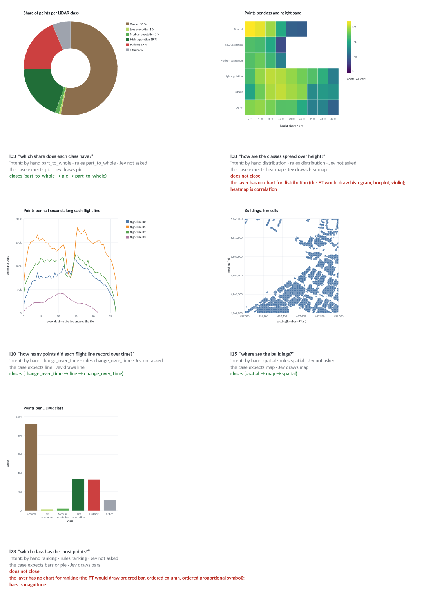

# A vocabulary for what a chart is for, September 2026

Is there an existing vocabulary to explain the intents of charts? Yes, several,
and they agree on a core of about ten. But each describes a different thing
(the reader's question, the author's message, or what an interaction is
for), and none is a shared, machine-readable standard that a chart grammar
carries. Vega-Lite has no intent field, and neither has Avenger's spec.

This page collects them, puts their overlap in one table, and runs a round
trip through experiment 7: question → intent → chart kind → back to the
intent. The round trip finds two cases where experiment 7's expected answer
does not serve the question asked.

How it was checked, on 30 Sep 2026: web searches, the papers' abstracts and
landing pages, and the Financial Times' Visual Vocabulary read from its
repository. The papers' full texts were **not** opened. The dimensions of
Schulz et al. and the sub-levels of Brehmer and Munzner are given from
knowledge of those papers, not re-read. The round trip below is this page's
own classification of experiment 7's cases, by hand; `intent_roundtrip`
(below) runs it, with Jev's own decisions as the charts.

## The vocabularies, by what they describe

### The reader's task: what someone wants to find out

- **Amar, Eagan and Stasko (2005)**, *Low-level components of analytic
  activity*: ten tasks, from about 200 questions students asked of five
  datasets. Retrieve value, filter, compute derived value, find extremum,
  sort, determine range, characterise distribution, find anomalies, cluster,
  correlate. The most reused list.
- **Brehmer and Munzner (2013)**, *A multi-level typology of abstract
  visualization tasks*: *why* a task is done (consume: present, discover,
  enjoy; or produce; then search: lookup, browse, locate, explore; then query:
  identify, compare, summarise), *how* (encode; manipulate: select, navigate,
  arrange, change, filter, aggregate; introduce: annotate, import, derive,
  record), and *what* goes in and comes out. Complex tasks are chains of simple
  ones.
- **Schulz, Nocke, Heitzler and Schumann (2013)**, *A design space of
  visualization tasks*: five dimensions (goal, means, characteristics,
  target, cardinality) after journalism's "5 Ws and How".
- **Quda (Fu et al., 2020)**: 14,035 natural-language queries labelled with
  ten low-level analytic tasks, for training classifiers that recognise the
  task in free text.
- **NL4DV (Narechania et al., 2020)**: seven tasks (correlation,
  distribution, derived value, trend, find extremum, filter, sort) inferred
  from a query and turned into Vega-Lite. Its LLM version (2024) writes the
  seven down as structured JSON (name, description, examples, attribute
  types, suitable encodings): the nearest thing found to a machine-readable
  task list.
- **Draco (Moritz et al., 2019; Draco 2, 2023)** uses two tasks, value and
  summary, as constraints in a recommender.

### What an interaction is for

- **Yi, Kang, Stasko and Jacko (2007)**: seven intents, named for what the
  user wants rather than the technique. Select, explore, reconfigure,
  encode, abstract/elaborate, filter, connect.
- **Shneiderman (1996)**: overview first, zoom and filter, then details on
  demand. The older and coarser form.

### The author's message: what a chart says

- **The Financial Times' Visual Vocabulary**: nine messages, each with the
  charts that suit it. Called a vocabulary outright, and the most used in
  practice (data.europa.eu's guide adopts it). Its lists, as the repository
  gives them:

  | Message | Charts |
  |---|---|
  | Deviation | diverging bar, diverging stacked bar, spine, surplus/deficit filled line |
  | Correlation | scatterplot, line + column, connected scatterplot, bubble, XY heatmap |
  | Ranking | ordered bar, ordered column, ordered proportional symbol, dot strip, slope, lollipop |
  | Distribution | histogram, boxplot, violin, population pyramid, dot strip, dot plot, barcode, cumulative curve |
  | Change over time | line, column, line + column, stock price, slope, area, fan chart, connected scatterplot, calendar heatmap, Priestley timeline, circle timeline, seismogram |
  | Part-to-whole | stacked column, proportional stacked bar, pie, donut, treemap, Voronoi, arc, gridplot, Venn, waterfall |
  | Magnitude | column, bar, paired column, paired bar, proportional stacked bar, proportional symbol, isotype, lollipop, radar, parallel coordinates |
  | Spatial | choropleth, proportional symbol, flow map, contour map, equalised cartogram, scaled cartogram, dot density, heat map |
  | Flow | Sankey, waterfall, chord, network |

- **AntV's AVA**, the industrial equivalent: its chart advisor files charts
  by purpose (comparison, trend, distribution, rank, proportion,
  composition).
- **Adar and Lee (2020)**, *Communicative visualizations as a learning
  problem*: intents as learning objectives, the one formal classification
  of communicative intent cited as broadly applicable.
- **VisActs (Dasu, Kuo and Ma, 2023)**: speech-act theory for charts, with
  intents such as inform, educate and emote.

### What a chart states: facts and descriptions

- **Data facts** (DataShot, 2019; Calliope, 2020): ten formally defined
  types to generate: value, difference, proportion, trend, categorisation,
  distribution, rank, association, extreme, outlier.
- **Lundgard and Satyanarayan (2021)**: four levels of what a description
  of a chart conveys, from 2,147 sentences. Construction (marks,
  encodings), statistics (extremes, correlations), perceptual patterns
  (trends), and domain context.

### Ontologies

- **VISO** (Voigt et al.): OWL modules for graphics, data, facts and
  activity, the last only interaction types. Available on GitHub.
- **Loshkovska and Panov (2025)** survey the visualization ontologies and
  find them "fragmented, heterogeneous, and inconsistent in terminology".

### 2025–2026

The work with language models mostly defines its own intents rather than
reuse these. Doc2Chart (EMNLP 2025) has a model decompose a user's intent to
guide data extraction; Text2Vis (EMNLP 2025) labels its own analytic tasks
over 20 chart types. Gyarmati, Moritz, Möller and Koesten (Dec 2025, revised
Jun 2026) catalogue 744 design guidelines as natural language with typed
metadata, and note that practitioners adapt guidance to audience and
communicative intent, without adopting a taxonomy. Vis-OntoQ (CHI EA 2026)
grounds question generation in domain ontologies, not a task ontology. No
standard was found (W3C, Vega-Lite, or a chart server such as AntV's MCP
server) that puts an intent into a chart specification.

## The shared core

Side by side, the lists largely name the same intents:

| Intent | FT message | Amar task | Data fact | AVA purpose |
|---|---|---|---|---|
| how much | magnitude | retrieve value | value, difference | comparison |
| which is first | ranking | sort, find extremum | rank, extreme | rank |
| how it changes | change over time | (compute derived value) | trend | trend |
| how it spreads | distribution | characterise distribution, determine range | distribution | distribution |
| what goes with what | correlation | correlate, cluster | association | – |
| what share | part-to-whole | – | proportion | proportion, composition |
| what departs | deviation | find anomalies | outlier | – |
| where, and to where | spatial, flow | – | – | – |

The FT's names are the most useful single set for a decider: each comes
with the charts that serve it, so an intent leads to a chart kind and a chart
kind leads back to the intents it can serve. That is the round trip below.

## Round trip through experiment 7

Experiment 7's decider, Jev, never names an intent: it picks an action and
its argument, and the 24 cases in [cases_layer.json](cases_layer.json)
expect one. Eleven of them expect a change of chart kind. Six of those
name the kind ("show this as a pie"); five ask a question instead, and the
chart kind is how the layer answers it. Those five go round:

1. **Forward**: the question's intent, then the FT's charts for it, kept to
   the five kinds the layer draws (bars, pie, line, heatmap, map).
2. **Back**: the kind the case expects, then the FT's messages that list it.
   The trip closes when the question's intent is among them.

| Case | Question | Intent | Forward: kinds the layer has | Case expects | Back: messages that list it | Closes |
|---|---|---|---|---|---|---|
| l03 | which share does each class have? | part-to-whole | pie | pie | part-to-whole | yes |
| l08 | how are the classes spread over height? | distribution | **none** (the FT lists no heatmap for distribution) | heatmap | correlation, change over time, spatial | **no** |
| l10 | how many points did each flight line record over time? | change over time | line | line | change over time | yes |
| l15 | where are the buildings? | spatial | map | map | spatial | yes |
| l23 | which class has the most points? | ranking (find extremum) | bars, if ordered | bars or pie | bars: magnitude (ranking needs them ordered); pie: part-to-whole | **bars only if sorted; pie no** |

What the two open trips say:

- **l08: the layer has no distribution chart.** The heatmap of class by 4 m
  height band is the nearest thing it draws, and it does show the spread
  (a column of counts per class). But in the FT's terms it is a correlation
  chart between class and height; a distribution is a histogram, a boxplot
  or a violin per class. The case is right about what the layer can do and
  the vocabulary is right about what was asked.
- **l23: bars answer "which is most" only when sorted.** The layer's bars are
  in class order (`ORDER BY o` in `data.rs`), which the FT files under
  magnitude; ranking is *ordered* bars. And the case's second answer, a pie,
  answers "what share", not "which is most": the round trip would not accept
  it.

The other thirteen cases change something other than the kind, and their
actions map onto the interaction vocabularies instead:

| Jev's action (writer's commands) | Yi et al. | Brehmer and Munzner, *how* | Amar |
|---|---|---|---|
| `mark` | encode | encode | – |
| `color` | encode | encode | – |
| `zoom` | explore, abstract/elaborate | navigate | – |
| `highlight` ("emphasise the biggest") | select | select | find extremum |
| `title` | – | annotate | – |
| `transform` (filter, aggregate, compute a field) | filter | filter, aggregate, derive | filter, compute derived value |
| `select point / interval / segment / timebox / lasso` | select (connect, when it cross-filters) | select | filter (with `--effect filter`) |
| `view fisheye / magnifier / tilt` | abstract/elaborate, reconfigure | navigate, change | – |
| `lens regression / sample / mole` | abstract/elaborate | derive | compute derived value (regression) |
| `undo`, `reset`, `no_change` | – | – | – |

Every action but three has a name in the literature. `undo` and `reset`
belong to the session rather than the chart, and no vocabulary above has
them (Brehmer and Munzner's *record* is about keeping a history, not going
back in it).

The other direction, what the vocabulary has and experiment 7 cannot say:
deviation, correlation between two quantities, flow, and magnitude kept
apart from ranking. Of Yi et al.'s seven intents, only *connect* is missing
as a named action; it happens only through cross-filtering.

## Run it

The round trip is code: the FT's nine messages and their charts, with
forward, back and the verdict, are [`src/layer/intent.rs`](src/layer/intent.rs);
the hand labels are [`cases_intent.json`](cases_intent.json), kept apart from
the cases, which were written before any decider ran.

```sh
cargo run --release -p lidar-decide --bin intent_roundtrip            # every case: a table and a contact sheet
cargo run --release -p lidar-decide --bin intent_roundtrip -- --ask   # type questions, one per line; each chart as a PNG
set -a; source <folder with your .env>/.env; set +a                   # to have Jev answer the intent too
```

For every case it puts the intent by hand, by keyword rules, and by Jev
asked one typed question (`intent::question()`, its own question set, so the
pilot's cached decisions keep their keys) beside each other; takes the chart
Jev's own decision draws, from its cached pilot answer applied to the start
state; and checks the round trip for that chart. It writes
[results/intent_roundtrip.md](results/intent_roundtrip.md) and
[images/intent_roundtrip.png](images/intent_roundtrip.png).



Run on 30 Sep 2026, with Jev (`typesafe/jev-1.13`) answering the intent:

| | |
|---|---|
| the five questions: intent by Jev | all five as labelled, at 0.71–1.00 |
| all 24 cases: Jev agrees with the hand labels | 20 of 24 |
| the round trip for the chart Jev's decision draws | closes for 3 of 5; l08 and l23 do not, as above |

Jev's four disagreements are instructions labelled `none` that name a chart:
"show this as a pie" → part-to-whole (0.73), "show a time series" → change
over time (0.99), "put it on a map" → spatial (0.94), and "mark the tallest
buildings" → ranking (0.53). The first three are the vocabulary's step back,
from a chart to the message it carries, taken by Jev; they are arguably
better labels than the hand ones. The keyword rules agree with the hand
labels on all 24, which says nothing: they were written after, and for,
these cases, and the first new question typed ("which class has the fewest
points?") missed until "fewest" was added.

Two questions typed with `--ask`, both new to Jev: "which class has the
fewest points?" is ranking (0.72), and Jev's decision keeps the bars, which
do not close it; "how do building heights compare between the classes?" is
magnitude (0.69), and Jev's decision is the heatmap, which the vocabulary
files under correlation. The second is where the vocabulary can be argued
with: class by height is a fair chart for that question.

With `--ask`, a question Jev cannot be asked (no key) falls back to the
keyword rules and the chart the vocabulary leads to, and says so.

### In the window, after every change

`autopilot_live` asks "what is the intent of the chart?" whenever the chart
changes (`transition_to`): Jev is given the new chart's observation and the
typed intent question, in the background, and the answer appears under
*changes* in Jev's column, beside the messages the vocabulary gives the chart
kind. When typed text caused the change, the text's intent is asked too
(seen from the chart before it), and the block says whether the chart leads
back to it. A change by a gesture has no text, so the block compares Jev's
reading with the vocabulary instead. Headless, with
`autopilot_live -- --snapshot <dir> "which share does each class have?" …`,
each step waits for the answers and prints them, on 30 Sep 2026:

| Typed | Chart after it | Jev on the chart | The text's intent | Closes |
|---|---|---|---|---|
| which share does each class have? | pie | part-to-whole 0.90 | part-to-whole 1.00 | yes |
| which class has the most points? | pie, "Ground" selected (Haiku) | part-to-whole 0.90 | ranking 0.41 | no |
| how are the classes spread over height? | heatmap | none 0.38 | distribution 0.87 | no |
| where are the buildings? | map | spatial 0.64 | spatial 0.98 | yes |

Jev cannot say what the heatmap is for (none, 0.38), which the vocabulary
reads as correlation: the same gap as l08, seen from the chart's side. Not
tried in the window with a real keyboard; only headless.

## What this suggests

Three layers, each taken from the literature rather than invented:

1. **Purpose**, Brehmer and Munzner's *why*: present or discover.
2. **Message or task**, the shared core with the FT's names, because each
   name brings its charts with it.
3. **Interaction**, Yi et al.'s seven.

For experiment 7 that step is taken (`intent_roundtrip`, above). l08 and l23
are the first two findings: a distribution chart and ordered bars would
close them. Declared in
Avenger's spec types, as the camera was in experiment 9, the intent would
be validated with the chart and could explain a refusal: "a ranking asks for
ordered bars".

## Sources

The reader's task
- Amar, Eagan, Stasko (2005), [Low-level components of analytic activity in information visualization](https://faculty.cc.gatech.edu/~stasko/papers/infovis05.pdf), IEEE InfoVis.
- Brehmer, Munzner (2013), [A multi-level typology of abstract visualization tasks](https://www.semanticscholar.org/paper/A-Multi-Level-Typology-of-Abstract-Visualization-Brehmer-Munzner/3ae8c3c0f79aa27ed491a486a16cd28cd006aed6), IEEE TVCG; [figure](https://www.researchgate.net/figure/Multi-level-typology-of-abstract-visualization-tasks-The-typology-spans-Why-how-and_fig1_261217488).
- Schulz, Nocke, Heitzler, Schumann (2013), [A design space of visualization tasks](https://www.semanticscholar.org/paper/A-Design-Space-of-Visualization-Tasks-Schulz-Nocke/966f1485f34e48b3531bf9092bde884bcef56cb0), IEEE TVCG.
- Fu, Xiong, Ge, Tang, Chen, Wu (2020), [Quda: natural language queries for visual data analytics](https://arxiv.org/abs/2005.03257).
- Narechania, Srinivasan, Stasko (2020), [NL4DV: a toolkit for generating analytic specifications for data visualization from natural language queries](https://arxiv.org/pdf/2008.10723), IEEE VIS; the LLM version (2024), [Generating analytic specifications … using large language models](https://arxiv.org/html/2408.13391v1).
- Moritz et al. (2019), [Formalizing visualization design knowledge as constraints (Draco)](https://idl.cs.washington.edu/files/2019-Draco-InfoVis.pdf); Yang et al. (2023), [Draco 2](https://idl.cs.washington.edu/files/2023-Draco2-VIS.pdf).

Interaction
- Yi, Kang, Stasko, Jacko (2007), [Toward a deeper understanding of the role of interaction in information visualization](https://faculty.cc.gatech.edu/~stasko/papers/infovis07-interaction.pdf), IEEE TVCG.

The author's message
- Financial Times, [Visual Vocabulary](https://github.com/Financial-Times/chart-doctor/tree/main/visual-vocabulary) (chart-doctor repository; © The Financial Times, no version date given); [GIJN's summary](https://gijn.org/resource/document-of-the-day-visual-vocabulary/); data.europa.eu, [choosing charts: the message](https://data.europa.eu/apps/data-visualisation-guide/choosing-charts-the-message).
- AntV, [chart-advisor](https://www.npmjs.com/package/@antv/chart-advisor); [AVA: an automated and AI-driven intelligent visual analytics framework](https://www.sciencedirect.com/science/article/pii/S2468502X24000226) (2024); [mcp-server-chart](https://github.com/antvis/mcp-server-chart).
- Adar, Lee (2020), [Communicative visualizations as a learning problem](https://arxiv.org/pdf/2009.07095), IEEE TVCG.
- Dasu, Kuo, Ma (2023), [VisActs: describing intent in communicative visualization](https://www.researchgate.net/publication/374976636_VisActs_Describing_Intent_in_Communicative_Visualization), arXiv:2309.05739.

What a chart states
- Wang et al. (2019), [DataShot: automatic generation of fact sheets from tabular data](https://www.researchgate.net/publication/335273829_DataShot_Automatic_Generation_of_Fact_Sheets_from_Tabular_Data); Shi et al. (2020), [Calliope: automatic visual data story generation](https://xiaoyangtao.github.io/assets/pubs/2020TVCG_Shi_Calliope.pdf).
- Lundgard, Satyanarayan (2021), [Accessible visualization via natural language descriptions: a four-level model of semantic content](https://vis.csail.mit.edu/pubs/vis-text-model/), IEEE TVCG.

Ontologies
- [VISO ontology](https://github.com/viso-ontology) (GitHub group).
- Loshkovska, Panov (2025), [Foundations for a generic ontology for visualization: a comprehensive survey](https://doi.org/10.3390/info16100915), *Information* 16(10).

2025–2026
- [Doc2Chart: intent-driven zero-shot chart generation from documents](https://arxiv.org/pdf/2507.14819), EMNLP 2025.
- [Text2Vis: a challenging and diverse benchmark for …](https://aclanthology.org/2025.emnlp-main.1622.pdf), EMNLP 2025.
- Gyarmati, Moritz, Möller, Koesten (2025, rev. 2026), [Structured visualization design knowledge for grounding generative reasoning and situated feedback](https://arxiv.org/abs/2512.20306).
- Braga (2026), [Vis-OntoQ: an ontology-guided framework to support non-expert analysts formulating data questions during visual exploration](https://dl.acm.org/doi/10.1145/3772363.3799218), CHI EA '26.
