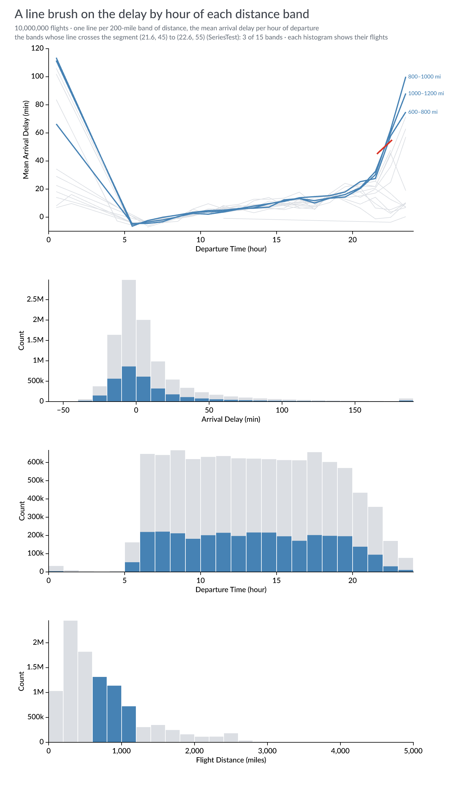
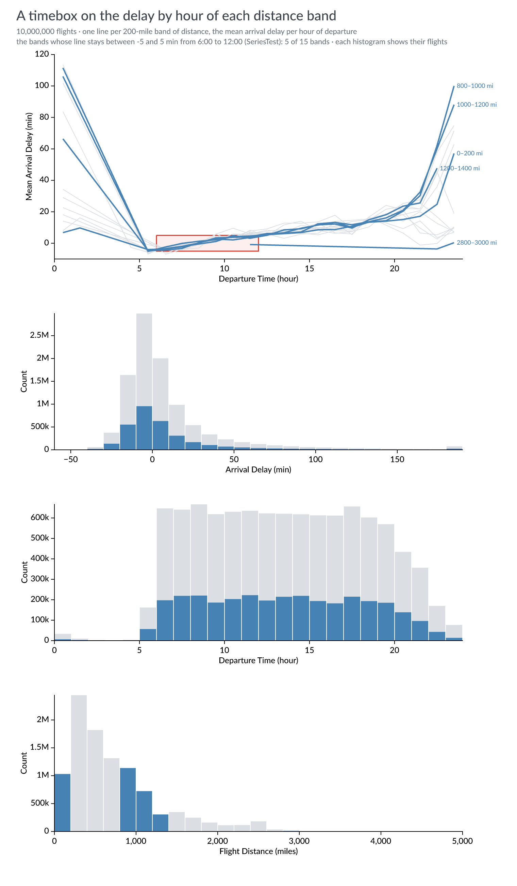
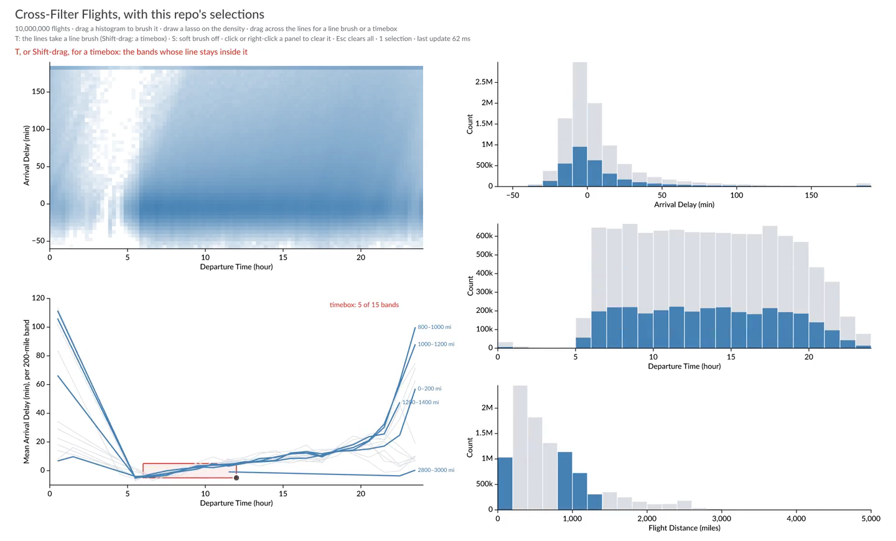

# Experiment 10: Mosaic flights, with this repo's selections

Jon's `examples/winit-mosaic-flights` (in `jonmmease/avenger`, at the pinned
`f4890be`) is Mosaic's [Cross-Filter Flights (10M)](https://idl.uw.edu/mosaic/examples/flights-10m.html)
in a native window: three histograms, a brush on each, each histogram
filtered by the other two, through `avenger-selection` with 1 px cells and
preaggregation. This experiment draws the same dataset and panels headlessly,
and adds the selections this repo added to the crate (FINDINGS.md 25–34): a
lasso on a density panel, a soft brush, a line brush and a timebox. It asks
whether they work on someone else's data as they did on the LiDAR tile.

The panels follow Jon's example: 600 × 200 px, the same domains and display
bins (10 minutes of arrival delay, one hour of departure, 200 miles), arrival
delay clipped to −60…180 as his `dataflow.rs` does, and one producer per
panel on a 1 px pixel grid, as his `selection.rs` defines it.

## Run

```sh
curl -L --fail -o data/flights-10m.parquet \
  'https://pub-1da360b43ceb401c809f68ca37c7f8a4.r2.dev/data/flights-10m.parquet'
cargo run --release -p lidar-flights --bin flights -- data/flights-10m.parquet
```

Without a GPU (a cloud container), wgpu needs a software Vulkan driver:
`apt-get install mesa-vulkan-drivers`, then run with
`VK_ICD_FILENAMES=/usr/share/vulkan/icd.d/lvp_icd.json`.

## The figures

**Cross-filter** ([crossfilter.png](images/crossfilter.png)): Jon's figure, a
brush on arrival delay from 60 to 180 minutes. Grey is every flight, blue the
flights the other panels' brushes leave. Late arrivals leave mostly in the
evening, and fly short distances about as often as all flights do.


**A lasso** ([lasso.png](images/lasso.png)): a density panel of departure time
against arrival delay (15 minutes by 5 minutes of delay, logarithmic tint),
and a lasso around evening departures that arrive late. The lasso is 190 runs
of 1 px cells (`SelectionValue::polygon`), and the three histograms below
show the flights inside it. The band at the top is the clip at 180 minutes.


**A soft brush** ([soft.png](images/soft.png)): a brush on distance from 1,500
to 2,500 miles, soft over 60 px. Dark blue is the flights inside the brush;
light blue counts every flight by its degree (`ConsumerFilter::degree`), so
flights just outside the brush count in part. In the brushed panel, each bar
is tinted by the degree at its centre.


## Measured

In this cloud container (4 cores), on the 10M flights in memory (loaded in
about 0.4 s):

| | Time |
|---|---|
| one histogram, filtered by a brush | 45–100 ms |
| one histogram, filtered by the lasso | 135–155 ms |
| one histogram, soft brush (hard and degree-weighted) | 100–210 ms |
| the keys of a line brush or timebox over the 15 bands | 90–110 ms |
| one histogram, filtered by those keys | 45–65 ms |
| the arrival-delay histogram as the lasso moves, direct | 134–163 ms per redraw |
| the same through the preaggregation split | 3.1–3.5 ms per redraw, same histogram |
| warm-up for the split (112,722 stored rows) | 246 ms, once |

The lasso's redraws are four positions of the same lasso; each rollup is
checked against the direct query. Jon's example measures its own footer time
in the window, with his dataflow caching; the numbers here are plain queries,
so they compare with each other, not with his.

**A line brush** ([linebrush.png](images/linebrush.png)) and **a timebox**
([timebox.png](images/timebox.png)) test whole series, and the flights have
none, so these figures choose an aggregation: one line per 200-mile band of
distance (Jon's display bins), the mean arrival delay per hour of departure,
over hours with at least 1,000 flights. `SeriesTest::keys` measures every line
in one query (about 100 ms, most of it the aggregation over 10M rows), and its
keys become a `one_of` on the band, which the histograms apply to the raw
flights. The line brush crosses the evening rise and takes the 600–1,200 mile
bands; the timebox keeps the bands that stay within 5 minutes of on time from
6:00 to 12:00, five of fifteen. A band with a gap in its hours is drawn, and
tested, as a line across the gap.





CloudLasso needs three dimensions, and the flights have two that suit it at
most; it is drawn on the LiDAR tile in [experiment 11](../11-cloudlasso/).

## The window

`flights_live` puts every selection above under the mouse, on the same 10M
flights: the density panel and the lines on the left, the three histograms
on the right. Each histogram shows the flights the other panels' selections
leave, queried again through `avenger-selection` while you drag.

```sh
./scripts/live_10_11.sh 10          # or:
cargo run --release -p lidar-flights --bin flights_live -- data/flights-10m.parquet
```

| Gesture | Selects |
|---|---|
| drag a histogram | a brush on that column; the panel itself tints its bars by the brush instead of filtering them |
| draw on the density | a lasso (`SelectionValue::polygon`) |
| drag across the lines | a line brush: the bands whose line crosses the segment |
| T, then drag the lines (or Shift-drag) | a timebox: the bands whose line stays inside it |
| S | the soft brush on or off: light blue counts every flight by its degree, over 60 px |
| click or right-click a panel | clears that panel's selection; Esc clears all |

[](video/flights_live.mp4)

[video/flights_live.mp4](video/flights_live.mp4) (37 s) goes through each of
them: two brushes, a right click, the soft brush, the lasso, a line brush, and a
timebox together with a brush. It is recorded headlessly with `--tour`, which
moves a drawn pointer through the window's own press, motion and release at 30
frames a second and queries every third frame while dragging, about as often
as the window's queries return. `--snapshots` checks the same gestures as seven
PNGs; neither involves capturing a window.

```sh
cargo run --release -p lidar-flights --bin flights_live -- data/flights-10m.parquet --snapshots out/flights_live
cargo run --release -p lidar-flights --bin flights_live -- data/flights-10m.parquet --tour out/flights_tour
ffmpeg -framerate 30 -i out/flights_tour/frame_%05d.png -vf scale=1440:-2 -c:v libx264 -preset slow -crf 28 \
  -pix_fmt yuv420p -movflags +faststart experiments/10-mosaic-flights/video/flights_live.mp4
```

Measured with `--snapshots` on an Apple Silicon laptop, 28 Sep 2026: the
flights load in 0.2 s; one update, all three histograms queried side by side,
takes 34–111 ms (a brush 59 ms, the lasso 87 ms, the soft brush 92 ms, the
timebox with a brush 111 ms), and 324 ms with the lasso, a brush and a line
brush set and the soft brush on.

The window found two bugs in the soft brush, both fixed in
`avenger-selection` ([FINDINGS.md](../../FINDINGS.md) 36): beside a line brush
or timebox, DataFusion refused the degree query with an internal error, and
beside the lasso an update took 1.5 s. Step 7 of `--snapshots` sets every
kind of selection at once with the soft brush on, and checks both.
