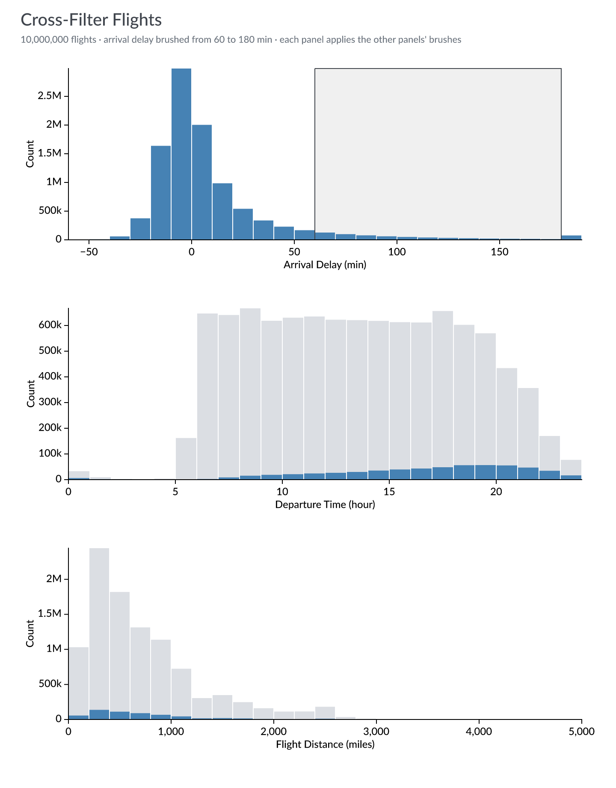
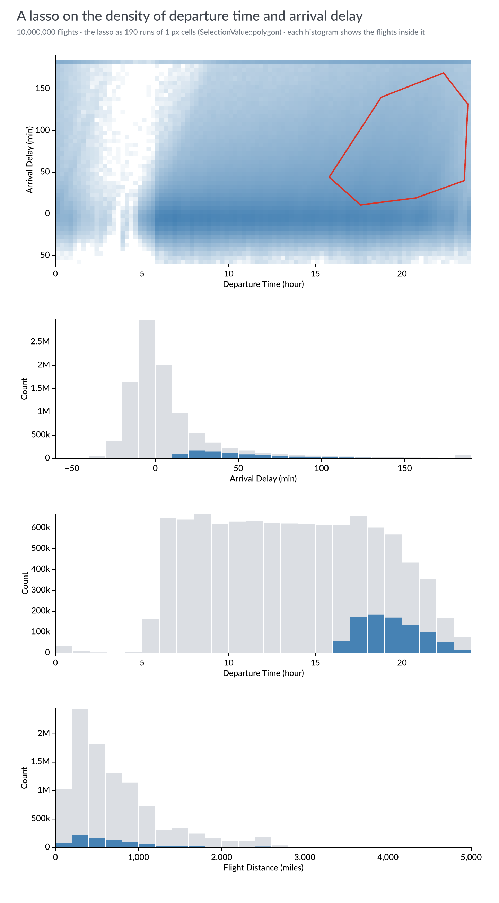
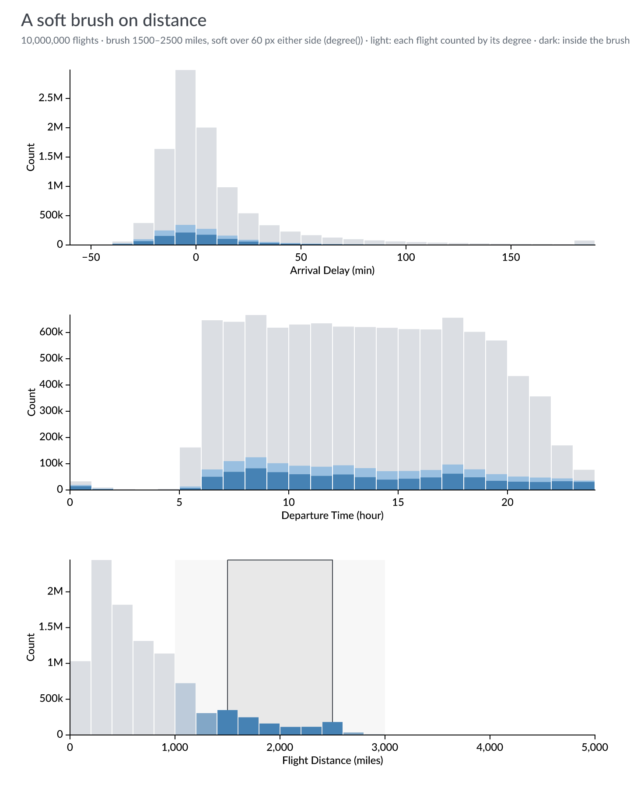

# Experiment 10: Mosaic flights, with this repo's selections

Jon's `examples/winit-mosaic-flights` (in `jonmmease/avenger`, at the pinned
`f4890be`) is Mosaic's [Cross-Filter Flights (10M)](https://idl.uw.edu/mosaic/examples/flights-10m.html)
in a native window: three histograms, a brush on each, each histogram
filtered by the other two, through `avenger-selection` with 1 px cells and
preaggregation. This experiment draws the same dataset and panels headlessly,
and adds the selections this repo added to the crate (FINDINGS.md 25–34): a
lasso on a density panel, and a soft brush. It asks whether they work on
someone else's data as they did on the LiDAR tile.

The panels follow Jon's example: 600 × 200 px, the same domains and display
bins (10 minutes of arrival delay, one hour of departure, 200 miles), arrival
delay clipped to −60…180 as his `dataflow.rs` does, and one producer per
panel on a 1 px pixel grid, as his `selection.rs` defines it.

## Run

```sh
curl -L --fail -o data/flights-10m.parquet \
  'https://pub-1da360b43ceb401c809f68ca37c7f8a4.r2.dev/data/flights-10m.parquet'
cargo run --release -p lidar-flights --bin flights -- data/flights-10m.parquet
```

Without a GPU (a cloud container), wgpu needs a software Vulkan driver:
`apt-get install mesa-vulkan-drivers`, then run with
`VK_ICD_FILENAMES=/usr/share/vulkan/icd.d/lvp_icd.json`.

## The figures

**Cross-filter** ([crossfilter.png](images/crossfilter.png)): Jon's figure, a
brush on arrival delay from 60 to 180 minutes. Grey is every flight, blue the
flights the other panels' brushes leave. Late arrivals leave mostly in the
evening, and fly short distances about as often as all flights do.



**A lasso** ([lasso.png](images/lasso.png)): a density panel of departure time
against arrival delay (15 minutes by 5 minutes of delay, logarithmic tint),
and a lasso around evening departures that arrive late. The lasso is 190 runs
of 1 px cells (`SelectionValue::polygon`), and the three histograms below
show the flights inside it. The band at the top is the clip at 180 minutes.



**A soft brush** ([soft.png](images/soft.png)): a brush on distance from 1,500
to 2,500 miles, soft over 60 px. Dark blue is the flights inside the brush;
light blue counts every flight by its degree (`ConsumerFilter::degree`), so
flights just outside the brush count in part. In the brushed panel, each bar
is tinted by the degree at its centre.



## Measured

In this cloud container (4 cores), on the 10M flights in memory (loaded in
about 0.4 s):

| | Time |
|---|---|
| one histogram, filtered by a brush | 45–100 ms |
| one histogram, filtered by the lasso | 135–155 ms |
| one histogram, soft brush (hard and degree-weighted) | 100–210 ms |
| the arrival-delay histogram as the lasso moves, direct | 134–163 ms per redraw |
| the same through the preaggregation split | 3.1–3.5 ms per redraw, same histogram |
| warm-up for the split (112,722 stored rows) | 246 ms, once |

The lasso's redraws are four positions of the same lasso; each rollup is
checked against the direct query. Jon's example measures its own footer time
in the window, with his dataflow caching; the numbers here are plain queries,
so they compare with each other, not with his.

**Not done:** the line brush and timebox, which need series (flights have
none in this dataset without choosing an aggregation), and CloudLasso, which
is for three dimensions.
