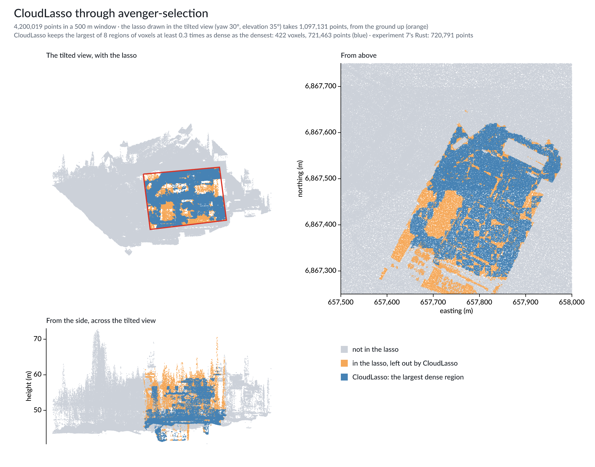
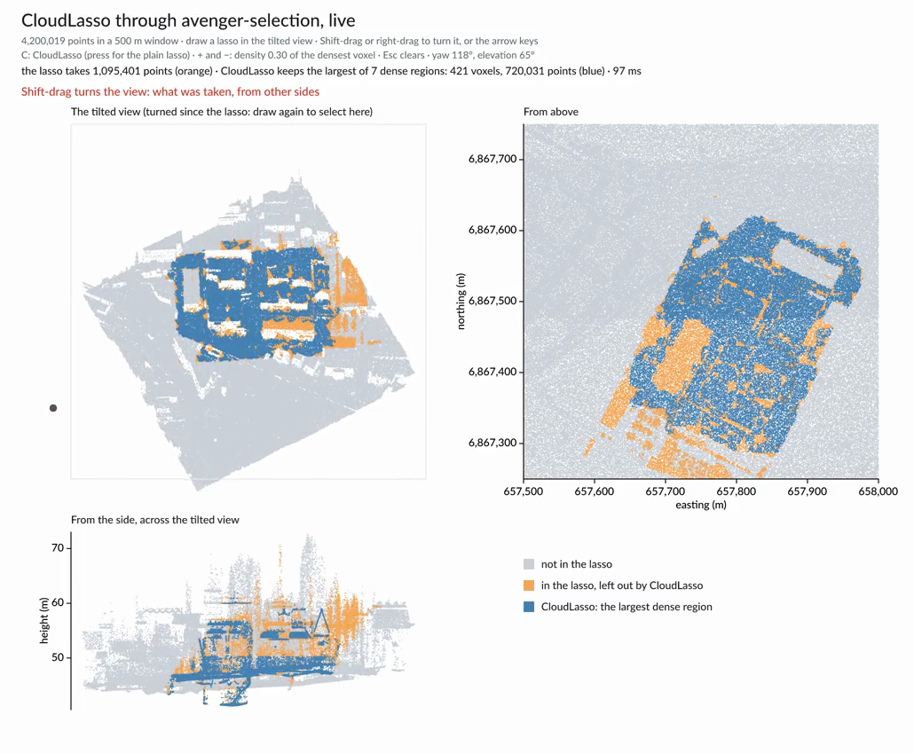

# Experiment 11: CloudLasso through avenger-selection

CloudLasso (Yu et al. 2012) selects in three dimensions from a lasso drawn in
two: of the points whose projection falls inside the lasso, it keeps the
largest connected region of dense voxels. Experiment 7 draws it with its own
code; the probe measures it through `avenger-selection` (FINDINGS.md 28) but
prints numbers only. This experiment draws the crate's result.

The setting is the probe's: a 500 m window of the tile, experiment 7's tilted
view (yaw 30°, elevation 35°) on a 400 px plot, its lasso, voxels 1/40 of the
window across and 1/10 of its height range up, and a structure of 0.3. The
chart and the crate split the work as the finding describes: the lasso is a
`SelectionValue::polygon` on 1 px screen cells; the chart counts the lasso's
points per voxel through the crate's predicate and finds the largest dense
region (experiment 7's algorithm, `lidar_common::largest_region`); the crate
then selects that region's voxels as `SelectionValue::cells`, intersected with
the lasso in one selection. The figure reads both memberships back through
`ConsumerFilter::predicate`.

## Run

```sh
cargo run --release -p lidar-cloudlasso --bin cloudlasso -- data/LHD_FXX_0657_6868_PTS_O_LAMB93_IGN69.copc.laz
```

Without a GPU, see experiment 10's README for the software Vulkan driver.

## The figure



In the tilted view the lasso covers a block of buildings. From above, the
lasso's points (orange) include low ground and structures in front of and
inside the block, which the lasso's prism passes through; CloudLasso (blue)
keeps the connected mass of the block itself. From the side, across the
tilted view, the orange that remains lies above the block's main heights and
on the ground beneath it. The classes of those points were not checked.

## Measured

In this cloud container (4 cores), on 4,200,019 points in the window:

| | |
|---|---|
| points in the lasso | 1,097,131 (experiment 7's Rust: 1,097,132) |
| CloudLasso | the largest of 8 dense regions, 422 voxels, 721,463 points |
| experiment 7's Rust | the largest of 8 regions, 421 voxels, 720,791 points, 0.09 % apart |
| lasso, voxel counts, region and voxel value | 124–133 ms |
| both memberships of every point, read back | 118–143 ms |

The small difference is finding 28's: the crate's cell kernel places voxel
edges in Float32, experiment 7's in Float64, so a few points on an edge fall
into the neighbouring voxel.

## The window

`cloudlasso_live` draws the three views of the figure and takes the lasso from
the mouse. The selection runs on all 4.2M points; each view draws 300,000 of
them.

```sh
./scripts/live_10_11.sh 11          # or:
cargo run --release -p lidar-cloudlasso --bin cloudlasso_live -- data/LHD_FXX_0657_6868_PTS_O_LAMB93_IGN69.copc.laz
```

| Gesture | Does |
|---|---|
| draw in the tilted view | a lasso; CloudLasso keeps the largest dense region inside it |
| Shift-drag or right-drag, or the arrow keys | turns the view; the points keep their colours, the lasso's outline shows only in the view it was drawn in |
| C | CloudLasso or the plain lasso |
| + and − | how dense a voxel must be, as a share of the densest (0.30 to start) |
| Esc | clears |

[](video/cloudlasso_live.mp4)

[video/cloudlasso_live.mp4](video/cloudlasso_live.mp4) (35 s) draws a lasso
around the block, switches to the plain lasso and back, raises the density
threshold, turns the view to see what was taken, and draws a second lasso in
the turned view. It is recorded headlessly with `--tour`, as experiment 10's is.

```sh
T=data/LHD_FXX_0657_6868_PTS_O_LAMB93_IGN69.copc.laz
cargo run --release -p lidar-cloudlasso --bin cloudlasso_live -- $T --snapshots out/cloudlasso_live
cargo run --release -p lidar-cloudlasso --bin cloudlasso_live -- $T --tour out/cloudlasso_tour
ffmpeg -framerate 30 -i out/cloudlasso_tour/frame_%05d.png -vf scale=1030:-2 -c:v libx264 -preset slow -crf 28 \
  -pix_fmt yuv420p -movflags +faststart experiments/11-cloudlasso/video/cloudlasso_live.mp4
```

Measured with `--snapshots` on an Apple Silicon laptop, 28 Sep 2026: the window
is ready in 1.0–1.1 s; a CloudLasso, with every point's two memberships read
back, takes 89–100 ms, and the plain lasso 32 ms.

**A lasso drawn by the mouse takes slightly fewer points than the figure's.**
A cell is in the lasso when its centre lies strictly inside it, so a centre
exactly on an edge is left out. The figure's corners are fractions of the plot
times 400 px (168.00000000000003, …), while the mouse gives whole pixels, and
then some edges run exactly through cell centres. The figure's four corners
rounded to whole pixels take 1,095,816 points instead of 1,097,131 (0.12 %),
and CloudLasso 720,021 instead of 721,463; handed the figure's exact corners,
the window gives the figure's counts. That is the rule working as stated, not
an error: any exact rule changes its answer where an edge crosses a centre.
